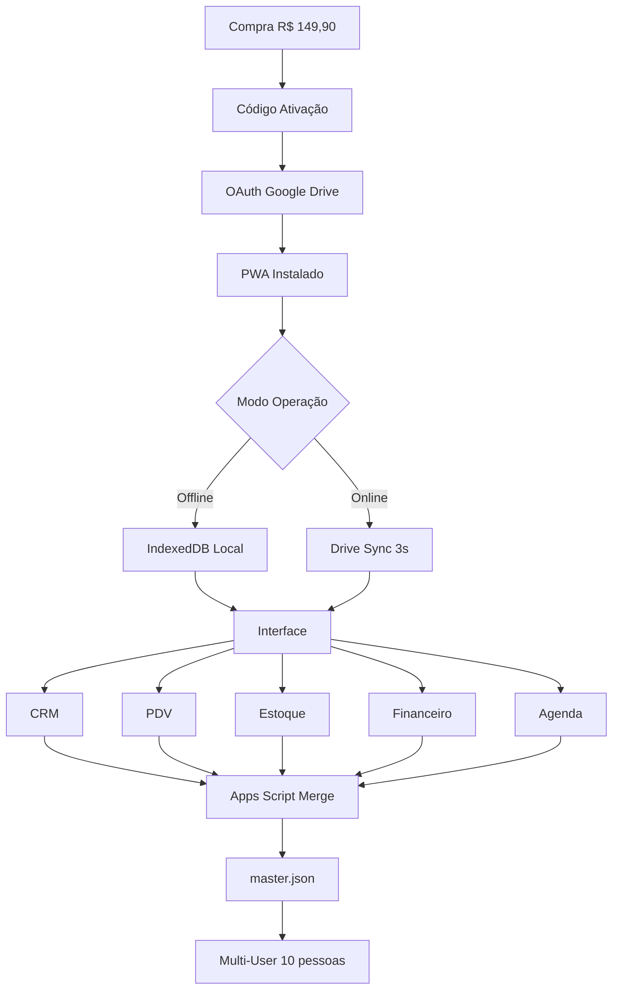

# 📖 TITANGESTÃO PRO - CODEX COMPLETO

**Versão:** 4.0 Final  
**Data:** 19 Janeiro 2026  
**Status:** Documento Mestre Unificado

> **Este é O documento.** Tudo que você precisa saber sobre TitanGestão PRO está aqui.

---

## 📑 NAVEGAÇÃO RÁPIDA

### I. [VISÃO EXECUTIVA](#i-visão-executiva)

- [O Que É](#1-o-que-é)
- [Diferenciais](#2-diferenciais)
- [Mercado e Público](#3-mercado-e-público)
- [Modelo de Negócio](#4-modelo-de-negócio)

### II. [ARQUITETURA TÉCNICA](#ii-arquitetura-técnica)

- [Stack Tecnológico](#1-stack-tecnológico)
- [Fluxo Completo](#2-fluxo-completo)
- [Estrutura Futuro-Proof](#3-estrutura-futuro-proof)
- [Segurança e Multi-User](#4-segurança-e-multi-user)

### III. [FUNCIONALIDADES](#iii-funcionalidades)

- [CRM](#1-crm)
- [PDV](#2-pdv)
- [Estoque](#3-estoque)
- [Financeiro](#4-financeiro)
- [Agenda](#5-agenda)
- [White Label](#6-white-label)

### IV. [INTELIGÊNCIA ARTIFICIAL](#iv-inteligência-artificial)

- [IA Agente Agentic](#1-ia-agente-agentic)
- [Trial 90 Dias Grátis](#2-trial-90-dias-grátis)
- [Ingestão de Documentos](#3-ingestão-de-documentos)
- [Rotinas Diárias](#4-rotinas-diárias)

### V. [INTEGRAÇÕES](#v-integrações)

- [WhatsApp](#1-whatsapp)
- [iFood](#2-ifood)
- [Nota Fiscal Eletrônica](#3-nota-fiscal-eletrônica)

### VI. [ROADMAP](#vi-roadmap)

- [Cronograma Sprints](#1-cronograma-sprints)
- [Versões](#2-versões)

### VII. [PRICING E ESTRATÉGIA](#vii-pricing-e-estratégia)

- [Precificação](#1-precificação)
- [Canais de Venda](#2-canais-de-venda)
- [Expansão LATAM](#3-expansão-latam)

### VIII. [FAQ](#viii-faq)

---

# I. VISÃO EXECUTIVA

## 1. O Que É

**TitanGestão PRO** é um sistema PWA híbrido de gestão empresarial completo (CRM + PDV + Estoque + Financeiro + Agenda) que funciona **offline e online**, com dados armazenados na nuvem **do cliente**.

### USP (Proposta Única)

> "O único sistema de gestão que funciona offline E online, com dados na SUA nuvem, por R$ 149,90 para sempre."

### Analogia

- **RD Station:** Aluga casa cara (R$ 99/mês = R$ 3.564/3 anos)
- **Excel:** Casa grátis mas barraco (sem profissionalismo)
- **TitanGestão:** Compra casa própria (R$ 149,90 único) + melhorias opcionais (MRR)

---

## 2. Diferenciais

| Característica   | TitanGestão             | Concorrentes        |
| ---------------- | ----------------------- | ------------------- |
| **Preço 3 anos** | R$ 149,90               | R$ 2.160-3.564      |
| **Offline**      | ✅ 100% funcional       | ❌ Precisa internet |
| **Dados**        | Google Drive DO CLIENTE | Servidor deles      |
| **IA Grátis**    | 90 dias trial           | Paga desde dia 1    |
| **Multi-user**   | 10 incluídos            | 1-3 incluídos       |
| **White Label**  | ✅ Completo             | ❌ ou caro          |

---

## 3. Mercado e Público

### Tamanho Mercado

- **Brasil:** 9,3 milhões PMEs sem sistema adequado
- **LATAM:** 26 milhões (México, Argentina, Colômbia, Chile)
- **Total:** 35,3M potencial

### Para Quem Serve

| Público          | Uso              | Pain Point Resolvido                      |
| ---------------- | ---------------- | ----------------------------------------- |
| **Lojistas**     | PDV + Estoque    | "Excel bagunçado, perco vendas"           |
| **E-commerce**   | PDV + Etiquetas  | "Correios pedem etiqueta, faço manual"    |
| **Consultores**  | CRM + Orçamentos | "Perco clientes no funil, sem follow-up"  |
| **Barbearias**   | CRM + Agenda     | "Esqueço agendamentos, clientes reclamam" |
| **Restaurantes** | PDV + iFood      | "iFood cobra caro, preciso meu sistema"   |

---

## 4. Modelo de Negócio

### Pricing Híbrido

```
╔══════════════════════════════════════╗
║  BASE: R$ 149,90 (Pagamento Único)  ║
╠══════════════════════════════════════╣
║  ✅ CRM + PDV + Estoque + Financeiro ║
║  ✅ Até 10 usuários                  ║
║  ✅ PWA offline                      ║
║  ✅ Google Drive sync                ║
║  ✅ White label                      ║
╚══════════════════════════════════════╝

         ↓ (Opcional MRR)

╔══════════════════════════════════════╗
║  USUÁRIOS EXTRAS                     ║
╠══════════════════════════════════════╣
║  11-20 users: +R$ 59,90/mês          ║
║  21-50 users: +R$ 99,90/mês          ║
║  51+ users: +R$ 149,90/mês           ║
╚══════════════════════════════════════╝

╔══════════════════════════════════════╗
║  IA ASSISTENTE (Trial 90 dias)       ║
╠══════════════════════════════════════╣
║  +R$ 47/mês após trial               ║
║  - Bot WhatsApp 24/7                 ║
║  - Ingestão documentos (PDF/XML)     ║
║  - Insights diários                  ║
╚══════════════════════════════════════╝

╔══════════════════════════════════════╗
║  INTEGRAÇÕES                         ║
╠══════════════════════════════════════╣
║  iFood: +R$ 29/mês                   ║
║  NFe: +R$ 79/mês                     ║
╚══════════════════════════════════════╝
```

### LTV (Lifetime Value)

**Cliente Básico:** R$ 149,90  
**Cliente Premium:** R$ 149,90 + (R$ 155/mês × 24) = **R$ 3.869,90**

### Canais de Venda

| Canal   | Meta Ano 1 | Lucro/Venda | % Mix |
| ------- | ---------- | ----------- | ----- |
| Kiwify  | 600 vendas | R$ 52       | 40%   |
| Hotmart | 450 vendas | R$ 45       | 30%   |
| Site    | 450 vendas | R$ 75       | 30%   |

**Total:** 1.500 vendas Brasil + 550 LATAM = **R$ 110.175 lucro**

---

# II. ARQUITETURA TÉCNICA

## 1. Stack Tecnológico

### Frontend (PWA)

```
HTML5 + CSS3 + JavaScript ES6+
├─ Service Worker (offline cache)
├─ IndexedDB (banco local 50MB+)
├─ Chart.js (gráficos)
└─ Manifest.json (instalável)
```

### Backend (Sync)

```
Google Apps Script (merge engine 3s)
Node.js + Express (auth apenas)
MongoDB Atlas (usuários/licenças)
Google Drive API (storage cliente)
```

### APIs Externas

```
Google Maps (autocomplete endereço)
Google OAuth 2.0 (autenticação)
Gemini API (IA agente)
Evolution API (WhatsApp)
iFood API (pedidos)
Focus NFe (notas fiscais)
```

---

## 2. Fluxo Completo



---

## 3. Estrutura Futuro-Proof

### Colunas Fantasmas (Preparação)

**TODOS os módulos têm colunas ocultas mesmo que não usem:**

```javascript
// CLIENTES
{
  id, nome, telefone, ...  // Visíveis
  _metadata_fiscal: {},    // CPF/CNPJ futuro
  _id_loja: '1',          // Multi-loja (sempre '1' v1.0)
  _campos_custom: {},     // IA cria dinâmico
  _origem: 'manual'       // ou 'pdf', 'xml'
}

// PRODUTOS
{
  id, nome, preco, ...     // Visíveis
  _metadata_fiscal: {},    // NCM, CEST (IA preenche!)
  _estoque_qtd: 0,        // Mesmo sem Estoque ativo
  _custo: null,
  _margem: null,
  _id_loja: '1'
}

// VENDAS
{
  id, data, valor, ...     // Visíveis
  _metadata_fiscal: {},    // NFe futuro
  _origem: 'pdv'          // ou 'ifood', 'whatsapp'
}
```

**Por quê?**

- ✅ IA importa XML fiscal dia 1 (salva NCM invisível)
- ✅ Cliente ativa Estoque depois → dados JÁ LÁ
- ✅ Multi-loja vira fácil (só preenche `_id_loja`)

### Repository Pattern

```javascript
// Abstração banco (trocar depois sem reescrever)
class Repository {
  // v1.0: IndexedDB
  // v2.0+: pode virar Sheets, SQL, etc

  async getProdutos(storeId = "1") {
    return indexedDB.getAll("produtos").filter((p) => p._id_loja === storeId);
  }

  async saveProduto(produto) {
    produto._id_loja = produto._id_loja || "1";
    produto._versao_schema = 1;
    return indexedDB.add("produtos", produto);
  }
}

// SEMPRE usar Repository, NUNCA indexedDB direto
```

### Feature Flags

```javascript
const CONFIG = {
  ENABLE_IA: true, // v1.0
  ENABLE_IFOOD: false, // v2.0
  ENABLE_NFE: false, // v2.5
  ENABLE_MULTI_LOJA: false, // v3.0
};

// Ligar/desligar módulos remotamente
if (CONFIG.ENABLE_IFOOD) {
  mostrarMenuIFood();
}
```

---

## 4. Segurança e Multi-User

### Race Condition (Estoque)

```javascript
// Problema: 2 users vendem último item simultaneamente
// Solução v1.0: Timestamps (simples)
venda.timestamp = Date.now();

// Solução v1.5: LockService (robusto)
const lock = await LockService.tryLock("estoque_produto_123", 5000);
if (lock) {
  await baixarEstoque(123, 1);
  lock.release();
}
```

### Multi-User Sync

```
User A edita cliente → IndexedDB local
   ↓ (3s depois)
Google Drive: mudancas.json
   ↓
Apps Script: merge(master.json, mudancas.json)
   ↓
master.json atualizado
   ↓ (User B sincroniza)
User B vê mudança
```

**Conflito:** Last-write-wins por timestamp

---

# III. FUNCIONALIDADES

## 1. CRM

### Core

- ✅ CRUD completo + histórico unificado
- ✅ Funil Kanban arrastar-soltar (5 etapas)
- ✅ Tags de captação customizáveis
- ✅ Filtros avançados (status, cidade, bairro, campos custom)

### Inteligente

- ✅ **Telefone internacional:** Auto-detecta país + formata

  ```
  Input: 11987654321
  Output: +55 (11) 98765-4321
  ```

- ✅ **Google Maps autocomplete:** Preenche tudo automaticamente

  ```
  Digita: "Rua Augusta, 1"
  IA preenche: Rua, número, bairro, cidade, estado, CEP
  ```

- ✅ **Campos customizáveis:** Cliente cria próprios campos
  ```
  Exemplo imobiliária: "Área m²", "Valor m²"
  IA detecta padrão e cria automaticamente
  ```

### Ações

- ✅ Importação Excel (CSV/XLSX) via IA
- ✅ Orçamentos PDF com logo
- ✅ WhatsApp manual (botão direto)
- ✅ Exportação relatórios

---

## 2. PDV

### Básico (v1.0)

- ✅ Interface simples (canhoto/digital WhatsApp)
- ✅ Formas pagamento:
  - Dinheiro
  - PIX (chave manual cadastrada)
  - Cartão (registro manual)
- ✅ Recibos PDF (enviar WhatsApp)
- ✅ Baixa estoque automática
- ✅ Controle caixa (abertura, fechamento, sangria)

### Etiquetas Envio (v1.0)

```javascript
function gerarEtiqueta(pedido) {
  const pdf = new jsPDF();

  // Remetente
  pdf.text(loja.nome, 10, 20);
  pdf.text(loja.endereco, 10, 25);

  // Destinatário
  pdf.text(cliente.nome, 10, 50);
  pdf.text(cliente.endereco_completo, 10, 55);

  // QR Code rastreio
  const qr = gerarQRCode(pedido.codigoRastreio);
  pdf.addImage(qr, "PNG", 120, 10, 50, 50);

  // Templates: Correios, Jadlog, Loggi, Total Express
}
```

### Avançado (v2.0+)

- ⏳ Gateways (PagSeguro, Mercado Pago) → v2.5
- ⏳ Impressora térmica → v1.1

---

## 3. Estoque

### Core (v1.0)

- ✅ CRUD produtos (código, nome, preço, foto)
- ✅ Movimentações (entrada, saída, transferência)
- ✅ Alertas estoque mínimo
- ✅ Relatórios (Curva ABC, giro, produtos parados)

### Importante

- ⚠️ **Colunas fantasmas SEMPRE existem** mesmo sem Estoque ativo
- ⚠️ Multi-local: Aumenta complexidade (avaliar necessidade)

---

## 4. Financeiro

- ✅ Contas a pagar (fornecedores, vencimento, baixa)
- ✅ Contas a receber (clientes, parcelas)
- ✅ Categorias (despesas/receitas)
- ✅ DRE simplificado
- ✅ Fluxo de caixa (projeção 30-60-90 dias)

---

## 5. Agenda

- ✅ Calendário mensal visual
- ✅ Tipos personalizáveis (reunião, ligação, visita)
- ✅ Vínculo cliente (histórico CRM)
- ✅ WhatsApp manual (scripts opcionais automação)
- ⏳ Integração Google Calendar → v2.0

---

## 6. White Label

- ✅ Upload logo (Base64 embedded)
- ✅ Paleta cores (CSS Variables)
- ✅ Google Fonts selecionáveis
- ✅ Nome sistema customizado
- ✅ Ícone PWA

---

# IV. INTELIGÊNCIA ARTIFICIAL

## 1. IA Agente Agentic

**Conceito:** IA não é chatbot - é AGENTE que executa tarefas como Antigravity

### Capacidades

| Entrada       | Processamento            | Saída                        |
| ------------- | ------------------------ | ---------------------------- |
| PDF           | Extração texto + tabelas | Clientes cadastrados         |
| Foto cardápio | OCR + Vision             | Produtos cadastrados         |
| XML NFe       | Parse estruturado        | NCM + Produtos + Conta pagar |
| Excel         | Detecção schema          | Campos customizados criados  |

### Exemplo Real

```
Cliente: Upload "cardapio.jpg" (foto rasgada)

IA: "📷 Processando imagem...

     Detectei 23 pratos, mas 5 preços ilegíveis (rasgado).

     💡 Encontrei PDF do fornecedor aqui. Posso cruzar?

     [Sim] [Não]"

Cliente: "Sim"

IA: "✅ Cruzamento completo!
     - 18 preços preenchidos automaticamente
     - 5 produtos marcados 'REVISAR PREÇO'
     - Categorias criadas: Entrada (8), Principal (10), Sobremesa (5)

     Confirma importação de 23 produtos?"

Cliente: "Sim"

IA: ✅ Pronto para vender!
    📋 Lista de 5 para revisar preço
```

### Raciocínio Multi-Step

```
1. Cliente quer cadastrar estoque
   ↓
2. IA pergunta como (PDF? XML? Manual?)
   ↓
3. Cliente: "Tenho XML nota fiscal"
   ↓
4. IA processa XML
   ↓
5. IA planeja:
   - Extrair 45 produtos
   - Buscar NCM de cada (fiscal)
   - Calcular margem 40%
   - Criar categorias
   - Salvar estoque
   - Criar conta pagar
   ↓
6. IA pede confirmação
   ↓
7. Cliente: "Vai!"
   ↓
8. IA executa 6 passos
   ↓
9. ✅ Concluído! 45 produtos cadastrados
```

---

## 2. Trial 90 Dias Grátis

### Estratégia Conversão

```
Dia 1-30:   IA GRÁTIS → Cliente vicia
Dia 31-60:  IA GRÁTIS → Depende insights
Dia 61-90:  Alerta: "Trial acaba em X dias"
Dia 91:     R$ 47/mês ou IA desliga
```

**Conversão esperada:** 60%+ (quem usa não larga)

**Custo IA:** R$ 3-6/cliente (Gemini + WhatsApp)  
**Margem:** R$ 41-44 (87-94%)

---

## 3. Ingestão de Documentos

### PDF Clientes

```
Upload: "clientes_sistema_antigo.pdf"

IA: "47 clientes encontrados
     - Formatação telefones automática
     - Tags: 'Migração Sistema Antigo'
     - Campos: Nome, Telefone, Cidade, Email

     Confirma?"

✅ 47 clientes importados em 3s
```

### XML Nota Fiscal

```
Upload: "fornecedor_nfe.xml"

IA: "45 produtos (32 já cadastrados, 13 novos)

     Ações automáticas:
     1. Atualizar custo 32 produtos
     2. Cadastrar 13 novos
     3. Salvar NCM (invisível, pronto fiscal)
     4. Criar conta pagar R$ 8.500 venc. 20/02

     Executar tudo?"

✅ Sistema atualizado + fiscal preparado
```

### Criar Campos Dinâmicos

```
Upload: planilha com "Área m²" (campo novo)

IA: "Detectei campo novo: 'Área m²'
     Tipo: Número
     Formato: XXX m²

     Criar automaticamente?"

✅ Campo criado + 90 valores preenchidos
```

---

## 4. Rotinas Diárias

**Horário:** 8h00 (configurável)  
**Canal:** WhatsApp ou Email

### Segunda: Resumo Semana

```
📊 Vendas: 12 (↑ 20%)
Ticket médio: R$ 89,50
Top produto: Camisa Polo

💡 Polo vendeu bem! Aumentar estoque?
```

### Terça: Contas a Pagar

```
💰 Vencendo esta semana:
⚠️ HOJE: Fornecedor - R$ 450
📅 Qui: Aluguel - R$ 1.200

Total: R$ 1.830
```

### Quarta: CRM

```
👥 3 clientes parados "Negociação" > 7 dias

💡 Enviar follow-up?
[Gerar mensagens]
```

### Quinta: Estoque

```
📦 Estoque baixo:
- Camisa P: 5 unidades
- Calça 42: 3 unidades

Produtos parados > 60 dias:
- Jaqueta: 15 un (promoção?)
```

### Sexta: Meta

```
🎯 Meta: R$ 5.000
Realizado: R$ 4.200 (84%)
Faltam: R$ 800 (2 vendas)

💪 Clientes inativos: 8
Campanha reativação?
```

---

# V. INTEGRAÇÕES

## 1. WhatsApp

### Evolution API (v1.5 - Maio 2026)

**Vantagens:**

- ✅ Sem navegador aberto
- ✅ Multi-instância
- ✅ Webhook automático
- ✅ Self-hosted (R$ 0) ou VPS (R$ 30/mês)

**Funcionalidades:**

```javascript
// Bot IA 24/7
Cliente: "Tem camisa P?"
IA: "Sim! 5 unidades em estoque
     R$ 89,90 cada
     Quer reservar?"

// Alertas proativos
IA → Cliente: "Camisa que você gostou voltou!
                Só 5 unidades."

// CRM unificado
// Histórico WhatsApp salvo no cliente
```

**Meta Business API (v2.0):** Oficial, mais caro (R$ 100-500/mês)

---

## 2. iFood

### Polling Passivo (v2.0 - Julho 2026)

**Como funciona:**

```javascript
// Trigger: A cada 3 minutos
1. GET /orders (iFood API)
2. Verifica UUID (idempotência)
3. Se novo: Salva venda
4. Baixa estoque
5. Notifica loja
```

**Conflito Estoque:**

```
PDV vende último item
   ↓ (simultâneo)
iFood vende mesmo item
   ↓
RUPTURA detectada
   ↓
Decisão: PDV ganha (presencial > delivery)
   ↓
iFood: Cancelar pedido automático
```

**Custo:** R$ 0 (iFood já cobra comissão)  
**MRR Cliente:** +R$ 29/mês

---

## 3. Nota Fiscal Eletrônica

### Focus NFe (v2.5 - Outubro 2026)

**Por quê terceiros?**

- ✅ Homologação SEFAZ complexa
- ✅ Regras fiscais por estado
- ✅ Certificado A1 do cliente

**Processo:**

```javascript
1. Venda finalizada
   ↓
2. IA já preencheu NCM? (coluna fantasma)
   ↓
3. Se não: IA busca NCM agora
   ↓
4. Gera XML NFe
   ↓
5. Envia Focus NFe API
   ↓
6. SEFAZ aprova
   ↓
7. Salva XML + PDF
   ↓
8. Email cliente automaticamente
```

**Custo:**

- R$ 79/mês (até 30 notas)
- R$ 149/mês (até 100 notas)

**Alternativas:** Bling (R$ 90/mês), Tiny (R$ 59/mês)

---

# VI. ROADMAP

## 1. Cronograma Sprints

### Sprint 1: Infraestrutura (29 Jan - 4 Fev)

- Google Cloud setup
- Apps Script deploy
- OAuth Drive
- Backend Node.js auth

### Sprint 2: PWA Core (5-11 Fev)

- Service Worker
- IndexedDB + colunas fantasmas
- Sync queue

### Sprint 3-4: CRM Features (12-25 Fev)

- Tags captação
- Telefone internacional
- Google Maps autocomplete
- Campos customizáveis
- White label
- Excel import (IA agente)

### Sprint 5: PDV + Estoque (26 Fev - 4 Mar)

- PDV básico
- Etiquetas envio
- Estoque movimentações

### Sprint 6: Integração (5-7 Mar)

- Dashboard unificado
- Multi-user sync
- Relatórios 12 gráficos

### Sprint 7-8: Beta + Launch (8-15 Mar)

- Testes beta (5 clientes)
- IA trial ativada
- VSL + Landing Kiwify/Hotmart
- **🚀 LANÇAMENTO: 15 Março 2026**

---

## 2. Versões

### v1.0 (Março 2026)

- ✅ Sistema base completo
- ✅ IA trial 90 dias
- ✅ Até 10 usuários
- ✅ R$ 149,90

### v1.5 (Maio 2026)

- 📱 WhatsApp Evolution API
- 🔒 LockService (race condition)
- 👁️ Watchdog robusto

### v2.0 (Julho 2026)

- 🍔 iFood sincronização
- 💬 WhatsApp Meta API (opcional)
- 🧠 IA aprende com uso

### v2.5 (Outubro 2026)

- 📄 Nota Fiscal (Focus NFe)
- 💳 Gateways pagamento
- 📊 Relatórios avançados

### v3.0 (2027)

- 🏢 Multi-loja real (ID_LOJA ativo)
- 🌐 API pública
- 🔗 Zapier

---

# VII. PRICING E ESTRATÉGIA

## 1. Precificação

| Plano              | Valor                      | Inclui                            | Quando     |
| ------------------ | -------------------------- | --------------------------------- | ---------- |
| **Base**           | R$ 149,90 único            | CRM+PDV+Estoque+Financeiro+Agenda | v1.0       |
| **Usuários 11-20** | +R$ 59,90/mês              | 10 usuários extras                | Opcional   |
| **Usuários 21-50** | +R$ 99,90/mês              | 30 usuários extras                | Opcional   |
| **IA Assistente**  | R$ 0 (90 dias) → R$ 47/mês | Agente+Ingestão+Insights          | v1.0 trial |
| **iFood**          | +R$ 29/mês                 | Sincronização automática          | v2.0       |
| **NFe**            | +R$ 79/mês                 | Emissão ilimitada                 | v2.5       |

### LTV Cenários

**Básico:** R$ 149,90  
**Médio:** R$ 149,90 + (R$ 47 × 24) = R$ 1.277,90  
**Completo:** R$ 149,90 + (R$ 155 × 24) = R$ 3.869,90

---

## 2. Canais de Venda

### Estratégia Multi-Canal (12 meses)

| Canal       | Comissão | Lucro | Meta | %   |
| ----------- | -------- | ----- | ---- | --- |
| **Kiwify**  | 65%      | R$ 52 | 600  | 40% |
| **Hotmart** | 70%      | R$ 45 | 450  | 30% |
| **Site**    | 50%      | R$ 75 | 450  | 30% |

**Total Ano 1:** 1.500 vendas = R$ 85.200

**Após 12 meses:** Focar no melhor canal

---

## 3. Expansão LATAM

### Mercados (v1.0)

| País          | Preço   | Adaptações     | Meta |
| ------------- | ------- | -------------- | ---- |
| **México**    | $39 USD | i18n ES        | 300  |
| **Argentina** | $39 USD | Moeda volátil  | 100  |
| **Colômbia**  | $39 USD | WhatsApp forte | 100  |
| **Chile**     | $39 USD | -              | 50   |

**Total LATAM:** 550 vendas = R$ 32.175

### Adaptações Técnicas

```javascript
// Auto-detect país
const pais = await detectarPorIP(); // 'BR', 'MX', etc

// i18n
const idioma = pais === "BR" ? "pt-BR" : "es-MX";

// Moeda
const moeda = {
  BR: { simbolo: "R$", decimal: "," },
  MX: { simbolo: "$", decimal: "." },
};

// Telefone já preparado (Sprint 3)
```

**Esforço:** +3 dias Sprint 3 + R$ 3k marketing

---

# VIII. FAQ

### Produto

**P: Funciona sem internet?**  
R: Sim! Após primeiro login, 100% offline (PWA + IndexedDB).

**P: Dados ficam no meu Drive ou de vocês?**  
R: SEU Drive. Privacidade total. Nós só gerenciamos sincronização.

**P: Posso usar sem IA?**  
R: Sim! IA é opcional (grátis 90 dias, depois R$ 47/mês).

**P: Tem multi-loja?**  
R: v1.0 não (preparado para v3.0). Uma loja por instalação.

### Técnico

**P: Precisa instalar algo?**  
R: Não! É PWA (Progressive Web App). Funciona no navegador, pode instalar como app.

**P: Roda em celular?**  
R: Sim! Android e iOS (PWA instalável).

**P: Quantos dados suporta?**  
R: IndexedDB: ilimitado. Google Drive: 15GB grátis (cliente).

### Pricing

**P: É vitalício mesmo?**  
R: Sim! R$ 149,90 uma vez. MRR é opcional (usuários extras, IA, integrações).

**P: Trial IA é obrigatório?**  
R: Não! Pode desativar IA completamente.

**P: Afiliados ganham quanto?**  
R: 60% (R$ 89,94). Nosso lucro: R$ 45-75 dependendo canal.

### Integrações

**P: WhatsApp é grátis?**  
R: Evolution API sim (self-hosted). Meta API: R$ 100-500/mês.

**P: iFood cobra?**  
R: +R$ 29/mês cliente (custo zero pra nós, só dev).

**P: NFe precisa certificado?**  
R: Sim! Cliente tem A1. Usamos Focus NFe (R$ 79/mês).

---

## 📚 DOCUMENTOS ARQUIVADOS

Arquivos antigos consolidados neste CODEX estão em [`_archive/v3_consolidados/`](_archive/v3_consolidados/)

---

**Última Atualização:** 19 Janeiro 2026  
**Versão CODEX:** 4.0 Final  
**Status:** Documento Mestre Único  
**GitHub:** [LucassVal/SAAS](https://github.com/LucassVal/SAAS)

---

**Este CODEX substitui todos os documentos anteriores.**
