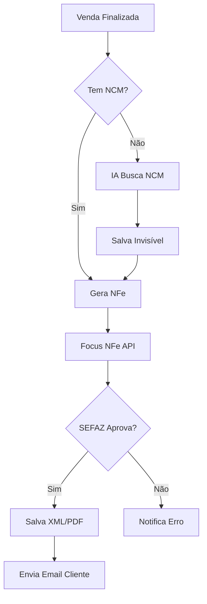

# 🔗 INTEGRAÇÕES EXTERNAS - TitanGestão PRO

**Versão:** 1.0  
**Status:** v1.5-v2.5 (escalonado)

---

## 📱 WHATSAPP (v1.5 - Maio 2026)

### Opção 1: Evolution API (Recomendado v1.5)

**O Que É:** API open-source para WhatsApp Business sem depender do WhatsApp Web

**Vantagens:**

- ✅ Sem navegador aberto
- ✅ Multi-instância (várias lojas)
- ✅ Webhook automático
- ✅ Self-hosted (controle total)

**Implementação:**

```javascript
// Webhook recebe mensagens
function doPost(e) {
  const dados = JSON.parse(e.postData.contents);

  // Identifica loja pelo número WhatsApp
  const storeId = mapearNumeroParaLoja(dados.instance);

  // IA Agente processa
  if (ConfigLoja.iaAtiva(storeId)) {
    const resposta = IAAgente.processarMensagem({
      mensagem: dados.message.text,
      cliente: dados.remoteJid,
      storeId: storeId,
    });

    // Envia resposta
    EvolutionAPI.enviarTexto(dados.remoteJid, resposta);
  }
}

// Enviar mensagem proativa
async function enviarAlertaEstoque(produto, cliente) {
  await EvolutionAPI.enviarTexto(
    cliente.whatsapp,
    `Oi ${cliente.nome}! 
     
     ${produto.nome} que você gostou está de volta!
     Só 5 unidades disponíveis.
     
     Quer reservar?`,
  );
}
```

**Custo:** R$ 0/mês (self-hosted) ou R$ 30/mês (servidor VPS)

### Opção 2: WhatsApp Business API (Meta) (v2.0)

**O Que É:** API oficial do Meta (Facebook)

**Vantagens:**

- ✅ Oficial (sem risco ban)
- ✅ Selo verificado
- ✅ Templates aprovados Meta

**Desvantagens:**

- ❌ Conversação cobra (R$ 0,03-0,15/msg)
- ❌ Burocracia aprovação
- ❌ Templates engessados

**Custo:** R$ 100-500/mês (volume mensagens)

### Integração TitanGestão

**Funcionalidades:**

1. **Bot IA 24/7**
   - Cliente pergunta estoque → IA responde
   - Cliente pede orçamento → IA gera PDF
   - Cliente compra → IA registra venda

2. **Alertas Proativos**
   - Estoque voltou
   - Promoção personalizada
   - Conta vencendo (cobrança gentil)

3. **CRM Unificado**
   - Histórico WhatsApp no CRM
   - Tags automáticas ("Respondeu rápido", "Interessado")

**Código Resumido:**

```javascript
// Configuração loja
const whatsappConfig = {
  api: "evolution", // ou 'meta'
  instancia: "loja_01",
  numero: "5511987654321",
  ia_ativa: true,
  horario_bot: "08:00-22:00", // Fora disso = humano
};
```

---

## 🍔 IFOOD (v2.0 - Julho 2026)

### Modo Polling Passivo

**O Que É:** Sistema busca pedidos iFood a cada X minutos

**Por quê Passivo?**

- ✅ Não precisa webhook complexo
- ✅ iFood API instável (polling mais confiável)
- ❌ Delay 3-5 min (aceitável para restaurante)

**Implementação:**

```javascript
// Trigger: Roda a cada 3 minutos
async function sincronizarIFood() {
  const lojas = await db.getLojasComIFood();

  for (const loja of lojas) {
    // 1. Buscar novos pedidos
    const pedidos = await iFoodAPI.getPedidos(loja.ifood_merchant_id);

    for (const pedido of pedidos) {
      // 2. Verificar se já existe (idempotência)
      const existe = await db.pedidoExiste(pedido.id);
      if (existe) continue;

      // 3. Salvar venda no sistema
      await Repository.salvarVenda({
        id: pedido.id, // UUID iFood
        origem: "ifood",
        data: pedido.createdAt,
        valor: pedido.total.orderAmount,
        cliente: {
          nome: pedido.customer.name,
          telefone: pedido.customer.phone,
        },
        itens: pedido.items.map((item) => ({
          produto_id: mapearSKU(item.externalCode),
          quantidade: item.quantity,
          preco: item.price,
        })),
        _metadata: pedido, // Salva JSON completo
      });

      // 4. Baixar estoque
      await Estoque.baixarAutomatico(pedido.items, loja.id);

      // 5. Notificar
      await notificar(loja.id, `Novo pedido iFood: ${pedido.shortReference}`);
    }
  }
}
```

**Conflito Estoque:**

```javascript
// Se PDV vende último item enquanto iFood processa
async function baixarEstoque(produtoId, quantidade) {
  const atual = await Estoque.getQuantidade(produtoId);

  if (atual < quantidade) {
    // RUPTURA! iFood tem prioridade? Ou PDV?
    // Decisão: PDV ganha (presencial > delivery)

    await notificar("RUPTURA: Cancelar pedido iFood #123");
    await iFoodAPI.cancelarPedido(pedidoId, "Produto esgotado");

    return { sucesso: false, motivo: "ruptura" };
  }

  // OK, baixa normalmente
  await Estoque.baixar(produtoId, quantidade);
  return { sucesso: true };
}
```

**Setup Cliente:**

```javascript
// Configuração
const iFoodConfig = {
  merchant_id: "abc-123-def", // ID do restaurante no iFood
  client_id: "xxx", // Credenciais OAuth
  client_secret: "yyy",
  polling_interval: 180, // 3 minutos
  auto_aprovar: false, // Manual ou auto?
  mapear_produtos: {
    SKU_IFOOD_001: "produto_123", // Mapeamento
    SKU_IFOOD_002: "produto_456",
  },
};
```

**Custo:** R$ 0 (iFood já cobra comissão do restaurante)

---

## 📄 NOTA FISCAL ELETRÔNICA (v2.5 - Outubro 2026)

### Terceiros: APIs NFe/NFSe

**Por quê terceiros?**

- ✅ Homologação SEFAZ complexa
- ✅ Certificado A1 (cliente tem)
- ✅ Regras fiscais por estado
- ❌ Fazer in-house = 6 meses dev

### Opção 1: Focus NFe (Recomendado)

**O Que É:** API completa NFe + NFSe + NFCe

**Vantagens:**

- ✅ R$ 79/mês (até 30 notas)
- ✅ Homologação todas SEFAZ
- ✅ Suporte bom
- ✅ Dashboard web

**Implementação:**

```javascript
// Emitir NFe
async function emitirNFe(vendaId) {
  const venda = await db.getVenda(vendaId);
  const cliente = await db.getCliente(venda.clienteId);
  const loja = await db.getLoja(venda.storeId);

  // 1. IA preencheu NCM? (coluna fantasma)
  const produtos = await Promise.all(
    venda.itens.map(async (item) => {
      const prod = await db.getProduto(item.produtoId);

      return {
        codigo_produto: prod.codigo,
        descricao: prod.nome,
        ncm: prod._metadata_fiscal?.ncm || "PENDENTE", // IA salvou!
        cfop: "5102", // Venda dentro estado
        valor_unitario: item.preco,
        quantidade: item.quantidade,
        valor_total: item.preco * item.quantidade,
      };
    }),
  );

  // 2. Verificar se TUDO tem NCM
  const semNCM = produtos.filter((p) => p.ncm === "PENDENTE");
  if (semNCM.length > 0) {
    throw new Error(`${semNCM.length} produtos sem NCM. Revisar!`);
  }

  // 3. Enviar para Focus NFe
  const nfe = await FocusNFeAPI.criarNFe({
    natureza_operacao: "Venda",
    data_emissao: new Date(),
    cliente: {
      cpf_cnpj: cliente.cpf_cnpj,
      nome: cliente.nome,
      endereco: cliente.endereco,
      // ...
    },
    produtos: produtos,
    // ... resto da NFe
  });

  // 4. Salvar XML + PDF
  await db.salvarNFe({
    vendaId: vendaId,
    chave_acesso: nfe.chave,
    xml: nfe.caminho_xml,
    pdf: nfe.caminho_danfe,
    status: nfe.status, // 'autorizada'
  });

  // 5. Enviar email cliente
  await enviarEmail(cliente.email, {
    assunto: "Nota Fiscal Eletrônica",
    anexos: [nfe.caminho_danfe],
  });
}
```

**Custo:**

- R$ 79/mês (até 30 notas)
- R$ 149/mês (até 100 notas)
- R$ 0,50/nota excedente

### Opção 2: Bling (Alternativa)

**O Que É:** ERP completo com NFe inclusa

**Vantagens:**

- ✅ ERP + NFe integrado
- ✅ Integrações prontas (Mercado Livre, etc)

**Desvantagens:**

- ❌ R$ 90/mês (mínimo)
- ❌ Mais pesado (ERP completo)

### Opção 3: Tiny ERP

**Custo:** R$ 59/mês  
**Limite:** 5 usuários  
**NFe:** Incluída (ilimitada)

### Integração TitanGestão

**Fluxo:**



**Configuração Cliente:**

```javascript
const nfeConfig = {
  provedor: "focus_nfe", // ou 'bling' ou 'tiny'
  api_token: "xxx",
  cert_a1: "base64...", // Certificado digital cliente
  senha_cert: "senha123",
  ambiente: "homologacao", // ou 'producao'
  serie_nfe: "1",
  proximo_numero: 1,
  regime_tributario: "simples_nacional",
};
```

---

## 📊 RESUMO INTEGRAÇÕES

| Integração             | Versão | Custo/Mês  | Prioridade | Status    |
| ---------------------- | ------ | ---------- | ---------- | --------- |
| **WhatsApp Evolution** | v1.5   | R$ 0-30    | 🔥 Alta    | Maio 2026 |
| **WhatsApp Meta**      | v2.0   | R$ 100-500 | Média      | Jul 2026  |
| **iFood Polling**      | v2.0   | R$ 0       | 🔥 Alta    | Jul 2026  |
| **Focus NFe**          | v2.5   | R$ 79+     | Média      | Out 2026  |
| **Bling/Tiny**         | v2.5   | R$ 59-90   | Baixa      | Out 2026  |

---

## 🎯 ESTRATÉGIA IMPLEMENTAÇÃO

### v1.5 (Maio 2026) - WhatsApp

**Foco:** Bot IA básico + alertas

**Esforço:** 2 semanas

- Evolution API setup
- Webhook handler
- IA conversacional
- CRM integração

### v2.0 (Julho 2026) - iFood

**Foco:** Pedidos automáticos

**Esforço:** 2 semanas

- Polling engine
- Mapeamento produtos
- Gestão conflitos
- Notificações

### v2.5 (Outubro 2026) - NFe

**Foco:** Fiscal completo

**Esforço:** 3 semanas

- Integração Focus NFe
- Validação NCM (IA já tem!)
- Geração XML
- Compliance SEFAZ

---

## 💰 IMPACTO PRICING

**Com Integrações:**

| Plano        | Preço            | Inclui                    |
| ------------ | ---------------- | ------------------------- |
| **Base**     | R$ 149,90 único  | Sem integrações           |
| **+ IA**     | +R$ 47/mês       | WhatsApp bot + insights   |
| **+ iFood**  | +R$ 29/mês       | Sincronização automática  |
| **+ NFe**    | +R$ 79/mês       | Emissão ilimitada (Focus) |
| **Completo** | R$ 155/mês total | Tudo incluso              |

**LTV Aumenta:** R$ 149,90 + (R$ 155 × 24) = **R$ 3.869,90**

---

**Próximo:** Atualizar ROADMAP com Sprints de integrações?
