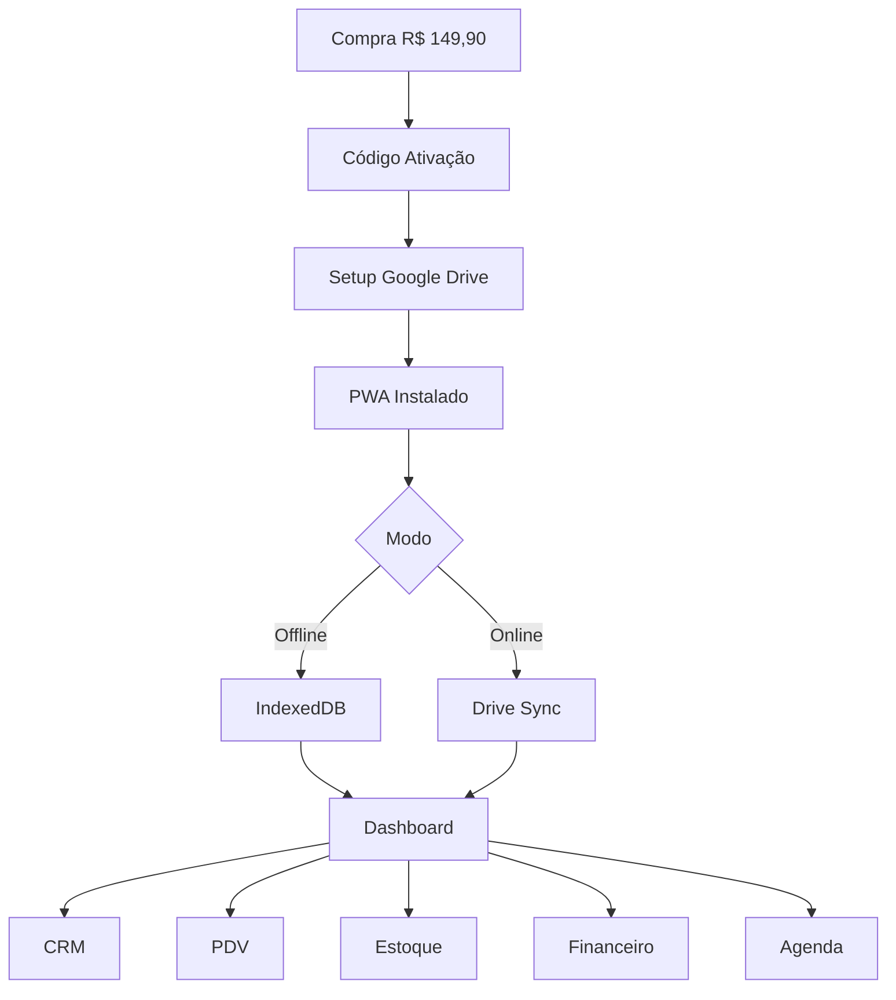
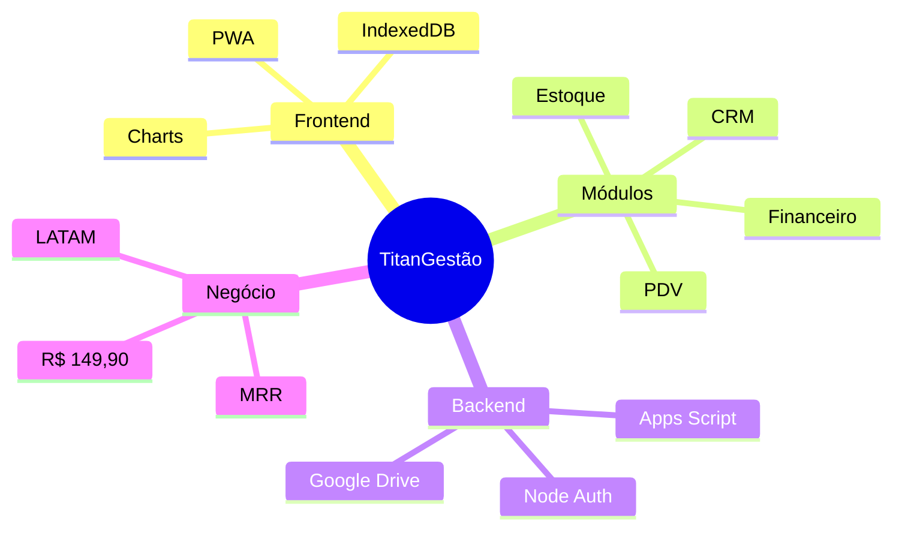

# 🚀 TitanGestão PRO - Sistema Completo de Gestão

**Versão:** 3.0 Híbrida  
**Status:** Documentação Consolidada + Nova Arquitetura em Análise  
**Lançamento:** Faseado (v1.0 Março 2026, v2.0 Julho 2026)

[](https://github.com/LucassVal/SAAS)
[]()

---

## 📑 ÍNDICE RÁPIDO

### Documentação Essencial

- [Diagramas Visuais](#-diagramas-visuais) - Fluxograma e Mapa Mental
- [Visão Geral](#-visão-geral) - O que é o produto
- [Arquitetura](#-arquitetura) - Como funciona tecnicamente
- [Modelo de Negócio](#-modelo-de-negócio) - Pricing e estratégia
- [Roadmap](#-roadmap) - Plano de implementação
- [Comparação Arquiteturas](#-comparação-arquiteturas-nova) - v1.0 vs v2.0
- [Documentos Detalhados](#-documentação-completa) - Todos os arquivos

---

## 🎨 DIAGRAMAS VISUAIS

### Fluxograma Completo do Sistema



### Mapa Mental Arquitetura



---

## 🎯 VISÃO GERAL

### O Que É

**TitanGestão PRO:** Sistema PWA híbrido de gestão empresarial (CRM + PDV + Estoque + Financeiro) que funciona offline e online, com dados na nuvem do cliente.

**Diferenciais:**

- ✅ Funciona offline após primeiro login
- ✅ Dados no Google Drive DO CLIENTE (privacidade total)
- ✅ Pagamento único R$ 149,90 base
- ✅ Multi-dispositivo sincronizado
- ✅ PWA instalável como app
- ✅ Até 10 usuários incluídos

### Para Quem Serve

| Público                 | Uso Principal         | Benefício                     |
| ----------------------- | --------------------- | ----------------------------- |
| **Lojistas**            | PDV + Estoque         | Controle vendas e produtos    |
| **E-commerce/Delivery** | PDV + Etiquetas Envio | Gestão pedidos + rastreamento |
| **Prestadores Serviço** | CRM + Agenda          | Gestão clientes/agendamentos  |
| **Barbearias/Salões**   | CRM + Agenda + PDV    | Tudo integrado                |
| **Consultores**         | CRM + Orçamentos      | Funil de vendas profissional  |
| **Pequenas Empresas**   | CRM + Financeiro      | Organização completa          |

> **E-commerce v1.0:** Geração manual de etiquetas (Correios, Jadlog, Loggi). Integrações API (Mercado Livre, Shopee) em v2.5+

**Mercado:** 9,3M PMEs Brasil + 26M LATAM sem sistema adequado  
**Preço concorrente:** R$ 720-1.800/ano  
**TitanGestão:** R$ 149,90 para sempre

📄 **Detalhes:** [GUIA_PROJETO.md](GUIA_PROJETO.md)

---

## 🏗️ ARQUITETURA

### Stack Tecnológico

```
Frontend:
├─ HTML5 + CSS3 + JavaScript ES6+
├─ PWA (Service Worker + Manifest)
├─ IndexedDB (offline storage)
└─ Chart.js (gráficos)

Backend/Sync:
├─ Google Apps Script (merge engine)
├─ Node.js + Express (auth)
├─ MongoDB Atlas (usuários/licenças)
└─ Google Drive API

APIs:
├─ Google Maps API (autocomplete endereço)
├─ Google OAuth 2.0
└─ Gemini API (IA v2.0)
```

### Como Funciona

**Fluxo Completo:**

1. **Compra:** Kiwify/Hotmart → Recebe código ativação
2. **Setup:** Ativa em tocadobarbaro.com + conecta Google Drive
3. **Offline:** PWA cacheia tudo (IndexedDB + Service Worker)
4. **Sync:** Mudanças locais → Drive → Apps Script merge → Multi-user

**Multi-Usuário:**

- Apps Script processa `mudancas.json` a cada 3s
- Merge inteligente campo por campo
- Last-write-wins por timestamp
- Suporta 10 usuários simultâneos

📄 **Detalhes:** [ARQUITETURA_COMPLETA.md](ARQUITETURA_COMPLETA.md)

---

## 💰 MODELO DE NEGÓCIO

### Pricing Híbrido

**Base (Pagamento Único):**

- R$ 149,90 vitalício
- CRM + PDV + Estoque + Financeiro + Agenda
- Até 10 usuários incluídos
- Google Maps autocomplete incluído
- White label completo
- PWA offline + multi-dispositivo

**MRR Opcional:**

- Usuários 11-20: +R$ 59,90/mês
- Usuários 21-50: +R$ 99,90/mês
- Usuários 51+: +R$ 149,90/mês
- IA WhatsApp 24/7: +R$ 47/mês (v2.0)

### Canais de Venda (Multi-Canal 12 meses)

| Canal            | Comissão | Lucro/Venda | Meta Ano 1 | % Mix |
| ---------------- | -------- | ----------- | ---------- | ----- |
| **Kiwify**       | 65%      | R$ 52       | 600 vendas | 40%   |
| **Hotmart**      | 70%      | R$ 45       | 450 vendas | 30%   |
| **Site Próprio** | 50-55%   | R$ 75       | 450 vendas | 30%   |

**Total Ano 1:** 1.500 vendas Brasil + 550 LATAM = **R$ 110.175 lucro**

### Expansão LATAM (v1.0)

**Mercados:** México, Argentina, Colômbia, Chile  
**Preço:** $39 USD (~R$ 195)  
**Adaptações:** i18n (ES), moeda auto-detect, telefone internacional

📄 **Detalhes:** [ESTRATEGIA_NEGOCIO.md](ESTRATEGIA_NEGOCIO.md)

---

## 📋 FUNCIONALIDADES

### Módulos Core (v1.0)

**1. CRM**

- CRUD clientes + histórico unificado
- Tags captação customizáveis
- Telefone internacional (país + formato auto)
- Google Maps autocomplete (endereço padronizado)
- Campos customizáveis dinâmicos
- Funil Kanban arrastar-soltar
- Importação Excel (CSV/XLSX)
- Orçamentos PDF com logo
- Filtros avançados
- WhatsApp manual (botão direto)

**2. PDV**

- Interface simples (canhoto/digital WhatsApp)
- Formas: Dinheiro, PIX manual, Cartão registro
- Recibos PDF (enviar WhatsApp)
- Baixa estoque automática
- Controle caixa (abertura, fechamento, sangria)
- **Etiquetas Envio** (Correios, Jadlog, Loggi) ← **NOVO**

**3. Estoque**

- CRUD produtos (código, descrição, preço, foto)
- Moviment

ações (entrada, saída, transferência)

- Alertas estoque mínimo
- Relatórios (Curva ABC, giro, parados)
- ⚠️ Multi-local: Aumenta complexidade, avaliar necessidade

**4. Financeiro**

- Contas a pagar/receber
- Categorias despesas/receitas
- DRE simplificado
- Fluxo de caixa (30-60-90 dias)
- Conciliação caixa

**5. Agenda + WhatsApp**

- Calendário mensal visual
- Tipos personalizáveis (reunião, ligação, visita)
- Vínculo cliente (histórico CRM)
- WhatsApp manual (scripts opcionais automação)

**6. Multi-Usuário**

- Até 10 usuários base (11+ = MRR)
- Níveis customizáveis (Admin, Gerente, Vendedor, etc)
- Permissões granulares
- Sync tempo real (Apps Script 3s)
- Auditoria completa (log alterações)

**7. White Label**

- Upload logo (Base64)
- Paleta cores (CSS Variables)
- Google Fonts
- Nome sistema customizado
- Ícone PWA

📄 **Detalhes:** [FEATURES.md](FEATURES.md) | [UI_MOCKUP_CADASTRO.md](UI_MOCKUP_CADASTRO.md)

---

## 🗺️ ROADMAP

### Sprint 1: Infraestrutura (29 Jan - 4 Fev)

- Google Cloud setup
- Apps Script deploy
- OAuth Google Drive
- Backend Node.js (auth básico)

### Sprint 2: PWA Core (5-11 Fev)

- Service Worker
- IndexedDB
- Sync queue

### Sprint 3-4: CRM Features (12-25 Fev)

- Tags captação
- Telefone internacional
- Google Maps
- Campos customizáveis
- White label
- Excel import

### Sprint 5: PDV + Estoque (26 Fev - 4 Mar)

- PDV básico
- Estoque movimentações
- Etiquetas envio ← **NOVO**

### Sprint 6: Integração (5-7 Mar)

- Dashboard unificado
- Multi-usuário sync
- Relatórios

### Sprint 7-8: Beta + Launch (8-15 Mar)

- Testes beta
- Correções
- VSL + Landing
- **LANÇAMENTO: 15 Março 2026** 🚀

### v2.0 (Junho 2026)

- IA WhatsApp 24/7
- Email marketing
- Workflows automação

📄 **Detalhes:** [ROADMAP.md](ROADMAP.md)

---

## 🆚 COMPARAÇÃO ARQUITETURAS **[NOVA]**

### Contexto

Recebemos proposta de nova arquitetura **"Agente Foda"** com mudanças significativas:

| Aspecto             | TitanGestão v1.0 (Atual) | "Agente Foda" (Proposta)          |
| ------------------- | ------------------------ | --------------------------------- |
| **Apps Script**     | Centralizado (nosso)     | Distribuído (cada cliente)        |
| **Dados**           | JSON (IndexedDB + Drive) | Google Sheets                     |
| **Modularização**   | Monolito HTML            | Modular (CLASP + VS Code)         |
| **IA**              | v2.0 opcional            | Core v1.0                         |
| **Multi-Loja**      | Não                      | Sim (ID_LOJA obrigatório)         |
| **Integrações**     | Básicas                  | iFood + WhatsApp + Hardware dia 1 |
| **Desenvolvimento** | 8 semanas                | 20-24 semanas                     |
| **Pricing**         | R$ 149,90 único          | R$ 97-197/mês SaaS                |

### Decisões Pendentes

Análise completa em: **[COMPARACAO_ARQUITETURAS.md](COMPARACAO_ARQUITETURAS.md)**

**Opções:**

- **A)** Pivô total (adotar "Agente Foda", lançar Julho)
- **B)** Faseamento (v1.0 simples Março, v2.0 completo Julho)
- **C)** Manter atual (TitanGestão docs atuais)

---

## 📚 DOCUMENTAÇÃO COMPLETA

### 📖 Documentos Principais (9 arquivos)

| Documento                                                    | Descrição                                 |
| ------------------------------------------------------------ | ----------------------------------------- |
| **[README.md](README.md)**                                   | 👈 Você está aqui - Índice completo       |
| **[GUIA_PROJETO.md](GUIA_PROJETO.md)**                       | Decisões, regras ouro, features completas |
| **[ARQUITETURA_COMPLETA.md](ARQUITETURA_COMPLETA.md)**       | Stack, Apps Script, PWA, setup dev        |
| **[ESTRATEGIA_NEGOCIO.md](ESTRATEGIA_NEGOCIO.md)**           | Pricing, mercado, marketing, LATAM        |
| **[ROADMAP.md](ROADMAP.md)**                                 | 8 sprints implementação                   |
| **[FEATURES.md](FEATURES.md)**                               | 89 funcionalidades detalhadas             |
| **[FAQ.md](FAQ.md)**                                         | Perguntas frequentes                      |
| **[FUTURO_IA.md](FUTURO_IA.md)**                             | Roadmap IA v2.0+                          |
| **[COMPARACAO_ARQUITETURAS.md](COMPARACAO_ARQUITETURAS.md)** | v1.0 vs "Agente Foda"                     |

### 📦 Arquivos Especiais

| Arquivo                                              | Descrição                          |
| ---------------------------------------------------- | ---------------------------------- |
| **[UI_MOCKUP_CADASTRO.md](UI_MOCKUP_CADASTRO.md)**   | Mockup completo interface cadastro |
| **[BACKUP_CONSOLIDACAO.md](BACKUP_CONSOLIDACAO.md)** | Backup docs antiga consolidação    |
| **[\_archive/](_archive/)**                          | Documentos antigos preservados     |

---

## 🔧 Quick Start Desenvolvedor

### Setup Local

```bash
# 1. Clone
git clone https://github.com/LucassVal/SAAS.git
cd SAAS

# 2. Abrir CRM
# Método 1: Duplo clique CRM.html
# Método 2: Servidor local
python -m http.server 8000
# http://localhost:8000/CRM.html
```

### Estrutura Projeto

```
SAAS/
├── CRM.html                      # Sistema completo (218KB)
├── README.md                     # 👈 Este arquivo
├── ROADMAP.md                    # Plano implementação
├── ARQUITETURA_COMPLETA.md       # Docs técnica
├── FEATURES.md                   # Lista features
├── FAQ.md                        # Perguntas
├── _archive/                     # Docs antigas
├── dados/                        # JSON local
└── scripts/                      # Utilitários
```

📄 **Setup Completo:** Ver seção "Setup Desenvolvimento" em [ARQUITETURA_COMPLETA.md](ARQUITETURA_COMPLETA.md)

---

## 📞 Contato

**Desenvolvedor:** Lucas Valério  
**GitHub:** [@LucassVal](https://github.com/LucassVal)  
**Repositório:** [LucassVal/SAAS](https://github.com/LucassVal/SAAS)  
**Website:** tocadobarbaro.com (em desenvolvimento)

---

## 📄 Licença

**Proprietário:** Lucas Valério  
**Uso Comercial:** Reservado  
**Código:** Privado

© 2026 TitanGestão PRO - Todos os direitos reservados

---

**Última Atualização:** 19 Janeiro 2026  
**Versão Documentação:** 3.0  
**Status:** Arquitetura em decisão (v1.0 vs v2.0)
