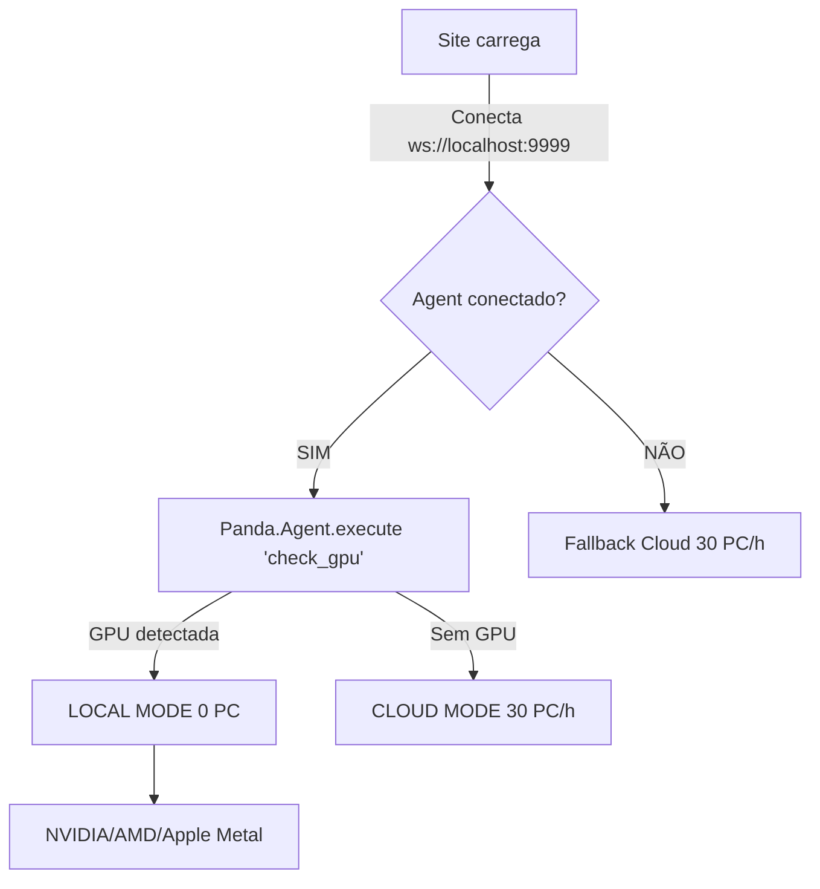
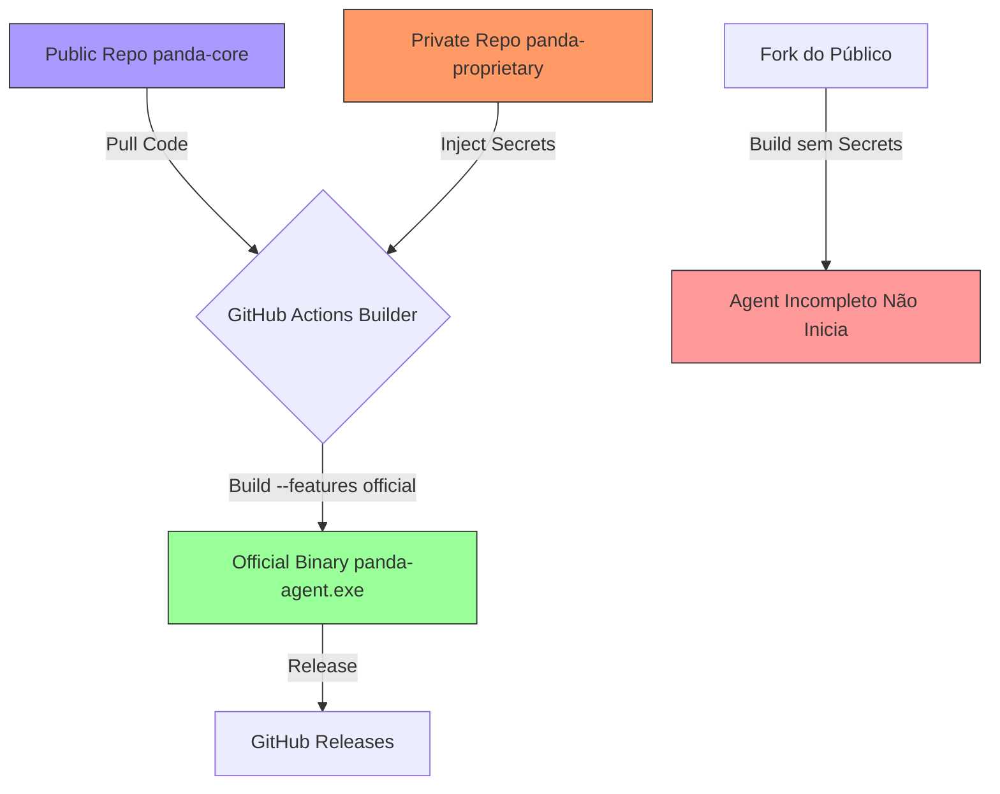

# 🐼 Panda Factory (PF) - Modular Operating System

> **Single Source of Truth** | Versão 4.0.0 | [Repositório Oficial](https://github.com/LucassVal/SAAS)

**Sistema operacional modular para desenvolvedores.** Infraestrutura Google simplificada, IA integrada, marketplace de módulos.

> [!TIP]
> **v4.0.0:** Arquitetura PF completa, Rust Agent MCP+RIG, Multi-User, Token Billing. [Ver Changelog](#changelog)

---

## 📚 Enciclopédia - Índice Mestre

### Documentação Técnica

| Doc                       | Descrição                         | Link                                                        |
| ------------------------- | --------------------------------- | ----------------------------------------------------------- |
| **📖 Arquitetura Mestre** | Documento completo (~2300 linhas) | [PF_MASTER_ARCHITECTURE.md](docs/PF_MASTER_ARCHITECTURE.md) |

### Navegação Rápida

| Seção               | Conteúdo                         | Ir para                                   |
| ------------------- | -------------------------------- | ----------------------------------------- |
| 🎯 **Visão Geral**  | O que é o Panda Factory          | [#visão-geral](#-visão-geral)             |
| 🏗️ **Arquitetura**  | Hub + Descentralizado            | [#arquitetura](#️-arquitetura)             |
| 🦀 **Rust Agent**   | MCP, RIG, GPU, Multi-User        | [#rust-agent](#-rust-agent)               |
| 📜 **Panda SDK**    | Slots, Adapters, Core Protection | [#panda-sdk](#-panda-sdk)                 |
| 📜 **GAS Backend**  | Serverless, Multi-tenant         | [#gas-backend](#-gas-backend)             |
| 🔥 **Firebase**     | Colmeia, Cells, Signaling        | [#firebase](#-firebase)                   |
| 🏪 **Store**        | Módulos, Dev Split, Pricing      | [#store](#-store)                         |
| 💰 **Economia**     | Tokens, Planos, Billing          | [#economia](#-economia)                   |
| 🏷️ **Convenção PF** | Prefixos, Nomes, Estrutura       | [#convenção-pf](#️-convenção-pf)           |
| 🚀 **Roadmap**      | 12 semanas de implementação      | [#roadmap](#-roadmap)                     |
| 🔒 **Segurança**    | Zero-Knowledge, Proteções        | [#segurança](#-segurança--zero-knowledge) |
| 🚀 **Onboarding**   | The Gate, Trial Mode             | [#onboarding](#-onboarding-the-gate)      |
| 🤖 **Automação**    | Bots, IP Rotation, HUD           | [#automação](#-automação--bot-services)   |
| 🤝 **Afiliados**    | Revenue Share Perpétuo           | [#afiliados](#-programa-de-afiliados)     |
| 🔐 **Open Core**    | GitHub, Fork Protection          | [#open-core](#-open-core-github)          |
| 📋 **Changelog**    | Histórico de versões             | [#changelog](#-changelog)                 |

---

## 🎯 Visão Geral

**Missão:** Democratizar infraestrutura Google para desenvolvedores.

> "Ganhamos na quantidade. Ajudamos os pequenos a crescerem."

**Proposta de valor:** GAS e Firebase são gratuitos/baratos. Repassamos a economia e cobramos pela **inteligência e conveniência** (SDK + Agent).

```text
┌─────────────────────────────────────────────────────────────┐
│                    PANDA FACTORY                            │
├─────────────────────────────────────────────────────────────┤
│                                                             │
│  🖥️ BROWSER                  🦀 RUST AGENT                  │
│  ├── Panda UI                ├── 🧠 RIG (Cérebro IA)        │
│  ├── Módulos                 ├── Cache Manager              │
│  └── SDK JavaScript          ├── MCP Server                 │
│           │                  ├── GPU Detection              │
│           │                  └── Multi-User                 │
│           │                         │                       │
│           └────────┬────────────────┘                       │
│                    │                                        │
│           ┌────────▼────────┐                               │
│           │   PANDA SDK     │  ← Tradutor Universal         │
│           └────────┬────────┘                               │
│                    │                                        │
│      ┌─────────────┼─────────────┐                          │
│      ▼             ▼             ▼                          │
│  ┌───────┐    ┌───────┐    ┌───────┐                       │
│  │ GAS   │    │Firebase│    │ APIs  │                       │
│  │Backend│    │Signaling│   │Externas│                      │
│  └───────┘    └───────┘    └───────┘                       │
│                                                             │
└─────────────────────────────────────────────────────────────┘

⭐ Rust é INFRAESTRUTURA (Cache, GPU, MCP) + CÉREBRO (RIG Multi-Provider)
```

📖 **Detalhes:** [Seção 1 - Arquitetura](docs/PF_MASTER_ARCHITECTURE.md#1-visão-geral-da-arquitetura)

---

## 🏗️ Arquitetura

### Hub Central + Descentralizado

| Centralizado (Panda) | Descentralizado (Cliente) |
| -------------------- | ------------------------- |
| HTML/Updates         | GAS Backend               |
| Panda Coins (Ledger) | Drive Storage             |
| Store/Registry       | Processamento             |

### Componentes Principais

| Componente      | Função                      | Tecnologia         |
| --------------- | --------------------------- | ------------------ |
| **Rust Agent**  | Cache, GPU, MCP, Multi-User | Rust + Tauri       |
| **Panda SDK**   | Tradutor universal          | JavaScript         |
| **GAS Backend** | Serverless                  | Google Apps Script |
| **Firebase**    | Signaling, Cells            | Realtime DB        |

📖 **Detalhes:** [Seções 1-4](docs/PF_MASTER_ARCHITECTURE.md#1-visão-geral-da-arquitetura)

### 📁 Estrutura de Pastas (Web/Client + Backend DDD)

> **Nota:** Organização client-side e backend (GAS) unificada.

```text
📁 PandaFactory/
├── 📁 components/ui/             # Componentes Web Globais
├── 📁 js/
│   ├── 📁 kernel/                # Event Bus & Loader
│   └── 📁 ui/                    # Controllers de Interface
├── 📁 backend/                   # Google Apps Script (DDD)
│   ├── 📁 core/                  # Dispatcher & Config
│   └── 📁 domains/               # "Chapéus" de Negócio
│       ├── 📁 finance/           # Wallet, Fiat, Crypto
│       ├── 📁 store/             # Registry, Sales
│       └── 📁 automation/        # Bots, Farms
└── README.md
```

---

## 🦀 Rust Agent

O motor local que roda no PC do cliente.

### Funcionalidades

| Feature           | Descrição                                        |
| ----------------- | ------------------------------------------------ |
| **MCP Tools**     | fs_read, fs_write, gpu_check, notify, automation |
| **RIG Framework** | Multi-provider (Gemini, Claude, OpenAI)          |
| **Token Meter**   | Contagem e billing por provider                  |
| **Multi-User**    | Sessões isoladas por usuário                     |
| **Self-Update**   | Atualização automática                           |
| **GPU Detection** | NVIDIA CUDA, AMD ROCm, Intel, Apple Metal        |

### 17.6 GPU Detection Flow & Economy



### Modal de Economia

```text
┌─────────────────────────────────────────┐
│ 🖥️ GPU Detectada: NVIDIA RTX 3080      │
│ ⚡ Modo: LOCAL (0 tokens/hora)          │
│ 💰 Economia estimada: 720 PC/dia       │
└─────────────────────────────────────────┘
```

### MCP Tools Disponíveis

```rust
enum McpTool {
    FsRead, FsWrite, FsList,      // Filesystem
    GpuCheck, GpuProcess,          // GPU
    Notify, Clipboard,             // System
    MouseMove, KeyboardType,       // Automation
    ScreenCapture, OcrRegion,      // Vision
    OverlayShow, OverlayHide,      // HUD
}
```

📖 **Detalhes:** [Seção 17 - Rust Deep Dive](docs/PF_MASTER_ARCHITECTURE.md#17--rust-agent-deep-dive---mcp--rig--multi-user)

---

## 📜 Panda SDK

O "colchão" que abstrai toda a complexidade.

### Slots Modulares

| Slot        | Default       | Adapters Premium              |
| ----------- | ------------- | ----------------------------- |
| **Data**    | Google Sheets | MongoDB, PostgreSQL, Supabase |
| **Brain**   | Gemini Flash  | Claude, GPT-4, Llama Local    |
| **GPU**     | Cloud         | CUDA, ROCm, WebGPU            |
| **Render**  | -             | Three.js, Babylon, PixiJS     |
| **Network** | Fetch         | Proxy Pool, VPN               |

### Uso

```javascript
// Simples assim:
Panda.Data.save('clients', data);
Panda.Brain.chat('Analise isso');
Panda.Bridge.execute('gpu_process', {...});
```

📖 **Detalhes:** [Seção 3 - SDK](docs/PF_MASTER_ARCHITECTURE.md#3-camada-2-panda-sdk-abstração)

---

## 📜 GAS Backend

Backend serverless usando Google Apps Script.

### Services

| Service              | Função               |
| -------------------- | -------------------- |
| **PF_Core_Auth**     | Login, OAuth, Tokens |
| **PF_Core_Database** | CRUD Sheets/Drive    |
| **PF_Core_Wallet**   | Panda Coins (Ledger) |
| **PF_Core_Billing**  | Quotas, Cobrança     |
| **PF_Core_Monitor**  | Tracking de uso      |

### Multi-Tenant

> **Definição Ghost Cells:** Planilhas onde o cliente vê apenas seus dados, mas o sistema vê todos.

```text
┌─────────────────────────────────────────────────────────────────┐
│                    ESTRUTURA MULTI-TENANT                       │
├─────────────────────────────────────────────────────────────────┤
│  TENANT (Loja/Empresa)                                          │
│  ├── config.json          → Configurações específicas           │
│  ├── users/               → Multi-usuário por tenant            │
│  │   ├── user_001.json                                          │
│  │   └── user_002.json                                          │
│  ├── modules/             → Módulos ativados                    │
│  │   ├── fiscal/          → NFe, NFCe, SPED                     │
│  │   ├── crm/             → Clientes, Leads                     │
│  │   └── store/           → Produtos, Estoque                   │
│  └── data/                → Planilhas com Ghost Cells           │
│      ├── clientes.sheet   → [ID, Nome, ..., __ghost__]          │
│      └── vendas.sheet     → [ID, Data, ..., __ghost__]          │
└─────────────────────────────────────────────────────────────────┘
```

Cada cliente tem dados isolados em sua própria planilha.

📖 **Detalhes:** [Seção 4 - GAS](docs/PF_MASTER_ARCHITECTURE.md#4-camada-3-gas-backend-serverless)

---

## 🔥 Firebase

Arquitetura "Colmeia" com células isoladas.

### Estrutura

```json
{
  "pf_core": { "version": "1.0.0", "status": "ONLINE" },
  "pf_cells": {
    "user_001": { "profile": {}, "usage": {}, "data": {} },
    "user_002": { "profile": {}, "usage": {}, "data": {} }
  }
}
```

### Uso

| Função        | Path                         |
| ------------- | ---------------------------- |
| **Signaling** | `/cells/{uid}/command_queue` |
| **Status**    | `/cells/{uid}/agent_status`  |
| **Usage**     | `/cells/{uid}/usage/{date}`  |

📖 **Detalhes:** [Seção 4.2 - Firebase Colmeia](docs/PF_MASTER_ARCHITECTURE.md#42-firebase-colmeia)

---

## 🏪 Store

Marketplace de módulos para desenvolvedores.

### Modelos de Monetização

| Modelo              | Split                | Descrição                 |
| ------------------- | -------------------- | ------------------------- |
| **Grátis + Energy** | 70% Dev / 30% Panda  | Dev ganha % sobre consumo |
| **Venda Direta**    | Dev define preço     | Compra com Panda Coins    |
| **Bundle Externo**  | 50% desconto atacado | Via Hotmart/Kiwify        |

### Fluxo Dev → Store → Cliente

```
Dev → Desenvolve → Submete → Review → Publica
Cliente → Navega → Compra (PC) → Instala → Usa
```

📖 **Detalhes:** [Seção 7 - Comunidade](docs/PF_MASTER_ARCHITECTURE.md#7-comunidade-github--registry)

---

## 💰 Economia

### Planos

| Plano        | Preço          | Tokens/mês | GPU Cloud  |
| ------------ | -------------- | ---------- | ---------- |
| **Free**     | R$ 0           | 100K       | ❌         |
| **Starter**  | R$ 9,90/mês    | 500K       | 10 min     |
| **Pro**      | R$ 29,90/mês   | 2M         | 60 min     |
| **Business** | R$ 99,90/mês   | 10M        | 300 min    |
| **Lifetime** | R$ 150 (único) | 500K/mês   | 10 min/mês |

### Custo por Modelo

| Modelo       | PC/1K input | PC/1K output |
| ------------ | ----------- | ------------ |
| Gemini Flash | 0.03        | 0.10         |
| Claude Haiku | 0.06        | 0.30         |
| GPT-4o-mini  | 0.04        | 0.15         |
| Llama Local  | 0.00        | 0.00         |

📖 **Detalhes:** [Seção 16 - Economia](docs/PF_MASTER_ARCHITECTURE.md#16--economia--pricing)

---

## 🏷️ Convenção PF

Prefixos padronizados em todo o ecossistema.

| Contexto      | Prefixo  | Exemplo              |
| ------------- | -------- | -------------------- |
| Repos GitHub  | `pf-`    | `pf-sdk`, `pf-agent` |
| Arquivos JS   | `pf.`    | `pf.core.js`         |
| Arquivos GAS  | `PF_`    | `PF_Core_Auth.gs`    |
| CSS Variables | `--pf-`  | `--pf-primary`       |
| API Pública   | `Panda.` | `Panda.Data`         |
| Internals     | `PF.`    | `PF._cache`          |

📖 **Detalhes:** [Seção 13 - Convenção](docs/PF_MASTER_ARCHITECTURE.md#13-%EF%B8%8F-convenção-de-nomes-pf-panda-fabrics)

---

## 🚀 Roadmap

### 12 Semanas para v1.0

| Fase           | Semanas | Entrega                       |
| -------------- | ------- | ----------------------------- |
| **Rust Agent** | 1-3     | Firebase, Cache, GPU, MCP     |
| **PF-SDK**     | 4-6     | Slots, Adapters, Offline      |
| **PF-Factory** | 7-9     | UI Components, Modules        |
| **PF-Store**   | 10-12   | Registry, Payments, Dashboard |

```text
Semana:  1  2  3  4  5  6  7  8  9  10 11 12
RUST  ═══█══█══█══┐
SDK              └══█══█══█══┐
FACTORY                      └══█══█══█══┐
STORE                                    └══█══█══█
```

📖 **Detalhes:** [Seção 15 - Roadmap](docs/PF_MASTER_ARCHITECTURE.md#15--roadmap-de-implementação)

---

## 🔒 Segurança & Zero-Knowledge

### Princípio Fundamental

> **"A Panda Fabrics não recebe dados. Recebe apenas telemetria de consumo."**

### O que o Rust ENVIA

| Dado            | Permitido |
| --------------- | --------- |
| uptime_seconds  | ✅        |
| energy_consumed | ✅        |
| status          | ✅        |

### O que NUNCA sai do PC

| Dado                 | Bloqueado |
| -------------------- | --------- |
| Conteúdo de arquivos | ❌        |
| Dados de clientes    | ❌        |
| Screenshots          | ❌        |
| API keys             | ❌        |

### Proteções

| Ataque           | Proteção                     |
| ---------------- | ---------------------------- |
| DDoS             | Rate limiting (1000 req/dia) |
| Data Leakage     | Células isoladas             |
| Malicious Module | Assinatura digital           |
| Abuse            | Revogação instantânea        |

> Agent é **Open Source** - audite em github.com/pandafabrics/panda-agent

📖 **Detalhes:** [Seção 8 - Zero-Knowledge](docs/PF_MASTER_ARCHITECTURE.md#8-zero-knowledge-cloud)

---

## 🚀 Onboarding (The Gate)

### Fluxo de Cadastro

```text
1. Cadastro Web → 2. The Gate → 3. Download → 4. Desbloqueio
```

| Passo | Descrição                           |
| ----- | ----------------------------------- |
| **1** | Email + Senha                       |
| **2** | Aceita termos (processamento local) |
| **3** | Baixa Panda Agent                   |
| **4** | Agent conecta → UI desbloqueia      |

### Rust é Obrigatório

> **Sem trial.** O Agent é o coração do sistema.

| Aspecto              | Detalhe                       |
| -------------------- | ----------------------------- |
| **Open Source**      | Código auditável no GitHub    |
| **Binário assinado** | Builds oficiais verificáveis  |
| **Compilável**       | Dev pode buildar do source    |
| **Código autoral**   | Proprietário mas transparente |

📖 **Detalhes:** [Seção 9 - Onboarding](docs/PF_MASTER_ARCHITECTURE.md#9-fluxo-de-onboarding)

---

## 🤖 Automação & Bot Services

100% **client-side** - Panda não vê o que você faz.

### Capacidades

| Feature            | Descrição                          |
| ------------------ | ---------------------------------- |
| **IP Rotation**    | Proxy Pool, WireGuard VPN          |
| **Fingerprinting** | Multi-account isolado              |
| **Overlay HUD**    | Dashboard transparente sobre games |
| **Automation**     | Mouse, Keyboard, OCR               |

### MCP Tools

| Tool           | Uso             |
| -------------- | --------------- |
| `rotate_ip`    | Anti-ban        |
| `mouse_move`   | Bot de jogo     |
| `ocr_region`   | Leitura de tela |
| `overlay_show` | Dashboard HUD   |

📖 **Detalhes:** [Seção 5.1 - Bot Services](docs/PF_MASTER_ARCHITECTURE.md#51-serviços-para-bots-farms--automação)

---

## 🤝 Programa de Afiliados

### Modelo

| Tipo                 | Ganho                            |
| -------------------- | -------------------------------- |
| **Indicação direta** | 5% sobre vendas do indicado      |
| **Perpétuo**         | Ganha em TODAS as vendas futuras |

### Exemplo

```text
Dev A indica Dev B
Dev B vende 100 PC → Dev A ganha 5 PC
Dev B vende 1000 PC → Dev A ganha 50 PC
(para sempre!)
```

📖 **Detalhes:** [Seção 11 - Afiliados](docs/PF_MASTER_ARCHITECTURE.md#11--store-dos-devs--monetização)

---

## 🔐 Open Core (GitHub)

### Fluxo de Proteção e Build



### Estratégia de Proteção

| Aspecto          | Detalhe                                |
| ---------------- | -------------------------------------- |
| **Repo Público** | `panda-core` - Código auditável        |
| **Repo Privado** | `panda-proprietary` - Lógica secreta   |
| **Fork**         | Build não-oficial = Não inicia         |
| **Oficial**      | GitHub Actions funde público + privado |

### Compilação Condicional

```rust
#[cfg(feature = "official_build")]
fn init_core() { panda_proprietary::start(); }

#[cfg(not(feature = "official_build"))]
fn init_core() { eprintln!("⚠️ Baixe oficial em panda.dev"); }
```

### Resultado

| Cenário       | Resultado           |
| ------------- | ------------------- |
| Baixa oficial | ✅ Funciona, grátis |
| Audita código | ✅ Transparente     |
| Faz fork      | ❌ Não inicia       |

📖 **Detalhes:** [Seção 18 - Open Core](docs/PF_MASTER_ARCHITECTURE.md#18--open-core-strategy-github)

---

## 📋 Changelog

### [4.0.0] - 2026-01-21

#### 🚀 Arquitetura Completa

- **PF_MASTER_ARCHITECTURE.md**: Documento unificado (~2300 linhas)
- **Rust Agent Deep Dive**: MCP + RIG + Multi-User + Token Meter
- **Firebase Colmeia**: Arquitetura de células isoladas
- **SDK Modular**: Sistema de slots e adapters
- **Economia Completa**: Planos, tokens, billing

#### 🏷️ Convenção PF

- Prefixos padronizados (`pf-`, `PF_`, `--pf-`, `Panda.`)
- Estrutura de pastas documentada
- Naming conventions para código

#### 📊 Pricing

- Modelo híbrido: 100K grátis + planos
- Lifetime R$ 150
- Dev Split 70/30

---

### [3.0.0] - 2026-01-20

#### 🚀 Novo

- **Panda Factory**: Rename de "CRM" para sistema modular
- **Kernel Isolado**: `js/panda.core.js`
- **Module Loader**: Sistema dinâmico
- **Store Module**: Marketplace integrado

---

### [2.4.0] - 2026-01-20

#### 🎨 Adicionado

- Premium Header (Glassmorphism)
- Omni Search Bar integrada
- Gradient Background Radial

---

---

## 🔗 Links Úteis

| Recurso                  | Link                                                             |
| ------------------------ | ---------------------------------------------------------------- |
| **Arquitetura Completa** | [docs/PF_MASTER_ARCHITECTURE.md](docs/PF_MASTER_ARCHITECTURE.md) |
| **Repositório GitHub**   | [github.com/LucassVal/SAAS](https://github.com/LucassVal/SAAS)   |

---

© 2026 Panda Fabrics (PF) - **Building the Developer Soil.**
