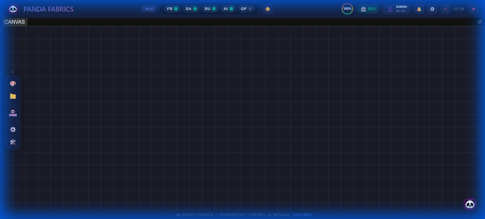
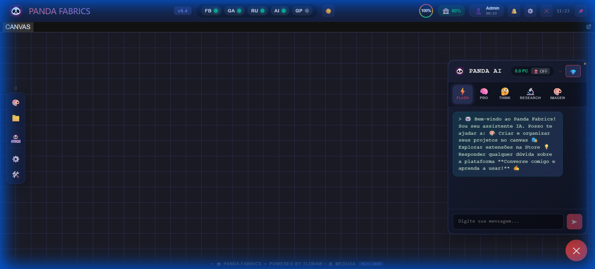

<p align="center">
  
</p>

<h1 align="center">🐼 Panda Factory</h1>

<p align="center">
  <strong>AI-Powered Micro-SaaS Runtime — Built Entirely on Google Infrastructure</strong><br>
  <em>"From PhD to Favela" — Democratizing software for underserved markets</em>
</p>

<p align="center">
  
  
  
  
  
</p>

<p align="center">
  <a href="#-live-demo">Live Demo</a> •
  <a href="#-vision--problem">Vision</a> •
  <a href="#-google-first-architecture">Architecture</a> •
  <a href="#-medusa-distribution-engine">Medusa Engine</a> •
  <a href="#-core-innovation">Innovation</a> •
  <a href="#-roadmap">Roadmap</a> •
  <a href="#-contact">Contact</a>
</p>

---

## 🤝 Why We Want to Join Google for Startups

We are applying for the **Google for Startups** program because Panda Factory is not just _built on_ Google — it **is** Google infrastructure, packaged for the next 3.8 billion internet users who can't afford traditional SaaS.

### What We Bring to Alphabet

| Value for Google                | How                                                                                                               |
| ------------------------------- | ----------------------------------------------------------------------------------------------------------------- |
| **Direct API Revenue**          | Every user generates ~500K Gemini tokens/month, Firebase connections, Drive storage, and Colab sessions           |
| **Emerging Market Penetration** | We reach micro-businesses in Brazil & LATAM that don't yet use Google Cloud — we onboard them natively            |
| **Gemini Showcase**             | Our AI Chat proves that Gemini can power an entire product (5 models, 6 specialist personas) — not just a chatbot |
| **Google Workspace Adoption**   | Medusa Engine deeply integrates Drive, Sheets, Docs, and Colab into daily workflows for non-tech users            |
| **Developer Ecosystem**         | Our plugin marketplace trains developers to build on Google APIs (MCP + GAS + Firebase)                           |

### What We Need from Google

| Support                        | Impact                                                         |
| ------------------------------ | -------------------------------------------------------------- |
| **Gemini API credits**         | Scale from 10K → 100K users without API cost bottleneck        |
| **Firebase Blaze sponsorship** | Remove free-tier limits for real-time P2P signaling            |
| **Google Cloud credits**       | Future Cloud Run + BigQuery for analytics at scale             |
| **Technical mentorship**       | Architecture review for production-grade GAS deployment        |
| **Go-to-market support**       | Visibility in Google for Startups alumni network, LATAM events |

### What We Build Together

> **Vision**: Panda Factory becomes the **"Canva for emerging markets"** — a free, AI-powered workspace where every interaction deepens the user's relationship with Google services.

- 📊 **Google Sheets as Database** → millions of new Sheets power users
- 🧠 **Gemini as Core Brain** → demonstrating AI-native product design
- 🧪 **Google Colab as GPU** → converting free-tier users to Colab Pro
- ☁️ **Google Drive as Storage** → Drive adoption in markets where Dropbox/OneDrive dominate
- 📢 **Google Ads integration** → SMBs managing ads directly from Panda Factory

---

## 🚀 Live Demo

> **[▶ Launch Panda Fabrics](https://lucassval.github.io/Panda-Factory/)**
>
> 🔑 Demo Login: `dev` / `dev` (Developer/User mode — SDK + DevTools enabled)
>
> _Founder and Admin credentials are restricted._

---

## 🎯 Vision & Problem

### The Problem

**3.8 billion people** have internet access but lack affordable software tools. Small businesses in emerging markets pay $50–200/month for CRM, design, and analytics tools they barely use.

### Our Solution

**Panda Factory** is a browser-based micro-SaaS runtime that delivers professional software tools at near-zero cost by leveraging:

- **Google Free Tiers** as primary infrastructure (GAS, Firebase, Gemini API)
- **Client-side processing** — the browser does 90% of the work
- **P2P Compute Network** — users share idle resources for credits
- **Plugin marketplace** — community-driven extension ecosystem

> **Key Insight**: Every user generates direct demand for Google services, creating natural alignment for **Google for Startups** partnership.

---

## 🔷 Google-First Architecture

Every layer of our stack is intentionally built on Google services:

```
┌─────────────────────────────────────────────────────────────────────┐
│                    PANDA FACTORY — GOOGLE-FIRST STACK               │
├─────────────────────────────────────────────────────────────────────┤
│                                                                     │
│  🧠 AI LAYER                      ☁️ BACKEND LAYER                  │
│  ├── Gemini 2.0 Flash (chat)      ├── Google Apps Script (logic)    │
│  ├── Gemini Pro (analysis)        ├── Google Sheets (database)      │
│  ├── Gemini Imagen (generation)   ├── Google Drive (file storage)   │
│  └── Google Colab (heavy GPU)     └── Google Workspace (docs/mail)  │
│                                                                     │
│  🔐 AUTH & REALTIME               🐙 MEDUSA ENGINE                  │
│  ├── Firebase Auth (identity)     ├── GitHub (code + deploy)        │
│  ├── Firebase RTDB (signaling)    ├── Google Drive (asset sync)     │
│  └── Firebase Hosting (CDN)       └── 15+ platform tentacles       │
│                                                                     │
│  🐍 COMPUTE LAYER                 🔌 INTEGRATION                    │
│  ├── Google Colab (free GPU)      ├── Model Context Protocol (MCP)  │
│  ├── User-side WebGPU             ├── Plugin-first architecture     │
│  └── P2P Node Network             └── AI-native from day one        │
│                                                                     │
└─────────────────────────────────────────────────────────────────────┘
```

### Google Services Demand Matrix

| Google Service         | Usage in Panda Factory                       | Demand Per User/Month |
| ---------------------- | -------------------------------------------- | --------------------- |
| **Gemini API**         | Core AI chat, code generation, analysis      | ~500K tokens          |
| **Google Apps Script** | Backend logic, billing, data processing      | ~2,000 executions     |
| **Google Sheets**      | Database for users, transactions, catalog    | ~500 rows written     |
| **Firebase Auth**      | User identity and session management         | 1 active user         |
| **Firebase RTDB**      | Real-time P2P signaling, live collaboration  | ~10K reads            |
| **Google Colab**       | Heavy AI tasks (BYOC — Bring Your Own Colab) | ~4 sessions           |
| **Google Drive**       | File storage, project assets, Medusa sync    | ~100MB                |

> **Projected Impact (Y1)**: 10,000 users → **5 billion Gemini tokens/month**, 1,000 concurrent Firebase connections, 500 weekly Colab sessions.

---

## 🐙 Medusa Distribution Engine

The **Medusa Engine** is our proprietary multi-platform distribution system. Each "tentacle" connects to an external service, enabling automatic content distribution, data sync, and cross-platform operations.

### Key Integrations

```
                          ┌──────────────┐
                          │   MEDUSA     │
                          │   ENGINE     │
                          └──────┬───────┘
                                 │
     ┌──────────┬────────────────┼────────────────┬──────────┐
     │          │                │                │          │
┌────┴───┐ ┌───┴────┐ ┌────────┴────────┐ ┌────┴───┐ ┌───┴────┐
│ GitHub │ │ Google │ │   Google Ads    │ │  P2P   │ │WhatsApp│
│  Sync  │ │ Drive  │ │   + Analytics   │ │Compute │ │Business│
└────────┘ └────────┘ └─────────────────┘ └────────┘ └────────┘
     │          │                │                │          │
┌────┴───┐ ┌───┴────┐ ┌────────┴────────┐ ┌────┴───┐ ┌───┴────┐
│Firebase│ │ Google │ │    Colab GPU    │ │Twitter │ │Facebook│
│Hosting │ │ Sheets │ │   (BYOC Node)   │ │  /X    │ │  Meta  │
└────────┘ └────────┘ └─────────────────┘ └────────┘ └────────┘
```

### 🔗 GitHub Integration

- **GitHub Pages** — production deployment and CDN via Actions workflow
- **GitHub Actions** — CI/CD pipeline for automated builds (Vite → dist)
- **GitHub Repos** — source control, version management, collaboration
- **GitHub API** — plugin publishing, marketplace distribution, issue tracking

### ☁️ Google Drive Integration — User Owns Their Data

> **Philosophy**: Panda Factory never holds user data hostage. All files are saved to the **user's own Google Drive**. Panda hooks into the files via SDK to provide editing, AI processing, and distribution — but the user always owns and controls their data.

- **Asset Sync** — project files, images, and exports stored in user's own Drive
- **Template Library** — shared templates distributed via Drive folders
- **Backup & Restore** — automatic project snapshots to Drive
- **Collaboration** — shared folders for team workspaces with real-time sync
- **Zero Lock-in** — leave Panda anytime, your files stay in YOUR Google Drive

```
TRADITIONAL SAAS                    PANDA FACTORY
─────────────────                   ─────────────
Files on THEIR servers      →       Files on YOUR Google Drive
Export = pay extra          →       Already in your Drive
Platform dies = data lost   →       Data survives forever
Vendor lock-in              →       Zero lock-in
```

> **For Google**: This means every Panda user becomes a **Google Drive power user** — increasing storage consumption, API calls, and potential Google One upgrades.

### Tentacle Status

| Tentacle                 | Platform                   | Status     | Google Demand          |
| ------------------------ | -------------------------- | ---------- | ---------------------- |
| 🐙 GitHub                | Deploy + CI/CD             | ✅ Active  | GitHub Pages, Actions  |
| ☁️ Google Drive          | User-owned file storage    | ✅ Active  | Drive API + Google One |
| 🔍 Google Search         | SEO + discovery            | ✅ Active  | Search Console         |
| 📊 Google Analytics      | User tracking              | ✅ Active  | GA4 events             |
| 📈 Google Sheets         | Database layer             | ✅ Active  | Sheets API             |
| 🧪 Google Colab          | GPU compute                | ✅ Active  | Colab sessions         |
| 📢 Google Ads            | Marketing automation       | 🚧 Q2 2026 | Ads API                |
| 💬 WhatsApp Business     | CRM messaging              | 🚧 Q2 2026 | —                      |
| 🥝 **Kiwify**            | Digital product sales      | 🚧 Q2 2026 | Sheets + Drive         |
| 🔥 **Hotmart**           | Course & infoproduct sales | 🚧 Q2 2026 | Sheets + Drive         |
| 🌐 **Landing Pages**     | Drag-and-drop page builder | 🚧 Q2 2026 | Drive (hosting assets) |
| ⛽ **Gasômetro**         | GAS usage dashboard        | 🚧 Q2 2026 | Apps Script monitoring |
| 🐦 Twitter/X             | Social distribution        | 🚧 Q3 2026 | —                      |
| 📘 Meta Ads              | Ad management              | 🚧 Q3 2026 | —                      |
| 📱 **Google Play Store** | Mobile app distribution    | 🚧 Q3 2026 | Play Console           |

### 🥝 Kiwify & 🔥 Hotmart Integration

Panda Factory connects directly to **Kiwify** and **Hotmart** — Brazil's largest digital product platforms — allowing users to:

```
USER ACTION                          → WHAT HAPPENS                        → REVENUE
─────────────────────────────────────────────────────────────────────────────────────
Creator builds course in Panda       → Gemini generates content + quizzes   → —
Creator publishes to Kiwify/Hotmart  → Medusa.tentacle("kiwify").publish()  → —
Buyer purchases the course           → Webhook triggers Panda Hook          → 70/20/10 split
Panda stores course assets           → Saved in creator's Google Drive      → Drive API usage
Gasômetro tracks GAS executions      → Real-time analytics dashboard        → GAS monitoring
```

> **Why this matters**: Brazil's infoproduct market is worth **$3.2B/year**. By connecting Panda to Kiwify/Hotmart, every digital product sale generates Google Drive storage, Gemini API usage, and Sheets transactions.

### 🌐 Landing Page Builder

Users create professional landing pages **inside Panda Factory** using the TLDraw canvas:

- Drag-and-drop page builder (no code)
- AI generates copy and images via Gemini
- Published directly to **GitHub Pages** or user's own domain
- Assets stored in **user's Google Drive** (not Panda servers)
- Conversion tracking via **Google Analytics** tentacle
- Leads captured to **Google Sheets** automatically

> **Panda acts as mediator**: The platform orchestrates the workflow, but the user owns every asset. Landing page files go to their Drive, leads go to their Sheets, analytics go to their GA4.

### ⛽ Gasômetro — GAS Usage Monitor

A real-time dashboard that tracks Google Apps Script execution usage:

- **Daily quotas**: Visualize remaining GAS executions
- **Cost mapping**: See which operations consume the most quota
- **Auto-scaling alerts**: Notify before hitting free-tier limits
- **Optimization suggestions**: AI recommends batching strategies

### Revenue Distribution (Hooks Model)

```
EVERY TRANSACTION:
├── 70% → Plugin Creator (incentivizes development)
├── 20% → Platform (sustainable growth)
└── 10% → PAT Treasury (autonomous AI reserve)
```

---

## 💰 Real-World Use Cases — SDK in Action

The Panda SDK is not theoretical — it powers real workflows today. Here's what users can do:

### Use Case 1: Freelance Designer

> Maria is a freelance graphic designer in São Paulo. She uses Panda Factory to manage clients, generate AI designs, and distribute content.

```
USER ACTION                          → SDK CALL                           → RESULT
─────────────────────────────────────────────────────────────────────────────────────
Maria opens Panda Factory            → Panda.Auth.login()                 → Firebase Auth ✅
She asks AI to design a logo         → Panda.Brain.Gemini.design()        → Gemini Imagen generates 4 options
She picks one and saves to Drive     → Panda.Storage.cloud.drive.save()   → Google Drive stores asset
She sends to client via WhatsApp     → Panda.Medusa.tentacle("whatsapp")  → Auto-formatted message sent
Client pays via Panda Coin           → Panda.Wallet.receive()             → 50 PC credited instantly
```

**Google services consumed**: Gemini API (image gen), Drive API (storage), Firebase Auth (identity) — all in a single 5-minute workflow.

### Use Case 2: Micro-SaaS for Real Estate

> Carlos runs a small real estate agency. He installs a CRM plugin from the Medusa Store.

```
USER ACTION                          → SDK CALL                           → RESULT
─────────────────────────────────────────────────────────────────────────────────────
Carlos installs "PandaCRM" plugin    → Panda.Plugins.install("panda-crm") → Plugin loaded from Store
He imports 200 leads from Sheets     → Panda.Storage.cloud.sheets.read()  → Google Sheets API (200 rows)
AI scores each lead automatically    → Panda.Brain.Gemini.analyze()       → Gemini ranks leads 1-10
He exports hot leads to Google Ads   → Panda.Medusa.tentacle("google-ads")→ Custom audience created
4 leads convert → hook triggers      → Panda.Hooks.onRevenue()            → Revenue auto-split 70/20/10
```

**Wealth generated**: The CRM plugin creator earns 70% of every subscription. Carlos grows his business. Google gains Sheets + Gemini + Ads API usage.

### Use Case 3: EdTech Course Platform

> Professor Ana creates interactive AI-powered courses.

```
USER ACTION                          → WHAT HAPPENS                       → GOOGLE DEMAND
─────────────────────────────────────────────────────────────────────────────────────
Student enrolls                      → Firebase Auth + Wallet setup       → Auth API
Student asks question                → Gemini 2.0 Flash answers           → ~2K tokens
AI generates quiz from content       → Gemini Pro analyzes text           → ~5K tokens
Heavy simulation runs on Colab       → P2P GPU fallback if no Colab      → Colab session
Student earns Panda Coins            → Wallet.credit() + Hook fires      → Sheets write
```

### Use Case 4: Trading Bot Marketplace

> Trader sells an automated analysis bot on the Medusa Store.

```
EVERY TIME SOMEONE BUYS THE BOT:
├── Buyer pays 100 PC
├── 70 PC → Bot creator (passive income 💰)
├── 20 PC → Platform (funds operations)
└── 10 PC → PAT Treasury (AI-governed reserve)
```

The creator keeps earning **while sleeping**. That's the Panda Factory wealth model.

---

## ⚡ Hooks: The Wealth Engine

Hooks are the economic nervous system of Panda Factory. Every meaningful action triggers automatic revenue distribution:

```
┌─────────────────────────────────────────────────────────────────────┐
│                     HOW HOOKS GENERATE WEALTH                       │
├─────────────────────────────────────────────────────────────────────┤
│                                                                     │
│  USER INSTALLS PLUGIN ──→ Hook: onInstall                          │
│  │                                                                  │
│  USER USES FEATURE ────→ Hook: onUsage (metered billing)           │
│  │                                                                  │
│  USER SHARES CONTENT ──→ Hook: onDistribute (Medusa tentacle)      │
│  │                                                                  │
│  AI COMPLETES TASK ────→ Hook: onAIComplete (Gemini tokens billed) │
│  │                                                                  │
│  P2P NODE PROCESSES ───→ Hook: onCompute (GPU credits earned)      │
│  │                                                                  │
│  EACH HOOK TRIGGERS ───→ Auto-split: 70% Creator / 20% Panda /    │
│                          10% Treasury                               │
│                                                                     │
│  ═══════════════════════════════════════════════════════════════    │
│                                                                     │
│  RESULT: Everyone earns. No middlemen. No delays.                  │
│  Creator earns while sleeping. User gets value. Platform grows.    │
│                                                                     │
└─────────────────────────────────────────────────────────────────────┘
```

### Concrete Revenue Example

A plugin creator builds a "Social Media Auto-Poster" tentacle:

| Metric                  | Month 1    | Month 6      | Month 12      |
| ----------------------- | ---------- | ------------ | ------------- |
| Users                   | 50         | 500          | 2,000         |
| Revenue (PC)            | 500        | 5,000        | 20,000        |
| **Creator earns (70%)** | **350 PC** | **3,500 PC** | **14,000 PC** |
| Platform earns (20%)    | 100 PC     | 1,000 PC     | 4,000 PC      |
| Treasury reserve (10%)  | 50 PC      | 500 PC       | 2,000 PC      |

> **This is not speculative.** The smart contract logic is hardcoded in the PAT Constitution — 12 immutable articles that no human can override.

### Who Earns What

| Participant            | How They Earn                                    | Passive?      |
| ---------------------- | ------------------------------------------------ | ------------- |
| **Plugin Creators**    | 70% of every transaction on their plugin         | ✅ Yes        |
| **P2P Node Operators** | Panda Coins for sharing idle GPU/CPU             | ✅ Yes        |
| **Content Creators**   | Medusa distributes content → monetization hooks  | ✅ Yes        |
| **Active Users**       | Earn PC by completing tasks, referring users     | ❌ Active     |
| **Platform**           | 20% of all transactions (sustainable growth)     | ✅ Yes        |
| **PAT Treasury**       | 10% reserve, AI-governed for ecosystem stability | ✅ Autonomous |

---

## 🧠 Core Innovation

### 1. Plugin-First Runtime

Minimal core shell — all features are plugins. Every plugin is **AI-native** via Model Context Protocol (MCP), meaning AI understands and can interact with every extension from day one.

### 2. P2P Compute Network (Partner Mode) 🤝

Users donate idle CPU/GPU resources → earn **Panda Coins (PC)** → spend credits in the ecosystem. This creates a **circular economy** that keeps platform costs near-zero while scaling.

### 3. PAT Council — AI Treasury 🏛️

An autonomous AI governs the token economy following **12 hardcoded constitutional articles**:

- No human can override the economic rules
- Founder has a fixed, immutable commission (1.03x multiplier)
- Supply/demand algorithmically balanced
- Full transparency via public audit trail

### 4. Web-First (Zero Install)

90% of functionality runs entirely in the browser via **PWA → GAS → Firebase**. No downloads, no installations — just open a URL and start working.

---

## 📸 UI Showcase

### Main Canvas — Infinite Workspace

<p align="center">
  
</p>

> TLDraw infinite canvas • AI-powered tools dock • Real-time status monitoring • Glassmorphism dark theme

### AI Chat — Onboarding Experience

<p align="center">
  
</p>

> Auto-open welcome on first login • 5 AI models (Flash, Pro, Think, Research, Imagen) • Friendly panda mascot with trail bubble greetings

---

## 🔐 Security & Governance

- **Panda Defend** — Automated security auditing rules
- **Ed25519 Cryptography** — Asymmetric key pairs for user identity
- **PAT Constitution** — 12 immutable articles governing the economy
- **Circuit Breaker Pattern** — Auto-failover for backend resilience
- **Idempotency Layer** — Prevents duplicate transactions

---

## 🗺️ Roadmap

### Current Status: Phase 1 — 90% Complete (Audited Feb 14, 2026)

| Component                | Status  | Audited Count                         |
| ------------------------ | ------- | ------------------------------------- |
| SDK Core (17 namespaces) | ✅ 100% | 12 .js files                          |
| React UI Components      | ✅ 100% | **30 JSX** + 18 CSS                   |
| Backend (GAS)            | ✅ 100% | 9 .gs files                           |
| AI Integration (Gemini)  | ✅ 100% | 5 models configured                   |
| MCP Protocol             | ✅ 100% | Tri-Mode + Tentacle extensibility     |
| Security (Panda Defend)  | ✅ 100% | 14 Semgrep rules                      |
| Documentation (SSoT)     | ✅ 100% | 16 PF\_ reference docs                |
| Rust Agent (Desktop)     | ✅ 100% | 8 .rs modules                         |
| Tentacle System          | ✅ 100% | 9 parents + 28 children               |
| Medusa Store             | ✅ 90%  | v3.2: 12 extensions (EN)              |
| Auth Ed25519             | 🚧 50%  | Crypto ready, SDK integration pending |
| GAS Production Deploy    | ⏳ Next | `useMock: true` — flip to go live     |
| Firebase RTDB Activation | ⏳ Next | Project exists, rules pending         |

### Timeline

| Phase    | Timeline     | Focus                 | Key Google Services                      |
| -------- | ------------ | --------------------- | ---------------------------------------- |
| **0** ✅ | Jan 2026     | Foundation            | GAS, Firebase, Gemini                    |
| **1** 🚧 | Feb 2026     | UI/UX + SDK Polish    | GitHub Pages, Gemini integration         |
| **2** ⏳ | Mar-Apr 2026 | Growth + Monetization | Kiwify/Hotmart hooks, PWA, Firebase live |
| **3** ⏳ | Q2-Q3 2026   | Expansion             | Google Ads, Play Store, P2P Network      |

---

## 🎯 Target Markets

| Vertical                          | TAM   | Google Alignment        | Panda Differentiation                      |
| --------------------------------- | ----- | ----------------------- | ------------------------------------------ |
| **Infoproducts** (Kiwify/Hotmart) | $3.2B | Drive + Sheets + Gemini | AI course generation + auto-distribution   |
| **EdTech** (Brazil, LATAM)        | $5B   | Colab + Gemini          | Interactive AI tutoring + P2P GPU          |
| **Micro-SaaS for SMBs**           | $12B  | Sheets as backend       | Near-zero cost, user owns data on Drive    |
| **Creator Economy**               | $100B | Drive + YouTube + Ads   | Landing pages + content distribution       |
| **FinTech**                       | $8B   | Sheets + Gemini         | AI analysis bots with passive income hooks |

---

## 💡 Why Google for Startups?

1. **Infrastructure = Google** — Our entire stack IS Google. Every user directly increases Google API consumption.
2. **Emerging Markets** — We target the 3.8B underserved users Google wants to reach.
3. **AI-Native** — Gemini powers our core product, not just an add-on feature.
4. **Medusa + Google** — Our distribution engine deepens Google Drive, Sheets, Colab, and Ads integration.
5. **Capital Efficient** — P2P compute keeps costs near-zero while still driving Google usage.

---

## 📬 Contact

**Lucas Valério** — Founder & Solo Developer

- 🐙 GitHub: [@LucassVal](https://github.com/LucassVal)
- 📧 Open to Google for Startups partnership discussions
- 📍 Brazil

---

<p align="center">
  <strong>🐼 Panda Fabrics</strong><br>
  <em>Built on Google. Built for everyone.</em><br>
  <code>v7.0 — February 2026 (Council Audit Synced)</code>
</p>
