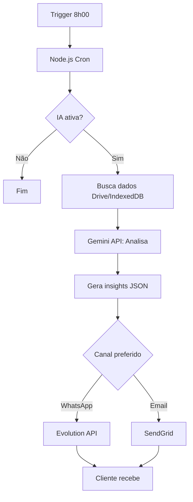

# 🤖 ESTRATÉGIA IA ASSISTENTE - 90 DIAS GRÁTIS

**Objetivo:** Gerar dependência → Converter para R$ 47/mês após trial  
**Filosofia:** Ajudar sem incomodar (assistente discreto)

---

## 🎯 MODELO DE NEGÓCIO

### Trial Gratuito Estratégico

```
Dia 1-30:   IA GRÁTIS → Cliente vicia nos insights
Dia 31-60:  IA GRÁTIS → Cliente depende das rotinas
Dia 61-90:  IA GRÁTIS → Alerta: "Trial acaba em X dias"
Dia 91:     UPGRADE → R$ 47/mês ou IA desliga
```

**Conversão Esperada:** 40-60% (quem usa IA diária não larga)

### Pricing IA

| Plano        | Preço                  | Features                |
| ------------ | ---------------------- | ----------------------- |
| **Base**     | R$ 149,90 (único)      | Sistema completo SEM IA |
| **Trial IA** | R$ 0/mês (90 dias)     | IA completa temporária  |
| **IA Ativa** | R$ 47/mês (após trial) | IA permanente           |

**LTV Aumenta:** R$ 149,90 + (R$ 47 × 24 meses) = **R$ 1.277,90**

---

## 🧠 FUNCIONALIDADES IA v1.0

### 1. Briefing Onboarding (Dia 1)

**Conversa inicial para entender contexto:**

```
IA: "Olá! Sou a assistente do TitanGestão.
     Vou te ajudar nos próximos 90 dias GRÁTIS.

     Me conta 3 coisas:
     1. Qual seu tipo de negócio? (loja, consultoria, serviço)
     2. Quantos clientes você atende por mês?
     3. Quais suas maiores dores? (estoque, vendas, cobrança)"

Cliente: "Tenho uma loja de roupas, 50 clientes/mês,
          maior dor é esquecer de cobrar"

IA: "Entendi! Vou te ajudar com:
     - Alertas de cobrança automática
     - Análise de produtos mais vendidos
     - Lembretes de estoque baixo

     Tudo por WhatsApp/Email, ok?"
```

**Salva em:** `config.ia_perfil` para personalizar mensagens

### 2. Rotinas Diárias (Não-Intrusivas)

**Horário:** 8h00 (configurável)  
**Canal:** WhatsApp ou Email (escolha do cliente)

#### Segunda-feira: Resumo Semana Anterior

```
📊 Resumo da Semana (13-19 Jan)

Vendas: 12 (↑ 20% vs semana anterior)
Ticket médio: R$ 89,50
Top produto: Camisa Polo (6 vendas)

💡 Insight: Polo vendeu bem! Considere aumentar estoque.
```

#### Terça-feira: Contas a Pagar

```
💰 Contas Vencendo Esta Semana

⚠️ HOJE: Fornecedor XYZ - R$ 450,00
📅 Quinta: Aluguel - R$ 1.200,00
📅 Sexta: Luz - R$ 180,00

Total: R$ 1.830,00
```

#### Quarta-feira: Análise CRM

```
👥 Oportunidades CRM

🔥 3 clientes parados em "Negociação" > 7 dias
   → João Silva, Maria Santos, Pedro Costa

💡 Sugestão: Enviar follow-up hoje?
   [Sim, gerar mensagens] [Depois]
```

#### Quinta-feira: Estoque

```
📦 Alertas de Estoque

⚠️ Estoque baixo (< 10 unidades):
   - Camisa Polo P: 5 unidades
   - Calça Jeans 42: 3 unidades

🔄 Produtos parados (> 60 dias):
   - Jaqueta inverno: 15 unidades

💡 Considere: Promoção na jaqueta?
```

#### Sexta-feira: Meta Semanal

```
🎯 Performance da Semana

Meta: R$ 5.000 | Realizado: R$ 4.200 (84%)
Faltam: R$ 800 (2 vendas médias)

💪 Bora fechar a semana forte!
Clientes inativos > 30 dias: 8
   → Enviar campanha reativação?
```

### 3. IA Assistente Conversacional

**Ativa sob demanda (cliente pergunta):**

```
Cliente: "Quantos clientes novos tive em janeiro?"

IA: "Você cadastrou 12 clientes novos em Janeiro/2026.

     Fontes:
     - Google Ads: 5 clientes
     - Indicação: 4 clientes
     - Instagram: 3 clientes

     Taxa conversão: 25% (12 de 48 leads)"

Cliente: "E quanto vendi para eles?"

IA: "Dos 12 clientes novos, 7 já compraram (58%).

     Faturamento: R$ 2.100
     Ticket médio: R$ 300

     5 clientes ainda não compraram. Quer que eu gere
     mensagens de follow-up?"
```

---

## 🚫 REGRAS NÃO-INTRUSIVAS

### O Que a IA NÃO Faz

❌ Enviar mensagens sem permissão  
❌ Tomar decisões sozinha  
❌ Mandar notificações constantes  
❌ Cobrar cliente automaticamente  
❌ Modificar dados sem confirmar

### O Que a IA FAZ

✅ Sugere ações (cliente decide)  
✅ Gera rascunhos de mensagens  
✅ Alerta problemas importantes  
✅ Responde perguntas (sob demanda)  
✅ Analisa dados (1x/dia)

### Controle Total do Cliente

```javascript
// Configurações IA
const configIA = {
  ativa: true, // Liga/desliga tudo
  horario: "08:00", // Horário insights
  canal: "whatsapp", // whatsapp | email | ambos
  rotinas: {
    resumoSemanal: true,
    contasPagar: true,
    analiseCRM: true,
    alertaEstoque: true,
    metaSemanal: false, // Cliente desativa se quiser
  },
  silencioso: {
    inicio: "22:00", // Não incomoda à noite
    fim: "07:00",
  },
};
```

---

## 💻 IMPLEMENTAÇÃO TÉCNICA

### Arquitetura

```
Frontend (CRM.html)
    ↓
Backend (Node.js)
    ↓
Gemini API (análise dados)
    ↓
Evolution API (envio WhatsApp)
```

### Fluxo Rotina Diária



### Custos Operacionais

| Item                   | Custo/Cliente/Mês | Observação           |
| ---------------------- | ----------------- | -------------------- |
| **Gemini API**         | R$ 2-5            | 30 análises/mês      |
| **WhatsApp Evolution** | R$ 1              | Mensagens ilimitadas |
| **Total**              | **R$ 3-6**        | vs R$ 47 cobrado     |

**Margem:** R$ 41-44 (87-94%) após trial

---

## 📊 ESTRATÉGIA DE CONVERSÃO

### Mecânica do Trial

**Dia 1:** Briefing + primeira análise  
**Dia 7:** "Como está indo? Ajustes?"  
**Dia 30:** Email: "1 mês de insights! Viu diferença?"  
**Dia 60:** WhatsApp: "30 dias restantes de trial"  
**Dia 75:** Email: "Trial acaba em 15 dias. Quer continuar?"  
**Dia 85:** WhatsApp: "Últimos 5 dias grátis!"  
**Dia 90:** Modal no sistema: "Trial encerrado. R$ 47/mês para continuar?"

### Gatilhos de Retenção

```javascript
// Se cliente usou IA > 50x em 90 dias
if (usosIA > 50) {
  mostrarOferta("Você REALMENTE usa a IA!
                 10% desconto: R$ 42,30/mês")
}

// Se cliente abriu < 10x
if (usosIA < 10) {
  perguntar("Quer que eu ajuste as rotinas?
             Talvez eu esteja incomodando...")
}
```

---

## 🎯 CRONOGRAMA IMPLEMENTAÇÃO

### Sprint 1 (v1.0 - Março 2026)

- ✅ Sistema base SEM IA
- ✅ Estrutura preparada (colunas ocultas)
- ✅ Lança R$ 149,90

### Sprint 7 (v1.5 - Abril 2026)

- 🤖 Ativa IA trial grátis
- 📊 Rotinas diárias básicas
- 💬 Gemini API integração

### Sprint 8 (v2.0 - Maio 2026)

- 💬 WhatsApp Evolution API
- 🎯 Briefing onboarding
- 📈 Dashboard IA (uso cliente)

### Continuidade (v2.1+)

- 🧠 IA aprende com uso
- 📧 Email marketing automático
- 🔮 Insights preditivos

---

## ✅ BENEFÍCIOS ESTRATÉGIA

**Para o Negócio:**

- 💰 MRR adicional: R$ 47/mês × 40% conversão = R$ 18,80/cliente
- 📈 LTV sobe de R$ 149,90 → R$ 1.277,90
- 🎯 Diferencial competitivo (IA grátis 90 dias)
- 🔥 Dependência criada naturalmente

**Para o Cliente:**

- ✅ 90 dias grátis (experimenta sem risco)
- 💡 Insights valiosos diários
- ⏰ Economiza tempo (alertas proativos)
- 🚫 Não-intrusivo (controle total)

---

## 📋 PRÓXIMOS PASSOS

1. **Aprovar estratégia** IA 90 dias grátis
2. **Atualizar ROADMAP.md** (Sprint 7-8 = IA)
3. **Atualizar PRICING.md** (trial 90 dias)
4. **Criar prompts IA** (briefing, rotinas, conversas)
5. **Implementar backend** (Gemini + Evolution)

---

**Aprovar para atualizar docs principais?**
