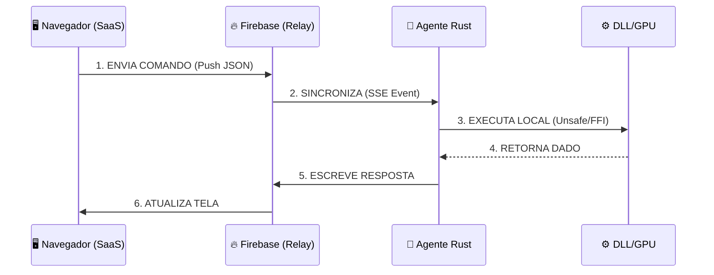

# Arquitetura Core: Firebase Signaling & Rust Agent

> **Status:** Draft / RFC (Request for Comments)
> **Data:** 2026-01-20
> **Objetivo:** Definir o padrão de comunicação segura entre Web (SaaS) e Hardware Local (GPU/DLLs).

## 1. Visão Geral: O Padrão "Signaling Server"

Em vez de uma conexão direta e frágil via WebSocket (`ws://localhost`), adotamos uma arquitetura desacoplada onde **Firebase Realtime Database** atua como um barramento de mensagens de baixa latência (Hot Layer).

**Diferença Crucial:**

- **Antes (WebSocket):** O navegador tentava conectar na porta 9999 do PC. Falhava se HTTPS exigisse WSS ou se firewall bloqueasse.
- **Agora (Firebase):** Ambos (Navegador e Agente Rust) conectam na nuvem (Porta 443 HTTPS). O Firebase sincroniza o estado.

---

## 2. Arquitetura de Dados (Firebase Schema)

A árvore de dados é efêmera e segregada por `user_uid`.

```json
{
  "channels": {
    "user_uuid_123": {
      // 🟢 COMANDOS (Browser -> Rust)
      "command_queue": {
        "cmd_id_x": {
          "action": "EXECUTE_DLL",
          "payload": { "symbol": "BTCUSD", "volume": 1.0 },
          "timestamp": 1700000000
        }
      },
      // 🔵 RESPOSTAS (Rust -> Browser)
      "response_stream": {
        "cmd_id_x": {
          "status": "SUCCESS",
          "data": { "ticket": 998877 },
          "completed_at": 1700000005
        }
      },
      // 💓 HEARTBEAT (Status do Agente)
      "agent_status": {
        "online": true,
        "last_ping": 1700000010,
        "gpu_model": "RTX 4090",
        "version": "2.0.0"
      }
    }
  }
}
```

### Regras de Segurança (Firestore Rules)

Garantes que usuários não leiam dados uns dos outros.

```javascript
{
  "rules": {
    "channels": {
      "$uid": {
        ".read": "auth.uid === $uid",
        ".write": "auth.uid === $uid"
      }
    }
  }
}
```

---

## 3. O Agente Local (Rust)

O agente roda como um **Daemon** (Serviço de Fundo).

### Stack Tecnológica

- **Linguagem:** Rust (Performance e Segurança de Memória).
- **Rede:** `reqwest` ou `firebase-rs` (REST Streaming/SSE).
- **Core:** `tokio` (Async I/O).
- **Integração:** `libloading` (Carregar DLLs) e `cudarc` (NVIDIA).

### Ciclo de Vida

1.  **Auth:** Usuário autentica e token é passado ao agente (ou agente inicia fluxo OAuth).
2.  **Listen:** Escuta ativa em `/channels/{uid}/command_queue`.
3.  **Exec:** Recebe JSON -> Executa Função Nativa (DLL ou Kernel CUDA).
4.  **Report:** Escreve resultado em `/channels/{uid}/response_stream`.
5.  **Watchdog:** Ping constante para manter `agent_status/online = true`.

---

## 4. Fluxo de Execução



## 5. Próximos Passos para Implementação

1.  **Configurar Projeto Firebase:** Criar Realtime DB e definir Rules.
2.  **Frontend (JS):** Criar classe `PandaBridgeFirebase` que substitui a antiga `PandaBridgeWebSocket`.
3.  **Backend (Rust):** Iniciar "Hello World" que escuta o Firebase e printa comandos.

---

---

## 6. Roadmap de Expansão (Muito além da GPU)

A questão estratégica é: **"Por que limitar o Rust apenas à GPU?"**
O navegador vive em uma "Sandbox" (prisão segura). O Agente Rust é a **ponte** para o mundo real do Sistema Operacional.

### 6.1. Módulo Financeiro & Trade (DLL Bridge)

Muitas plataformas de mercado financeiro (ex: MetaTrader 4/5, Profitchart) ou sistemas bancários antigos (TEF, Token USB) só aceitam integração via **DLL Windows (Win32 API)**.

- **O Agente Rust:** Carrega a `mt5.dll` na memória e expõe funções como `OrderSend()` através do Firebase.
- **Resultado:** O SaaS Web consegue enviar ordens para um terminal Desktop legado.

### 6.2. Módulo de Automação (RPA / "Ghost User")

Para sistemas que não têm API nem DLL (ex: Aquele ERP antigo da empresa).

- **O Agente Rust:** Usa bibliotecas como `enigo` ou `winapi` para controlar **Mouse e Teclado**.
- **Ação:** O SaaS diz "Cadastrar Cliente X". O Rust abre a janela do ERP, clica no campo, digita e salva.

### 6.3. Módulo de Hardware & IoT

Navegadores têm acesso limitado a portas USB/Serial (WebUSB/WebSerial existem, mas são chatos de configurar).

- **O Agente Rust:** Acesso total a:
  - Impressoras Térmicas (Impressão RAW/ESC-POS).
  - Balanças de precisão (Porta COM).
  - Leitores Biométricos.

> **Resumo:** O Rust transforma seu SaaS Web em um **Super App Nativo** sem precisar reescrever o frontend. A Web é o "Cérebro" e a "Face"; o Rust são as "Mãos" firmes no sistema operacional.

---

### 6.4. Sistema de Plugins Local (Marketplace de Drivers)

O Rust pode carregar módulos dinâmicos (`.dll` ou `.wasm`) baixados da Store.
ex: A "Pizzaria do Zé" contrata um dev para fazer um driver para a impressora Epson antiga dele.

- O dev cria `epson_driver.dll`.
- O cliente instala via interface Web.
- O Rust carrega esse driver e a mágica acontece.

---

## 7. Fronteiras Avançadas (O Futuro do Agente)

Além do controle básico, existem super-poderes que transformam o produto:

### 7.1. Local AI Intelligence (Offline Brain) 🧠

Em vez de gastar API Key do Gemini/OpenAI para tudo:

- O Agente Rust roda um modelo **Llama 3 ou Mistral** quantizado na CPU/GPU do usuário.
- **Caso de Uso:** Resumo de contratos sigilosos. O PDF é lido pelo Rust, a IA local resume, e só o texto final (resumo) vai para o Firebase. O documento original nunca sai do PC. **Privacidade Absoluta.**

### 7.2. Filesystem Watcher (Modo "Dropbox") 📂

O navegador não pode "olhar" uma pasta o tempo todo. O Rust pode.

- **Cenário:** O dono da loja recebe notas fiscais (XML) e salva na pasta `C:\Downloads\Notas`.
- **Ação:** O Rust detecta o arquivo novo (`Inotify`), lê o XML, faz o parse e envia para o SaaS: _"Nova Compra Detectada!"_.
- **Resultado:** Importação automática sem o usuário clicar em "Upload".

### 7.3. OS HUD / Overlay (DirectX Hook) 🕹️

Para Gamers ou Traders hardcore que não querem Alt-Tab.

- O Agente Rust desenha um **Overlay Transparente** (como o FPS do Steam) _por cima_ de outros jogos ou do MetaTrader.
- **Display:** Mostra "Vendas Hoje: R$ 5.000" num cantinho da tela enquanto o cara joga ou opera, sem precisar abrir o navegador.

> **Conclusão:** O Rust deixa de ser um "acessório" e vira o **Coração Local** do ecossistema Panda, permitindo funcionalidades que nenhum Web App puro (PWA) jamais conseguirá.

---

---

## 8. Segurança Jurídica & Responsabilidade (CYA)

Com grandes poderes vêm grandes responsabilidades e riscos jurídicos. Como o Rust tem acesso "Ilimitado" ao PC, precisamos nos proteger (Blindagem).

### 8.1. O Modelo de Permissões "Android-Style" 🛡️

O Agente Rust **NUNCA** deve executar uma ação perigosa silenciosamente na primeira vez.

- **Request:** O site pede: "Ler pasta C:\Notas".
- **Pop-up no Desktop (Rust):** "O App Panda CRM deseja ler sua pasta de Notas. [Permitir] [Bloquear]".
- **Persistência:** O usuário aceita _explicitamente_ aquele acesso. Isso tira a responsabilidade de nós ("O usuário autorizou").

### 8.2. Assinatura Digital de Plugins (Code Signing) ✍️

Para evitar que hackers usem nosso Agente para criar vírus:

- O Rust só carrega DLLs/Plugins que tenham a **Assinatura Digital Criptográfica da Panda Fabrics**.
- Se um dev criar um driver malicioso e tentar injetar, o Agente recusa: _"Assinatura Inválida"_.
- **Review:** Nossa equipe audita o código do dev antes de assinar e publicar na Store.

### 8.3. Isenção de Responsabilidade (Termos de Uso)

O instalador do Agente deve ter um ToS (Terms of Service) claro:

> "O Panda Agent é uma ferramenta de automação passiva. A Panda Fabrics **não se responsabiliza** por perda de dados, ordens financeiras erradas ou mau uso dos recursos do sistema operacional. O usuário detém controle total e responsabilidade final sobre as permissões concedidas."

### 8.4. Botão de Pânico (Kill Switch) 🚨

Se detectarmos uma vulnerabilidade global:

- O Firebase manda um sinal de `EMERGENCY_STOP`.
- Todos os Agentes Rust do mundo entram em "Modo Seguro" (apenas leitura) instantaneamente.

---

_Este documento serve como especificação técnica para a equipe de desenvolvimento._
