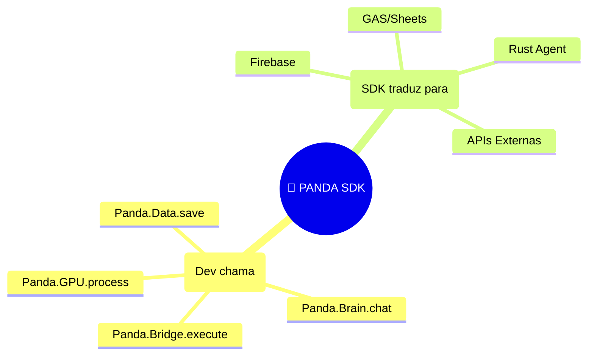
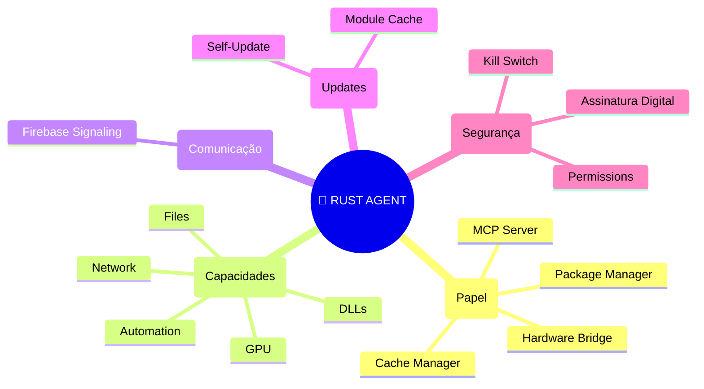
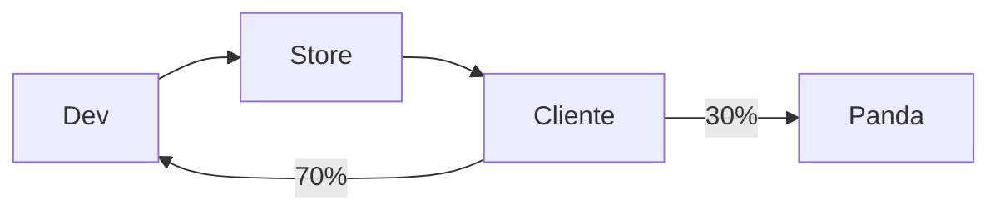

# 🐼 Panda OS - Arquitetura Completa

> **Documento Mestre de Arquitetura**
> Consolidação das decisões estratégicas para o ecossistema Panda Fabrics.

---

## 📋 Índice

1. [Visão Geral da Arquitetura](#1-visão-geral)
2. [Camada 1: Rust Agent (Obrigatório)](#2-rust-agent)
3. [Camada 2: Panda SDK (Abstração)](#3-panda-sdk)
4. [Camada 3: GAS Backend (Serverless)](#4-gas-backend)
5. [MCP - Model Context Protocol](#5-mcp)
6. [DevTools Dock & Extensions (Open VSX)](#6-devtools-extensions)
7. [Comunidade GitHub & Registry](#7-comunidade)
8. [Zero-Knowledge Cloud](#8-zero-knowledge)
9. [Fluxo de Onboarding](#9-onboarding)
10. [Decisões de Design & Trade-offs](#10-decisoes)

---

## 1. Visão Geral da Arquitetura

```text
┌─────────────────────────────────────────────────────────────────────────┐
│                         NAVEGADOR (Panda UI)                            │
│  ┌─────────────┐  ┌─────────────┐  ┌─────────────┐  ┌─────────────┐    │
│  │  App Dock   │  │  DevTools   │  │  Sidebar    │  │  Modules    │    │
│  │  (Esquerda) │  │  (Direita)  │  │  (Chat IA)  │  │  (CRM etc)  │    │
│  └──────┬──────┘  └──────┬──────┘  └──────┬──────┘  └──────┬──────┘    │
│         │                │                │                │            │
│         └────────────────┴────────────────┴────────────────┘            │
│                                   │                                      │
│                          ┌────────▼────────┐                            │
│                          │   PANDA SDK     │  ← O "Colchão"             │
│                          │  (JavaScript)   │                            │
│                          └────────┬────────┘                            │
└───────────────────────────────────┼─────────────────────────────────────┘
                                    │
              ┌─────────────────────┼─────────────────────┐
              │                     │                     │
              ▼                     ▼                     ▼
┌─────────────────────┐  ┌─────────────────────┐  ┌─────────────────────┐
│   🦀 RUST AGENT     │  │   ☁️ FIREBASE       │  │   📜 GOOGLE APPS    │
│   (PC Local)        │  │   (Signaling)       │  │   SCRIPT (Backend)  │
│                     │  │                     │  │                     │
│ • GPU Detection     │  │ • Heartbeat         │  │ • Dados Planilha    │
│ • File System       │  │ • Comandos          │  │ • Wallet/Coins      │
│ • DLL/Exe Install   │  │ • Status Online     │  │ • Auth/Quotas       │
│ • MCP Server        │  │ • Telemetria        │  │ • Module Registry   │
│ • Local AI (LLama)  │  │                     │  │                     │
└─────────────────────┘  └─────────────────────┘  └─────────────────────┘
        │                                                    │
        │  DADOS NUNCA SAEM DAQUI                           │
        │  (Zero-Knowledge)                                  │
        └────────────────────────────────────────────────────┘
```

---

### 1.1. Detalhe do Hub Central (SDK)

```text
🐼 PANDA SDK
├── (Dev chama)
│   ├── Panda.Data.save
│   ├── Panda.Brain.chat
│   ├── Panda.Bridge.execute
│   └── Panda.GPU.process
└── (SDK traduz para)
    ├── GAS / Sheets
    │   ├── Google Apps Script
    │   ├── SpreadsheetApp
    │   └── DriveApp
    ├── Firebase
    │   ├── Realtime DB
    │   ├── Auth
    │   └── Signaling
    ├── Rust Agent
    │   ├── GPU Local
    │   ├── DLLs
    │   ├── Files
    │   └── MCP Tools
    └── APIs Externas
        ├── Gemini
        ├── Claude
        └── Stripe
```

### 1.2. Fluxo de Dados Completo

```text
👨‍💻 DEV (Code) --> 🎯 SDK (Router)
                      │
          ┌───────────┼───────────┐
          ▼           ▼           ▼
      🦀 RUST        📜 GAS      💾 CACHE
      (Local)       (Cloud)     (Offline)
         │             │           │
         ▼             ▼           ▼
    ⚡ Hardware    ☁️ Sheets    🔄 Sync Queue
    (GPU/DLLs)    (Drive)
         │             │           │
         └─────────────┼───────────┘
                       ▼
                  🔥 FIREBASE
                  (Signaling + Células)
```

---

## 2. Rust Agent (Obrigatório)

```text
🦀 RUST AGENT
├── (Papel)
│   ├── Cache Manager
│   ├── Package Manager
│   ├── MCP Server
│   └── Hardware Bridge
├── (Capacidades)
│   ├── GPU
│   │   ├── CUDA NVIDIA
│   │   ├── ROCm AMD
│   │   ├── Metal Apple
│   │   └── WebGPU
│   ├── Files
│   │   ├── Read / Write
│   │   ├── Watch Folder
│   │   └── Compress
│   ├── DLLs
│   │   ├── MetaTrader
│   │   ├── ProfitChart
│   │   └── Drivers
│   ├── Automation
│   │   ├── Mouse / Keyboard
│   │   ├── OCR
│   │   └── Overlay HUD
│   └── Network
│       ├── Proxy Pool
│       ├── VPN
│       └── IP Rotation
├── (Comunicação)
│   └── Firebase Signaling
│       ├── command_queue
│       ├── response_stream
│       └── heartbeat
├── (Updates)
│   ├── Self-Update
│   ├── Module Cache
│   └── Extension Install
└── (Segurança)
    ├── Assinatura Digital
    ├── Permissions
    └── Kill Switch
```

### Por que Rust é Obrigatório?

O Rust Agent é o **"Corpo Físico"** do Panda OS no PC do usuário. Sem ele:

- ❌ Não há acesso a arquivos locais
- ❌ Não há GPU local (custo zero)
- ❌ Não há instalação de DLLs/ferramentas
- ❌ Não há MCP para a IA
- ❌ Não há privacidade (dados teriam que ir pra nuvem)

### Capacidades do Rust Agent

| Recurso           | Descrição                                     | Impacto                                           |
| ----------------- | --------------------------------------------- | ------------------------------------------------- |
| **GPU Detection** | Detecta NVIDIA CUDA / AMD ROCm / Intel OneAPI | Decide se processa local (grátis) ou cloud (pago) |
| **File System**   | Lê/escreve arquivos locais                    | IA pode analisar CSVs, PDFs sem upload            |
| **DLL Bridge**    | Conecta com MetaTrader, ProfitChart           | Trading automatizado                              |
| **MCP Server**    | Expõe "Tools" para a IA                       | IA ganha superpoderes dinâmicos                   |
| **Local LLM**     | Roda Llama/Mistral offline                    | 100% privado, sem tokens                          |
| **Instalador**    | Baixa e instala extensões                     | Marketplace funcional                             |

### Fluxo de Detecção GPU

```text
Rust Agent Inicia
       │
       ▼
┌──────────────────┐
│ nvml.dll existe? │──── Sim ──► NVIDIA Detectada ──► CUDA Mode
└──────────────────┘
       │ Não
       ▼
┌──────────────────┐
│ ROCm disponível? │──── Sim ──► AMD Detectada ──► ROCm Mode
└──────────────────┘
       │ Não
       ▼
┌──────────────────┐
│ Metal (macOS)?   │──── Sim ──► Apple Silicon ──► Metal Mode
└──────────────────┘
       │ Não
       ▼
   CPU Only Mode (Fallback)
```

### 2.1. Rust como Cache Manager (Offline-First)

> **Importante:** O Rust é **obrigatório** para instalação, mas **NÃO precisa rodar o tempo todo**.
> O app funciona do cache mesmo com o Rust dormindo.

#### Analogia: Funciona como Google Drive Desktop

```text
┌─────────────────────────────────────────────────────────────┐
│           PANDA AGENT = GOOGLE DRIVE DESKTOP                │
├─────────────────────────────────────────────────────────────┤
│                                                             │
│  🖥️ Ícone na Bandeja do Windows/Mac                        │
│     • Fica lá, quietinho, sincronizando                     │
│     • Usuário nem percebe que está rodando                  │
│                                                             │
│  📂 Pasta Local Sincronizada                                │
│     • %APPDATA%/PandaAgent/cache/                           │
│     • Módulos, componentes, extensões                       │
│     • Abre instantâneo do cache                             │
│                                                             │
│  🔄 Sync em Background                                      │
│     • Verifica updates a cada hora                          │
│     • Baixa novos módulos silenciosamente                   │
│     • Notifica só quando precisa reiniciar                  │
│                                                             │
│  💤 Modo Economia                                           │
│     • Se usuário não usa há 30min, dorme                    │
│     • Acorda quando abre o Panda no browser                 │
│     • Consumo mínimo de RAM/CPU                             │
│                                                             │
└─────────────────────────────────────────────────────────────┘
```

#### Modos de Operação

```text
┌─────────────────────────────────────────────────────────────┐
│                    MODOS DE OPERAÇÃO                        │
├─────────────────────────────────────────────────────────────┤
│                                                             │
│  🟢 ONLINE + RUST ATIVO                                     │
│     • Sync em tempo real                                    │
│     • GPU local disponível                                  │
│     • DLLs/MCP funcionando                                  │
│                                                             │
│  🟡 ONLINE + RUST DORMINDO                                  │
│     • App roda do cache local (IndexedDB)                   │
│     • Sync via GAS/Firebase                                 │
│     • GPU = Cloud (pago)                                    │
│                                                             │
│  🟠 OFFLINE (100% Cache)                                    │
│     • App 100% do cache local                               │
│     • Rust NÃO precisa estar rodando                        │
│     • Dados pendentes sincronizam depois                    │
│                                                             │
│  🔴 SEM RUST INSTALADO                                      │
│     • Trial mode: 7 dias cloud-only                         │
│     • Depois exige instalação para continuar                │
│                                                             │
└─────────────────────────────────────────────────────────────┘
```

#### Estratégia de Cache (Offline-First)

```javascript
// No SDK - Todas as operações são cache-first
Panda.Data.getClients = async function () {
  // 1. Sempre tenta o cache primeiro (INSTANTÂNEO)
  const cached = await localDB.get("clients");
  if (cached) {
    UI.render(cached); // Mostra imediatamente
  }

  // 2. Se online, busca atualização em background
  if (navigator.onLine) {
    const fresh = await GAS.fetchClients();
    await localDB.save("clients", fresh);
    if (hasChanges(cached, fresh)) {
      UI.render(fresh); // Atualiza se mudou
    }
  }
};
```

#### Quando o Rust Precisa Rodar?

| Função                     | Rust Ativo?    | Alternativa                |
| -------------------------- | -------------- | -------------------------- |
| Instalar/Cachear módulos   | ✅ Obrigatório | -                          |
| Abrir app do cache         | ❌ Não precisa | IndexedDB/LocalStorage     |
| Editar dados offline       | ❌ Não precisa | Cache local                |
| Sincronizar com nuvem      | ❌ Não precisa | GAS/Firebase direto        |
| Processar GPU local        | ✅ Obrigatório | Cloud (pago) como fallback |
| Acessar DLLs/Files         | ✅ Obrigatório | -                          |
| Rodar IA offline (Llama)   | ✅ Obrigatório | Cloud API como fallback    |
| Updates de módulos/sistema | ✅ Obrigatório | -                          |

### 2.2. Sistema de Updates (Self-Managed)

O Rust é o **Package Manager** do ecossistema. Ele gerencia TODOS os updates:

```text
┌─────────────────────────────────────────────────────────────┐
│                    UPDATE SYSTEM                            │
├─────────────────────────────────────────────────────────────┤
│                                                             │
│  O QUE O RUST ATUALIZA:                                     │
│                                                             │
│  📦 Rust Agent (Self-Update)                                │
│     • Verifica nova versão no Firebase                      │
│     • Baixa binário assinado                                │
│     • Reinicia automaticamente                              │
│                                                             │
│  🧩 Extensões/Plugins                                       │
│     • Monitora registry.json do GitHub                      │
│     • Baixa updates em background                           │
│     • Notifica usuário para reiniciar módulo                │
│                                                             │
│  📱 Módulos UI (CRM, Store, etc)                            │
│     • Cacheia HTML/JS/CSS localmente                        │
│     • Verifica hash no servidor                             │
│     • Atualiza cache se hash mudou                          │
│                                                             │
│  🐼 Panda Core (Sistema Base)                               │
│     • Components fixos (Header, Docks)                      │
│     • SDK JavaScript                                        │
│     • Styles base                                           │
│                                                             │
└─────────────────────────────────────────────────────────────┘
```

#### Fluxo de Update Automático

```text
1. Rust Agent inicia (ou acorda)
       │
       ▼
2. Verifica Firebase: "Há updates?"
       │
       ├── Agent novo? ──► Baixa, verifica assinatura, reinicia
       │
       ├── Módulos novos? ──► Atualiza cache local
       │
       └── Extensions novas? ──► Baixa e registra tools
       │
       ▼
3. Volta a dormir (Watchdog a cada 1h)
```

#### Self-Update do Agent

```rust
// Pseudocódigo do self-update
async fn check_for_updates() {
    let current_version = env!("CARGO_PKG_VERSION");
    let latest = firebase.get("/agent/latest_version").await;

    if semver::gt(latest.version, current_version) {
        // 1. Baixa novo binário
        let binary = download(latest.url).await;

        // 2. Verifica assinatura digital (anti-tampering)
        if !verify_signature(binary, PANDA_PUBLIC_KEY) {
            log_error("Assinatura inválida! Possível ataque.");
            return;
        }

        // 3. Substitui executável
        replace_self(binary);

        // 4. Reinicia
        restart_agent();
    }
}
```

#### Cache de Módulos UI

```text
📁 %APPDATA%/PandaAgent/cache/
├── modules/
│   ├── crm/
│   │   ├── index.html.gz      (comprimido)
│   │   ├── styles.css.gz
│   │   └── manifest.json
│   ├── store/
│   └── analytics/
├── components/
│   ├── Comp_Header.html.gz
│   └── Comp_Sidebar.html.gz
├── extensions/
│   ├── mt5_bridge.dll
│   └── pdf_parser.wasm
└── versions.json              (hashes para verificar updates)
```

---

## 3. Panda SDK (A Abstração)

### A Regra de Ouro

> **"O Módulo NUNCA fala com o Servidor. O Módulo fala com o Panda, e o Panda fala com o Servidor."**

### Estrutura do Objeto Global `Panda`

```javascript
window.Panda = {
    // ═══════════════════════════════════════════
    // 💰 WALLET (Economia)
    // ═══════════════════════════════════════════
    Wallet: {
        getBalance: () => Promise<number>,
        charge: (amount, reason) => Promise<boolean>,
        subscribe: (callback) => void  // Notifica mudanças
    },

    // ═══════════════════════════════════════════
    // 📦 DATA (Persistência)
    // ═══════════════════════════════════════════
    Data: {
        // O Dev não sabe se é Sheets, Firebase ou SQLite
        get: (collection, id) => Promise<Object>,
        list: (collection, filters) => Promise<Array>,
        save: (collection, data) => Promise<string>,
        delete: (collection, id) => Promise<boolean>,

        // Atalhos para schemas padrão
        Clients: { ... },  // Panda.Data.Clients.list()
        Sales: { ... },
        Logs: { ... }
    },

    // ═══════════════════════════════════════════
    // 🖥️ GPU (Processamento Local)
    // ═══════════════════════════════════════════
    GPU: {
        isAvailable: () => boolean,
        getInfo: () => { vendor, model, vram, driver },
        process: (task, data) => Promise<Result>,  // Delega pro Rust

        // Modos
        preferLocal: true,  // Configuração do usuário
        forceCloud: false
    },

    // ═══════════════════════════════════════════
    // 🦀 BRIDGE (Rust Agent)
    // ═══════════════════════════════════════════
    Bridge: {
        status: 'ONLINE' | 'OFFLINE' | 'CONNECTING',

        // Comandos genéricos
        execute: (command, args) => Promise<any>,

        // File System
        readFile: (path) => Promise<string>,
        writeFile: (path, content) => Promise<boolean>,
        listDir: (path) => Promise<Array>,

        // Instalação
        installExtension: (url) => Promise<boolean>,
        listExtensions: () => Promise<Array>
    },

    // ═══════════════════════════════════════════
    // 🤖 BRAIN (IA)
    // ═══════════════════════════════════════════
    Brain: {
        chat: (message) => Promise<string>,
        analyze: (data, prompt) => Promise<Object>,

        // MCP - Tools disponíveis
        tools: [],  // Populado dinamicamente pelo Rust
        callTool: (toolName, args) => Promise<any>
    },

    // ═══════════════════════════════════════════
    // 🎨 UI (Interface)
    // ═══════════════════════════════════════════
    UI: {
        notify: (message, type) => void,
        loading: (show) => void,
        modal: (title, content) => Promise<boolean>,
        toast: (text, duration) => void
    },

    // ═══════════════════════════════════════════
    // 📡 EVENTS (Ciclo de Vida)
    // ═══════════════════════════════════════════
    on: (event, callback) => void,
    off: (event, callback) => void,
    emit: (event, data) => void

    // Eventos disponíveis:
    // 'ready', 'login', 'logout', 'offline', 'online',
    // 'wallet:change', 'bridge:connect', 'bridge:disconnect'
};
```

### 3.1. SDK Modular (Slots & Adapters)

O SDK funciona como um **processador com slots de expansão**. O Core é rígido e protegido, mas aceita módulos especializados que se "plugam" em interfaces pré-definidas.

#### Arquitetura de Slots

```text
🔌 SDK SLOTS
├── (Core Protegido)
│   ├── Panda.use
│   ├── Panda.on/emit
│   ├── Panda.version
│   ├── Sandbox
│   └── Validation
├── (Slot Data)
│   ├── Default: Sheets
│   └── Adapters
│       ├── MongoDB
│       ├── PostgreSQL
│       ├── Supabase
│       └── IndexedDB
├── (Slot Brain)
│   ├── Default: Gemini
│   └── Adapters
│       ├── Claude
│       ├── GPT-4
│       ├── Local Llama
│       └── DeepSeek
├── (Slot GPU)
│   ├── Default: Cloud
│   └── Adapters
│       ├── CUDA Direct
│       ├── ROCm
│       └── WebGPU
├── (Slot Render)
│   ├── Default: Nenhum
│   └── Adapters
│       ├── Three.js
│       ├── Babylon
│       └── PixiJS
├── (Slot Network)
│   ├── Default: Fetch
│   └── Adapters
│       ├── ProxyPool
│       └── VPN Client
├── (Slot Audio)
│   ├── Default: Nenhum
│   └── Adapters
│       ├── Howler.js
│       └── ElevenLabs
```

```text
┌─────────────────────────────────────────────────────────────┐
│                    PANDA SDK (Core Protegido)               │
│                    "A Motherboard Blindada"                 │
├─────────────────────────────────────────────────────────────┤
│                                                             │
│  ┌─────────┐ ┌─────────┐ ┌─────────┐ ┌─────────┐           │
│  │  SLOT   │ │  SLOT   │ │  SLOT   │ │  SLOT   │           │
│  │  Data   │ │  Brain  │ │  GPU    │ │ Render  │           │
│  └────┬────┘ └────┬────┘ └────┬────┘ └────┬────┘           │
│       │          │          │          │                   │
│  [Adapter]  [Adapter]  [Adapter]  [Adapter]                │
│   Sheets      Gemini     CUDA      Three.js                │
│   MongoDB     Claude     ROCm      Babylon                 │
│   Supabase    Local      WebGPU    PixiJS                  │
│                                                             │
│  🔒 CORE IMUTÁVEL:                                         │
│     • Panda.use() - Sistema de plugins                      │
│     • Panda.on/emit - Event bus                             │
│     • Panda.version - Versioning                            │
│     • Validação de interfaces                               │
│     • Sandbox de segurança                                  │
│                                                             │
└─────────────────────────────────────────────────────────────┘
```

#### Proteção do Core (Blindagem)

```javascript
// O Core é IMUTÁVEL - não pode ser substituído
const PROTECTED_CORE = Object.freeze({
  version: "1.0.0",

  // Sistema de plugins (nunca muda)
  use: function (slotName, adapter) {
    // Validação obrigatória
    if (!SLOT_INTERFACES[slotName]) {
      throw new Error(`Slot "${slotName}" não existe`);
    }

    // Verificar se adapter implementa interface
    const required = SLOT_INTERFACES[slotName];
    for (const method of required) {
      if (typeof adapter[method] !== "function") {
        throw new Error(`Adapter inválido! Falta: ${slotName}.${method}()`);
      }
    }

    // Verificar assinatura digital (anti-tampering)
    if (!verifyAdapterSignature(adapter)) {
      throw new Error("Adapter não assinado pela Panda");
    }

    // Sandboxar o adapter
    this._slots[slotName] = sandboxAdapter(adapter);
    console.log(`✅ Adapter plugado: Panda.${slotName}`);
  },

  // Event bus (imutável)
  on: (event, cb) => eventBus.on("panda:" + event, cb),
  off: (event, cb) => eventBus.off("panda:" + event, cb),
  emit: (event, data) => eventBus.emit("panda:" + event, data),

  // Slots iniciam como null
  _slots: {},
});

// Expor como propriedades computed (proxy)
window.Panda = new Proxy(PROTECTED_CORE, {
  get(target, prop) {
    // Slots são acessados via proxy
    if (target._slots[prop]) return target._slots[prop];
    return target[prop];
  },
  set(target, prop, value) {
    // Bloquear modificação direta do core
    throw new Error("Core é imutável. Use Panda.use()");
  },
});
```

#### Interfaces de Slot (Contratos)

Cada slot tem uma **interface obrigatória** que o adapter deve implementar:

| Slot     | Interface Obrigatória           | Opcional                  |
| -------- | ------------------------------- | ------------------------- |
| `Data`   | `get`, `list`, `save`, `delete` | `query`, `batch`, `watch` |
| `Brain`  | `chat`, `analyze`               | `embed`, `vision`, `tts`  |
| `GPU`    | `isAvailable`, `process`        | `benchmark`, `info`       |
| `Bridge` | `status`, `execute`             | `readFile`, `writeFile`   |
| `Render` | `init`, `loadModel`, `animate`  | `physics`, `shaders`      |
| `Audio`  | `play`, `stop`                  | `tts`, `stt`, `stream`    |
| `Auth`   | `login`, `logout`, `getUser`    | `refresh`, `mfa`          |

#### Sandboxing de Adapters

Adapters de terceiros rodam em **sandbox isolado**:

```javascript
function sandboxAdapter(adapter) {
  return new Proxy(adapter, {
    apply(target, thisArg, args) {
      // Rate limiting
      if (rateLimiter.exceeded(adapter.id)) {
        throw new Error("Rate limit excedido");
      }

      // Timeout protection
      return Promise.race([
        target.apply(thisArg, args),
        new Promise((_, reject) => setTimeout(() => reject("Timeout"), 30000)),
      ]);
    },

    get(target, prop) {
      // Bloquear acesso a propriedades perigosas
      if (["constructor", "__proto__", "eval"].includes(prop)) {
        throw new Error("Acesso bloqueado");
      }
      return target[prop];
    },
  });
}
```

#### Slots Disponíveis e Adapters

| Slot      | Default (Grátis)  | Adapters Premium               | Custo      |
| --------- | ----------------- | ------------------------------ | ---------- |
| `Data`    | Google Sheets     | MongoDB, PostgreSQL, Supabase  | 100-500 PC |
| `Brain`   | Gemini Flash      | Claude, GPT-4, Local Llama     | Varia      |
| `GPU`     | Cloud (T4)        | CUDA Direct, WebGPU, ROCm      | 100 PC     |
| `Bridge`  | Firebase Realtime | WebSocket, gRPC                | Grátis     |
| `Render`  | _Nenhum_          | Three.js, Babylon, PixiJS      | 200-500 PC |
| `Audio`   | _Nenhum_          | Howler.js, Tone.js, ElevenLabs | 100-300 PC |
| `Physics` | _Nenhum_          | Cannon.js, Rapier              | 150 PC     |
| `Network` | _Nenhum_          | ProxyPool, VPN Client          | 200 PC     |

#### Exemplo: Plugando Adapter 3D

```javascript
// 1. Dev instala módulo "Panda 3D Engine" via Store

// 2. O módulo se auto-registra no boot
Panda.use("Render", {
  // Interface obrigatória
  init: (canvas) => new THREE.WebGLRenderer({ canvas }),
  loadModel: (url) => new GLTFLoader().loadAsync(url),
  animate: (fn) => {
    renderer.setAnimationLoop(fn);
  },

  // Extras
  physics: new CANNON.World(),
  shaders: ShaderLibrary,
});

// 3. Agora qualquer módulo pode usar gráficos 3D
const scene = Panda.Render.init("#my-canvas");
const model = await Panda.Render.loadModel("/character.glb");
Panda.Render.animate(() => scene.render());
```

#### Modelo de Monetização

```text
┌─────────────────────────────────────────────────────────────┐
│                    MONETIZAÇÃO SDK                          │
├─────────────────────────────────────────────────────────────┤
│                                                             │
│  SDK CORE                    → Gratuito (atrai devs)        │
│  Adapters Default            → Gratuito (funciona básico)   │
│  Adapters Premium            → Pago em PC (monetização)     │
│  Consumo de API              → Pago por uso (energia)       │
│  Adapters de Terceiros       → Dev define preço (70/30)     │
│                                                             │
│  SEGURANÇA:                                                 │
│  • Core é open source (auditável)                            │
│  • Adapters assinados digitalmente                           │
│  • Sandbox impede acesso malicioso                           │
│  • Rate limiting por adapter                                 │
│                                                             │
└─────────────────────────────────────────────────────────────┘
```

---

## 4. GAS Backend (Google Apps Script)

```text
📜 GAS BACKEND
├── (Core Services)
│   ├── Authentication
│   │   ├── OAuth Google
│   │   ├── Token Validation
│   │   └── Multi-tenant
│   ├── Data Storage
│   │   ├── Spreadsheet API
│   │   ├── CRUD Operations
│   │   └── Ghost Cells
│   └── Webhooks
│       ├── Kiwify
│       ├── Hotmart
│       └── Stripe
├── (Chapéus e Domains)
│   ├── FINANCE
│   │   ├── Wallet - Voltímetro
│   │   ├── Fiat - Gateways
│   │   └── Crypto - Blockchain
│   ├── STORE
│   │   ├── Registry - Catálogo
│   │   ├── Sales - Comissão
│   └── AUTOMATION
│       └── Bots - Farms
├── (Dispatcher Core)
│   ├── Entry Point Unico
│   ├── Roteamento Seguro
│   └── Config Global
├── (Integrações Nativas)
│   ├── Gmail
│   ├── Calendar
│   ├── Drive
│   ├── Maps
│   └── YouTube
└── (Quotas)
    ├── 6 min por execução
    ├── 90 min por dia free
    └── Trigger automático
```

### Papel do GAS

O GAS é o **"Cérebro na Nuvem"** para operações que precisam de:

- Autenticação centralizada
- Armazenamento compartilhado (multi-tenant)
- Webhooks (receber pagamentos, callbacks)
- Store/Registry de módulos

### O que o GAS NÃO faz

- ❌ Processar dados sensíveis do usuário
- ❌ Armazenar arquivos privados
- ❌ Executar IA (isso é local ou via API)

### Conexão GAS ↔ SDK

```javascript
// No SDK (Browser)
Panda.Data.save('clients', { name: 'João' });

// Internamente chama:
google.script.run
    .withSuccessHandler(...)
    .backendSaveData('clients', { name: 'João' }, userToken);

// No GAS (Server)
function backendSaveData(collection, data, token) {
    const user = validateToken(token);
    const sheet = getSheetForTenant(user.tenantId, collection);
    sheet.appendRow([...]);
    return { success: true, id: newId };
}
```

### 4.1. Ecossistema Google (Nativo vs Módulos)

O Panda OS é construído sobre o Google Workspace. Algumas integrações são **nativas** (core), outras são **módulos opcionais**.

#### Integrações NATIVAS (Core do Sistema)

Já vêm incluídas, não precisam de módulo extra:

| Serviço                | Uso no Panda                  | Implementação      |
| ---------------------- | ----------------------------- | ------------------ |
| **Google Sheets**      | Banco de dados principal      | `Panda.Data.*`     |
| **Google Apps Script** | Backend serverless            | Toda lógica server |
| **Firebase Realtime**  | Signaling Rust ↔ Browser      | `Panda.Bridge.*`   |
| **Firebase Auth**      | Login/OAuth                   | `Panda.Auth.*`     |
| **Google Drive**       | Storage de arquivos do tenant | `Panda.Files.*`    |

#### Integrações via MÓDULOS (Opcionais)

Instaláveis via Store para quem precisa:

| Módulo                  | Funcionalidade                        | Custo          |
| ----------------------- | ------------------------------------- | -------------- |
| **📅 Calendar Sync**    | Sincroniza agenda com Google Calendar | Grátis         |
| **📧 Gmail Automator**  | Envio em massa, templates             | 50 PC/mês      |
| **🗺️ Maps Integration** | Geocoding, rotas para entregas        | 10 PC/1000 req |
| **📹 YouTube Manager**  | Upload/gerenciamento de vídeos        | 100 PC/mês     |
| **👥 Contacts Sync**    | Sincroniza com Google Contacts        | Grátis         |
| **📊 Data Studio**      | Dashboards avançados                  | 200 PC/mês     |

#### Arquitetura de Módulos Google

```text
┌─────────────────────────────────────────────────────────────┐
│                    GOOGLE ECOSYSTEM                         │
├─────────────────────────────────────────────────────────────┤
│                                                             │
│  ┌─────────────── CORE (Nativo) ───────────────┐            │
│  │                                             │            │
│  │  Sheets ◄── Panda.Data                      │            │
│  │  GAS ◄── Backend Logic                      │            │
│  │  Firebase ◄── Panda.Bridge                  │            │
│  │  Drive ◄── Panda.Files                      │            │
│  │                                             │            │
│  └─────────────────────────────────────────────┘            │
│                         │                                   │
│                         ▼                                   │
│  ┌─────────────── MÓDULOS (Store) ─────────────┐            │
│  │                                             │            │
│  │  [📅 Calendar]  [📧 Gmail]  [🗺️ Maps]       │            │
│  │  [📹 YouTube]   [👥 Contacts]               │            │
│  │                                             │            │
│  │  → Instalados sob demanda                   │            │
│  │  → Permissões OAuth específicas             │            │
│  │  → Alguns têm custo de energia              │            │
│  │                                             │            │
│  └─────────────────────────────────────────────┘            │
│                                                             │
└─────────────────────────────────────────────────────────────┘
```

### 4.2. Firebase Colmeia (Arquitetura Modular)

O Firebase é estruturado como uma **colmeia** onde cada dev/tenant tem sua célula isolada. Isso protege contra ataques e permite que devs testem e publiquem seus módulos.

#### Estrutura Colmeia

```text
🔥 FIREBASE
├── (Core Zone)
│   ├── version
│   ├── status
│   └── announcements
├── (Células)
│   ├── Developer Cell
│   │   ├── profile
│   │   ├── sandbox
│   │   ├── modules_in_dev
│   │   ├── published_modules
│   │   └── quotas
│   └── Client Cell
│       ├── profile
│       ├── sandbox
│       ├── installed_modules
│       ├── data PRIVADO
│       └── quotas
├── (Signaling)
│   ├── command_queue
│   ├── response_stream
│   └── agent_status
├── (Security)
│   ├── Cell Isolation
│   ├── Auth Rules
│   ├── Rate Limiting
│   └── Schema Validation
└── (Multi-Project)
    ├── Core Project
    ├── Dev Sandbox
    └── Telemetry
```

```text
┌─────────────────────────────────────────────────────────────┐
│                    FIREBASE "COLMEIA" 🐝                    │
├─────────────────────────────────────────────────────────────┤
│                                                             │
│    ┌─────────┐  ┌─────────┐  ┌─────────┐  ┌─────────┐      │
│    │ CÉLULA  │  │ CÉLULA  │  │ CÉLULA  │  │ CÉLULA  │      │
│    │ DEV_001 │  │ DEV_002 │  │ CLIENT  │  │  ADMIN  │      │
│    │   🔒    │  │   🔒    │  │   🔒    │  │   👑    │      │
│    └────┬────┘  └────┬────┘  └────┬────┘  └────┬────┘      │
│         │            │            │            │            │
│         └────────────┴────────────┴────────────┘            │
│                           │                                 │
│                    ┌──────▼──────┐                          │
│                    │  CORE ZONE  │  🛡️ Imutável             │
│                    │  (Signaling)│                          │
│                    └─────────────┘                          │
│                                                             │
└─────────────────────────────────────────────────────────────┘
```

#### Estrutura de Dados

```json
{
  "core": {
    "version": "1.0.0",
    "status": "ONLINE"
  },

  "cells": {
    "dev_uid_001": {
      "type": "DEVELOPER",
      "sandbox": {
        "command_queue": {},
        "response_stream": {}
      },
      "modules_in_dev": {
        "meu_bot": { "status": "TESTING" }
      },
      "quotas": { "requests_today": 150, "limit": 1000 }
    },

    "client_uid_002": {
      "type": "CLIENT",
      "installed_modules": ["meu_bot_v1.0"],
      "sandbox": {}
    }
  }
}
```

#### Security Rules (Blindagem)

```javascript
{
  "rules": {
    "core": {
      ".read": true,
      ".write": "auth.token.admin === true"
    },
    "cells": {
      "$uid": {
        ".read": "auth.uid === $uid",
        ".write": "auth.uid === $uid",
        "quotas": {
          ".write": "auth.token.admin === true"
        }
      }
    }
  }
}
```

#### Fluxo: Dev → Store → Cliente

```text
┌─────────────────────────────────────────────────────────────┐
│              DEV → STORE → CLIENTE PIPELINE                 │
├─────────────────────────────────────────────────────────────┤
│                                                             │
│  FASE 1: DESENVOLVIMENTO                                    │
│  ┌─────────────────────────────────────────────────┐       │
│  │  Dev trabalha na sua CÉLULA (sandbox)           │       │
│  │  • Testa módulo localmente                      │       │
│  │  • Usa quotas de desenvolvimento                │       │
│  │  • Firebase isolado (só ele vê)                 │       │
│  └──────────────────────┬──────────────────────────┘       │
│                         │                                   │
│                         ▼                                   │
│  FASE 2: PUBLICAÇÃO                                         │
│  ┌─────────────────────────────────────────────────┐       │
│  │  Dev submete para a STORE                       │       │
│  │  • Upload do manifest.json                      │       │
│  │  • Código vai para GitHub (tag: panda-sdk)      │       │
│  │  • Review automático (lint, segurança)          │       │
│  │  • Assinatura digital pela Panda                │       │
│  └──────────────────────┬──────────────────────────┘       │
│                         │                                   │
│                         ▼                                   │
│  FASE 3: DISTRIBUIÇÃO                                       │
│  ┌─────────────────────────────────────────────────┐       │
│  │  Módulo aparece na LOJA                         │       │
│  │  • Cliente navega e compra (PC)                 │       │
│  │  • Módulo é cacheado via Rust Agent             │       │
│  │  • Cliente recebe sua CÉLULA Firebase própria   │       │
│  └──────────────────────┬──────────────────────────┘       │
│                         │                                   │
│                         ▼                                   │
│  FASE 4: EXECUÇÃO                                           │
│  ┌─────────────────────────────────────────────────┐       │
│  │  Módulo roda no PANDA do cliente                │       │
│  │  • Usa a célula Firebase do CLIENTE             │       │
│  │  • Dev não tem acesso aos dados do cliente      │       │
│  │  • Cobrança de energia vai para o Dev (markup)  │       │
│  └─────────────────────────────────────────────────┘       │
│                                                             │
└─────────────────────────────────────────────────────────────┘
```

#### Célula do Desenvolvedor

```text
📁 cells/dev_uid_123/
├── profile/              → Dados do dev
│   ├── name: "João Dev"
│   ├── plan: "PRO"
│   └── wallet: 5000
│
├── sandbox/              → Comunicação com Rust
│   ├── command_queue/    → Comandos pendentes
│   └── response_stream/  → Respostas
│
├── modules_in_dev/       → Módulos em desenvolvimento
│   └── meu_bot/
│       ├── status: "TESTING"
│       ├── version: "0.2.0"
│       └── test_data/    → Dados de teste (isolados)
│
├── published_modules/    → Módulos publicados
│   └── meu_bot_v1.0/
│       ├── downloads: 150
│       ├── revenue: 2500
│       └── rating: 4.8
│
└── quotas/               → Limites (admin controla)
    ├── dev_requests: 1000/dia
    └── clients_total: 500
```

#### Célula do Cliente (Usuário Final)

```text
📁 cells/client_uid_456/
├── profile/              → Dados do cliente
│   └── tenant_id: "loja_abc"
│
├── sandbox/              → Comunicação com Rust
│
├── installed_modules/    → Módulos comprados
│   ├── crm_panda/        → Módulo oficial
│   └── meu_bot_v1.0/     → Módulo do dev
│       └── config: {}    → Config específica do cliente
│
├── data/                 → Dados do cliente (PRIVADOS)
│   ├── clients/          → Só o cliente acessa
│   └── sales/
│
└── quotas/
    └── energy_balance: 3000
```

#### Isolamento de Dados

```text
┌─────────────────────────────────────────────────────────────┐
│                    ISOLAMENTO TOTAL                         │
├─────────────────────────────────────────────────────────────┤
│                                                             │
│  DESENVOLVEDOR NÃO VÊ:                                      │
│  ❌ Dados dos clientes que usam seu módulo                  │
│  ❌ Células de outros desenvolvedores                       │
│  ❌ Informações financeiras dos clientes                    │
│                                                             │
│  DESENVOLVEDOR VÊ:                                          │
│  ✅ Sua própria célula (sandbox)                            │
│  ✅ Estatísticas anônimas (downloads, rating)               │
│  ✅ Revenue gerado (PC ganhos)                              │
│                                                             │
│  CLIENTE NÃO VÊ:                                            │
│  ❌ Código fonte do módulo                                  │
│  ❌ Células de outros clientes                              │
│  ❌ Dados do desenvolvedor                                  │
│                                                             │
│  CLIENTE VÊ:                                                │
│  ✅ Sua própria célula                                      │
│  ✅ Seus dados                                              │
│  ✅ Módulos instalados                                      │
│                                                             │
└─────────────────────────────────────────────────────────────┘
```

#### Proteção contra Ataques

| Ataque               | Proteção                                |
| -------------------- | --------------------------------------- |
| **DDoS**             | Rate limiting por célula (1000 req/dia) |
| **Data Leakage**     | Células isoladas, rules rígidas         |
| **XSS/CSRF**         | Dados em célula diferente do atacante   |
| **Malicious Module** | Assinatura digital obrigatória          |
| **Abuse**            | Revogação instantânea da célula         |
| **Injection**        | Schema validation, size limits          |

---

## 5. MCP - Model Context Protocol

### O que é MCP?

MCP é o protocolo que permite a IA "ganhar mãos". Em vez de só responder texto, ela pode **executar ações** no mundo real.

### Como funciona no Panda OS

```text
┌─────────────────────────────────────────────────────────────────┐
│                         IA (Gemini/Local)                       │
│                                                                 │
│  "Analise o arquivo vendas.csv e gere um gráfico"              │
└─────────────────────────────────────────────────────────────────┘
                              │
                              ▼
┌─────────────────────────────────────────────────────────────────┐
│                      MCP ROUTER (SDK)                           │
│                                                                 │
│  1. IA pede: "Preciso da tool 'fs_read'"                       │
│  2. SDK verifica: Essa tool existe? → Sim, no Rust             │
│  3. SDK delega: Panda.Bridge.execute('fs_read', {path: '...'}) │
└─────────────────────────────────────────────────────────────────┘
                              │
                              ▼
┌─────────────────────────────────────────────────────────────────┐
│                      RUST AGENT (MCP Server)                    │
│                                                                 │
│  Tools Registradas:                                             │
│  • fs_read: Ler arquivo local                                   │
│  • fs_write: Escrever arquivo                                   │
│  • gpu_process: Processar com GPU                               │
│  • mt5_order: Enviar ordem pro MetaTrader                       │
│  • pdf_parse: Extrair texto de PDF                              │
└─────────────────────────────────────────────────────────────────┘
```

### Registro de Tools (Extensível)

```rust
// No Rust Agent
pub struct McpTool {
    name: String,
    description: String,
    parameters: Vec<Param>,
    handler: fn(args: Value) -> Result<Value>
}

// Extensões podem registrar novas tools
fn register_extension_tools(ext_path: &Path) {
    let manifest = read_manifest(ext_path);
    for tool in manifest.tools {
        MCP_REGISTRY.register(tool);
    }
}
```

### 5.1. Serviços para Bots, Farms & Automação

O Rust Agent permite casos de uso avançados como **bots de jogos**, **farms de contas**, e **automação em massa**. Tudo **client-side** (roda 100% na máquina do usuário).

#### Capacidades Disponíveis

```text
┌─────────────────────────────────────────────────────────────┐
│           BOT / FARM SERVICES (Client-Side)                 │
├─────────────────────────────────────────────────────────────┤
│                                                             │
│  🌐 NETWORK & IDENTITY                                      │
│     • IP Rotation (Proxy Pool)                              │
│     • VPN Integration (WireGuard, OpenVPN)                  │
│     • Multi-Account Fingerprinting                          │
│     • Browser Profile Isolation                             │
│                                                             │
│  🎮 GAME AUTOMATION                                         │
│     • Mouse/Keyboard Simulation (enigo, winapi)             │
│     • Pixel Detection / OCR                                 │
│     • Memory Reading (com permissão)                        │
│     • Multi-Instance Management                             │
│                                                             │
│  🖥️ VISUAL OVERLAY (HUD)                                   │
│     • Janela transparente sobre aplicativos                 │
│     • DirectX/OpenGL Hook                                   │
│     • Stats em tempo real                                   │
│     • Controles flutuantes                                  │
│                                                             │
│  📊 FARM MANAGEMENT                                         │
│     • Multi-conta simultânea                                │
│     • Scheduler de tarefas                                  │
│     • Logging centralizado                                  │
│     • Alertas via Panda.UI                                  │
│                                                             │
└─────────────────────────────────────────────────────────────┘
```

#### IP Rotation & VPN (via Rust)

```rust
// Tool MCP: Rotacionar IP
#[mcp_tool]
async fn rotate_ip(provider: &str) -> Result<IpInfo> {
    match provider {
        "PROXY_POOL" => {
            let proxy = PROXY_MANAGER.get_next();
            set_system_proxy(proxy);
            Ok(get_current_ip())
        },
        "VPN_WIREGUARD" => {
            VPN_CLIENT.disconnect();
            VPN_CLIENT.connect_random_server();
            Ok(get_current_ip())
        },
        _ => Err("Provider não suportado")
    }
}
```

**Uso pelo Dev (via SDK):**

```javascript
// Rotaciona IP antes de cada ação
await Panda.Bridge.execute("rotate_ip", { provider: "PROXY_POOL" });
const newIp = await Panda.Bridge.execute("get_current_ip");
console.log("Novo IP:", newIp);
```

#### Visual Overlay (HUD Transparente)

O Rust pode desenhar uma **janela transparente** por cima de qualquer aplicativo (jogo, terminal de trade, etc).

```text
┌─────────────────────────────────────────────────────────────┐
│                                                             │
│   [Jogo/App Rodando em Fullscreen]                         │
│                                                             │
│   ┌──────────────────────────────────┐  ◄── Overlay Panda  │
│   │  💰 Saldo: 5.230 PC              │      (Transparente)  │
│   │  📊 Farms: 12/12 Online          │                      │
│   │  ⚡ GPU: 78%                      │                      │
│   │  [Pausar] [Config] [Fechar]      │                      │
│   └──────────────────────────────────┘                      │
│                                                             │
└─────────────────────────────────────────────────────────────┘
```

```rust
// Criar overlay transparente
fn create_overlay() {
    let window = Window::new()
        .title("Panda HUD")
        .transparent(true)
        .always_on_top(true)
        .click_through(false)  // ou true para ignorar cliques
        .size(300, 150)
        .position(Position::BottomRight);

    window.render(|ctx| {
        ctx.text("💰 Saldo: 5.230 PC");
        ctx.text("📊 Farms: 12/12 Online");
        ctx.button("Pausar", || pause_all_bots());
    });
}
```

#### Multi-Account / Fingerprinting

Para farms que precisam de múltiplas contas isoladas:

```text
┌─────────────────────────────────────────────────────────────┐
│              MULTI-ACCOUNT ISOLATION                        │
├─────────────────────────────────────────────────────────────┤
│                                                             │
│  CONTA 1          CONTA 2          CONTA 3                  │
│  ┌─────────┐      ┌─────────┐      ┌─────────┐             │
│  │ IP: X   │      │ IP: Y   │      │ IP: Z   │             │
│  │ FP: ABC │      │ FP: DEF │      │ FP: GHI │             │
│  │ Cookie  │      │ Cookie  │      │ Cookie  │             │
│  └─────────┘      └─────────┘      └─────────┘             │
│       │                │                │                   │
│       └────────────────┴────────────────┘                   │
│                        │                                    │
│               Rust Agent (Gerenciador)                      │
│                                                             │
│  Cada conta tem:                                            │
│  • Fingerprint único (Canvas, WebGL, Fonts)                 │
│  • Proxy/VPN dedicado                                       │
│  • Cookies isolados                                         │
│  • User-Agent diferente                                     │
│                                                             │
└─────────────────────────────────────────────────────────────┘
```

#### Tools MCP para Automação

| Tool              | Descrição                  | Uso         |
| ----------------- | -------------------------- | ----------- |
| `rotate_ip`       | Troca IP via proxy/VPN     | Anti-ban    |
| `get_fingerprint` | Gera fingerprint único     | Multi-conta |
| `mouse_move`      | Move mouse para coordenada | Bot de jogo |
| `keyboard_type`   | Digita texto               | Automação   |
| `pixel_color`     | Lê cor de pixel na tela    | Detecção    |
| `ocr_region`      | OCR em região da tela      | Leitura     |
| `overlay_show`    | Mostra HUD transparente    | Dashboard   |
| `overlay_update`  | Atualiza conteúdo do HUD   | Stats       |

#### Arquitetura Client-Side

**IMPORTANTE:** Tudo roda no PC do usuário. Panda Fabrics **não vê** o que o bot está fazendo.

```text
┌─────────────────────────────────────────────────────────────┐
│                    100% CLIENT-SIDE                         │
├─────────────────────────────────────────────────────────────┤
│                                                             │
│  [Browser Panda UI]                                         │
│        │                                                    │
│        ▼                                                    │
│  [SDK JavaScript]                                           │
│        │                                                    │
│        ▼                                                    │
│  [Firebase] ──► Apenas sinais de "está online?"             │
│        │                                                    │
│        ▼                                                    │
│  [Rust Agent] ◄── TUDO acontece aqui no PC                  │
│        │                                                    │
│        ├── Proxy/VPN local                                  │
│        ├── Mouse/Teclado local                              │
│        ├── Overlay local                                    │
│        └── Nenhum dado sai                                  │
│                                                             │
│  🔒 Zero-Knowledge: Panda não sabe o que você está fazendo  │
│                                                             │
└─────────────────────────────────────────────────────────────┘
```

---

## 6. DevTools Dock & Extensions

### As 3 Abas do DevTools

```text
┌─────────────────────────────────────────────┐
│  🧩 Extensions  │  💻 Console  │  🤖 Brain  │
├─────────────────────────────────────────────┤
│                                             │
│  ┌─────────────────────────────────────┐   │
│  │ 📦 PostgreSQL Connector    [Ativo]  │   │
│  │    Permite IA ler bancos locais     │   │
│  ├─────────────────────────────────────┤   │
│  │ 📄 PDF Parser              [Ativo]  │   │
│  │    Extrai texto de documentos       │   │
│  ├─────────────────────────────────────┤   │
│  │ 📈 MetaTrader Bridge       [Baixar] │   │
│  │    Conecta com MT4/MT5              │   │
│  └─────────────────────────────────────┘   │
│                                             │
│  [+ Explorar Loja]                         │
└─────────────────────────────────────────────┘
```

### Janelas Pop-out (Multi-Monitor)

```javascript
// Core_Dock.js
const PandaDock = {
  popups: { console: null, brain: null, extensions: null },

  popout: function (type) {
    if (this.popups[type] && !this.popups[type].closed) {
      return this.popups[type].focus();
    }

    const win = window.open("", `Panda_${type}`, "width=500,height=700");

    // Injeta o conteúdo e mantém conexão com a janela pai
    win.document.write(`
            <html>
            <head><link rel="stylesheet" href="_system/styles.css"></head>
            <body>
                <div id="popout-root"></div>
                <script>
                    const Panda = window.opener.Panda;
                    // Agora o popup tem acesso total ao SDK!
                </script>
            </body>
            </html>
        `);

    this.popups[type] = win;
  },
};
```

---

## 7. Comunidade GitHub & Registry

### Estrutura do Repositório `panda-registry`

```text
panda-registry/
├── README.md
├── CONTRIBUTING.md
├── extensions/
│   ├── core/                    # Mantido pela Panda
│   │   ├── fs-access/
│   │   ├── gpu-detect/
│   │   └── pdf-parser/
│   │
│   └── community/               # Contribuições externas
│       ├── metatrader-bridge/
│       ├── arduino-controller/
│       └── thermal-printer/
│
├── modules/                     # Módulos de UI
│   ├── crm-advanced/
│   └── whatsapp-bot/
│
└── registry.json               # Índice central
```

### Manifesto de Extensão

```json
{
  "id": "com.community.metatrader-bridge",
  "name": "MetaTrader Bridge",
  "version": "1.2.0",
  "author": "DevTrader",
  "description": "Conecta o Panda OS com MetaTrader 4/5",

  "platform": ["windows"],
  "requires": {
    "rust_agent": ">=2.0.0",
    "panda_sdk": ">=1.0.0"
  },

  "permissions": ["DLL_LOAD", "NETWORK_LOCAL"],

  "tools": [
    {
      "name": "mt5_get_positions",
      "description": "Lista posições abertas no MetaTrader"
    },
    {
      "name": "mt5_send_order",
      "description": "Envia ordem de compra/venda"
    }
  ],

  "install": {
    "type": "rust_plugin",
    "binary": "mt_bridge.dll"
  }
}
```

---

## 8. Zero-Knowledge Cloud

### Princípio Fundamental

> **"A Panda Fabrics não recebe dados. Recebe apenas telemetria de consumo."**

### O que o Rust ENVIA (Permitido)

```json
{
  "device_id": "uuid_anonimo",
  "timestamp": 1700000000,
  "session_id": "sess_abc123",
  "metrics": {
    "uptime_seconds": 3600,
    "cpu_cycles": 150000,
    "gpu_cycles": 80000,
    "modules_active": ["crm", "trader"],
    "energy_consumed": 0.15
  },
  "status": "HEALTHY"
}
```

### O que o Rust JAMAIS ENVIA (Bloqueado)

- ❌ Conteúdo de arquivos
- ❌ Dados de clientes/vendas
- ❌ Screenshots/gravações
- ❌ Teclas digitadas
- ❌ APIs keys do usuário
- ❌ Histórico de chat com IA

### Verificação Open Source

```text
┌─────────────────────────────────────────────────────────────┐
│  "Não confia em executáveis?"                               │
│                                                              │
│  O Panda Core é Open Source.                                │
│  [🔍 Audite o Código]  [🛠️ Compile Você Mesmo]              │
│                                                              │
│  github.com/pandafabrics/panda-agent                        │
└─────────────────────────────────────────────────────────────┘
```

---

### 8.1. Camadas de Segurança (Overview)

```text
LAYER 1: FRONTEND
├── SDK Proxy (Isolamento)
└── Input Validation

      │
      ▼

LAYER 2: TRANSPORTE
├── HTTPS Only
└── Firebase Auth (Token)

      │
      ▼

LAYER 3: BACKEND
├── Cell Isolation (Multi-tenant)
├── Rate Limiting
└── Schema Validation

      │
      ▼

LAYER 4: RUST AGENT (HARDWARE)
├── Assinatura Digital (Check)
├── Adapter Sandbox
└── Permissions Pop-up (User Allow)

      │
      ▼

LAYER 5: ADMIN
├── Audit Logging
├── Kill Switch Remoto
└── Revogação Instantânea
```

---

## 9. Fluxo de Onboarding

```text
┌──────────────────────────────────────────────────────────────┐
│  PASSO 1: Cadastro Web                                       │
│  [Email] [Senha] [Criar Conta]                               │
└──────────────────────────────────────────────────────────────┘
                          │
                          ▼
┌──────────────────────────────────────────────────────────────┐
│  PASSO 2: Tela de Bloqueio (The Gate)                        │
│                                                              │
│  "Ativando seu Ambiente Seguro"                              │
│                                                              │
│  🔒 Seu PC ─────[MURO]───── ☁️ Panda Fabrics                │
│                                                              │
│  ☑️ Entendo que meus dados são processados LOCALMENTE        │
│  ☑️ Concordo com cobrança por telemetria de ENERGIA          │
│  ☑️ Autorizo instalação do Panda Agent                       │
│                                                              │
│  [📥 Baixar Panda Agent]                                     │
└──────────────────────────────────────────────────────────────┘
                          │
                          ▼
┌──────────────────────────────────────────────────────────────┐
│  PASSO 3: Instalação                                         │
│                                                              │
│  "Aguardando conexão do Agente..."                           │
│                         ⏳                                    │
│                                                              │
│  Status: Procurando Agente Local...                          │
└──────────────────────────────────────────────────────────────┘
                          │
        Rust Agent conecta via Firebase
                          │
                          ▼
┌──────────────────────────────────────────────────────────────┐
│  PASSO 4: Desbloqueio Automático                             │
│                                                              │
│  ✅ Agente Conectado!                                        │
│  ✅ GPU Detectada: NVIDIA RTX 3080                           │
│  ✅ Modo Local Ativado (0 tokens/hora)                       │
│                                                              │
│  [🚀 Entrar no Panda OS]                                     │
└──────────────────────────────────────────────────────────────┘
```

---

## 10. Decisões de Design & Trade-offs

### Decisão 1: Rust Obrigatório

| Prós                    | Contras                       |
| ----------------------- | ----------------------------- |
| ✅ Privacidade máxima   | ❌ Fricção no onboarding      |
| ✅ GPU local grátis     | ❌ Não funciona em Chromebook |
| ✅ MCP nativo           | ❌ Precisa manter binário     |
| ✅ Zero custo de server | ❌ Updates são mais complexos |

**Mitigação:** Oferecer modo "Cloud-Only" para teste (7 dias), depois exigir Agent.

### Decisão 2: SDK como Única Interface

| Prós                                  | Contras                                  |
| ------------------------------------- | ---------------------------------------- |
| ✅ Dev não precisa saber GAS/Firebase | ❌ Menos flexibilidade para power users  |
| ✅ Segurança por design               | ❌ SDK precisa ser muito bem documentado |
| ✅ Fácil de vender/ensinar            |                                          |

### Decisão 3: Open Source do Agent

| Prós                          | Contras                      |
| ----------------------------- | ---------------------------- |
| ✅ Confiança total            | ❌ Concorrentes podem copiar |
| ✅ Comunidade pode contribuir | ❌ Precisa moderar PRs       |
| ✅ Auditoria pública          |                              |

**Mitigação:** Core é open, mas módulos premium/store são fechados.

---

## Próximos Passos

1. [ ] **Rust Agent MVP** - Detectar GPU, conectar Firebase, expor 3 tools básicas
2. [ ] **SDK v1.0** - Implementar `Panda.Wallet`, `Panda.Data`, `Panda.Bridge`
3. [ ] **MCP Integration** - Conectar IA com tools do Rust
4. [ ] **DevTools Dock** - Interface de extensões + pop-out
5. [ ] **Registry GitHub** - Estrutura inicial + 3 extensões de exemplo
6. [ ] **Onboarding Flow** - Tela de bloqueio + download automático

---

## 11. 🛒 Store dos Devs & Monetização

### Visão Geral

A Store é o **coração econômico** do ecossistema Panda. Ela permite que desenvolvedores:

1. **Publiquem** módulos/extensões (via GitHub tag `panda-sdk`)
2. **Monetizem** através de vendas diretas ou `energy_fee`
3. **Integrem** com Kiwify/Hotmart para vender bundles
4. **Ganhem** como afiliados indicando outros devs

### 11.1. Fluxo: Dev → Store → Cliente

```text
[👨‍💻 DEV]
   │
   ├── (1) Desenvolve
   │
   ▼
[📦 CÉLULA DEV]
   │
   ├── (2) Testa Módulo
   │
   ▼
[🏪 STORE]
   │
   ├── (3) Review Automático
   ├── (4) Assinatura Digital
   │
   ▼
[👤 CLIENTE]
   │
   ├── (5) Compra (Panda Coins) --> [💰 RECEITA 70% Dev / 30% Panda]
   ├── (6) Cache Local (Rust)
   │
   ▼
[🐼 PANDA FACTORY]
   └── Roda Módulo Assinado
```

### Arquitetura da Store (Já Implementada)

```text
┌─────────────────────────────────────────────────────────────────────────┐
│                           STORE ARCHITECTURE                            │
├─────────────────────────────────────────────────────────────────────────┤
│                                                                         │
│  ┌─────────────────┐    ┌─────────────────┐    ┌─────────────────┐     │
│  │  MarketplaceService.gs │    │  SDKRegistry.gs  │    │  WebhookController.js │     │
│  │                 │    │                 │    │                 │     │
│  │ • Busca GitHub  │    │ • Registra SDKs │    │ • Kiwify        │     │
│  │   tag:panda-sdk │    │ • SDKContext.use()│   │ • Hotmart       │     │
│  │ • Lê manifest   │    │ • Lista plugins │    │ • Eduzz         │     │
│  └─────────────────┘    └─────────────────┘    └─────────────────┘     │
│           │                     │                       │               │
│           └─────────────────────┴───────────────────────┘               │
│                                 │                                       │
│                        ┌────────▼────────┐                              │
│                        │   Ledger.js     │  ← Wallet & Coins            │
│                        │   (Economia)    │                              │
│                        └─────────────────┘                              │
└─────────────────────────────────────────────────────────────────────────┘
```

### Fluxos de Monetização para Devs

#### Fluxo 1: Venda Direta na Store

```text
1. Dev publica módulo "Bot WhatsApp" no GitHub (tag: panda-sdk)
2. MarketplaceService.gs detecta e lista na Store
3. Usuário compra (ex: 500 PC)
4. Sistema cobra wallet do usuário
5. Dev recebe 70% (350 PC), Panda 30% (150 PC)
```

#### Fluxo 2: Energy Fee (Módulo Grátis, Lucro no Uso)

```json
// manifest.json do módulo
{
  "id": "com.dev.trader-bot",
  "price": {
    "module": 0, // GRÁTIS para baixar
    "energy_fee": 1.2 // 20% de markup sobre consumo
  }
}
```

```text
Exemplo:
- Usuário usa o módulo e consome 100 PC de energia
- Com energy_fee de 1.2, ele paga 120 PC
- Dev recebe os 20 PC extras
- Panda recebe os 100 PC base

→ O Dev ganha passivamente conforme seus usuários usam!
```

#### Fluxo 3: Webhook Kiwify/Hotmart (B2B Bundle)

Já implementado em `backend/WebhookController.js`:

```javascript
// Webhook recebe compra do infoproduto
function processB2BWebhook(payload, source) {
  if (source === "KIWIFY" && payload.order_status === "paid") {
    const email = payload.Customer.email;
    const coins = calculateCoinsFromB2B(payload.amount);

    creditWallet(email, coins, "KIWIFY_BUNDLE_SALE");
    // Dev vendeu curso com 5.000 PC de bônus inclusos!
  }
}
```

**Modelo de Negócio:**

1. Dev compra 100.000 PC por R$ 1.000 (preço atacado)
2. Dev vende curso de R$ 297 com "5.000 PC de bônus inclusos"
3. Quando aluno compra, webhook credita automaticamente
4. Dev pagou ~R$ 50 pelos coins, vendeu como valor agregado de ~R$ 150

#### Fluxo 4: Programa de Afiliados

```text
┌─────────────────────────────────────────────────────────────────┐
│  🤝 AFFILIATE PROGRAM                                          │
├─────────────────────────────────────────────────────────────────┤
│                                                                 │
│  Dev A indica Dev B                                             │
│       │                                                         │
│       ▼                                                         │
│  Dev B vende módulo (100 PC)                                    │
│       │                                                         │
│       ├── Dev B recebe: 70 PC                                   │
│       ├── Dev A recebe: 5 PC (Afiliado Tier 1)                 │
│       └── Panda recebe: 25 PC                                   │
│                                                                 │
│  → Afiliado ganha em TODAS as vendas futuras do indicado!       │
└─────────────────────────────────────────────────────────────────┘
```

### GitHub como Registry (Já Implementado)

O `MarketplaceService.gs` busca automaticamente repositórios com a tag `panda-sdk`:

```javascript
// Busca no GitHub
const query = "topic:panda-sdk sort:updated";
const url = `https://api.github.com/search/repositories?q=${query}`;

// Para cada repo, lê o manifest e lista na Store
MarketplaceService.searchCommunitySDKs();
```

**Para publicar um módulo, o Dev só precisa:**

1. Criar repo no GitHub
2. Adicionar a topic: `panda-sdk`
3. Incluir `manifest.json` na raiz
4. Pronto! Aparece automaticamente na Store.

### Integração Rust ↔ Store

Quando um módulo precisa de capacidades locais (GPU, DLL, arquivos):

```text
1. Usuário instala módulo "MetaTrader Bridge" via Store (Web)
2. Store detecta que manifest exige: "permissions": ["DLL_LOAD"]
3. UI avisa: "Este módulo requer o Panda Agent instalado"
4. Se Agent está ONLINE:
   └── SDK chama: Panda.Bridge.installExtension(module.url)
   └── Rust baixa e registra a extensão localmente
5. IA (MCP) agora tem acesso à nova "tool": mt5_send_order()
```

### Tabela de Monetização Resumida

| Modelo           | Quem Paga          | Quem Ganha                  | Como                        |
| ---------------- | ------------------ | --------------------------- | --------------------------- |
| **Venda Direta** | Usuário Final      | Dev (70%) + Panda (30%)     | Preço fixo em PC            |
| **Energy Fee**   | Usuário (no uso)   | Dev (markup) + Panda (base) | Multiplicador sobre consumo |
| **B2B Bundle**   | Aluno (Hotmart)    | Dev (100% do curso)         | Webhook credita PC          |
| **Afiliado**     | Vendas do Indicado | Afiliado (5-10%)            | Revenue share perpétuo      |

---

## 12. 📚 Documentação & Wiki

### Estado Atual

| Arquivo                         | Conteúdo             | Status      |
| ------------------------------- | -------------------- | ----------- |
| `README.md`                     | Documentação mestre  | ✅ Completo |
| `ARCHITECTURE_FIREBASE_RUST.md` | Spec do Rust Agent   | ✅ Completo |
| `CHANGELOG.md`                  | Histórico de versões | ✅ Ativo    |
| Wiki formal                     | Navegável/Interativo | ⏳ Pendente |

### Estrutura Proposta para Wiki

````text
📁 docs/
├── getting-started.md       # Quick Start
├── sdk/
│   ├── wallet.md           # Panda.Wallet
│   ├── data.md             # Panda.Data
│   ├── bridge.md           # Panda.Bridge (Rust)
│   └── brain.md            # Panda.Brain (IA)

---

## 13. 📊 Resumo Visual Completo

```text
    [🖥️ FRONTEND]              [☁️ BACKEND]              [🌐 EXTERNOS]

    Panda UI ─────────────────► GAS (DDD) ───────────► Gemini API
       │                           │                   GitHub Store
       ▼                           ▼                   Webhooks
    SDK JS ══════════════════► Firebase
       │                           ▲
       │ (WebSocket/Http)          │ (Sync)
       ▼                           │
    [🖥️ LOCAL PC]                  │
                                   │
    🦀 RUST AGENT ═════════════════╝
       │
       ├── GPU Process (CUDA/Metal)
       ├── Cache Local (Files)
       └── DLLs (Drivers)
````

├── store/
│ ├── publishing.md # Como publicar módulo
│ ├── monetization.md # Modelos de ganho
│ └── webhooks.md # Kiwify/Hotmart
├── rust-agent/
│ ├── installation.md # Setup
│ ├── mcp.md # Model Context Protocol
│ └── extensions.md # Criar extensões Rust
└── templates/
├── hello-world.zip # Módulo de exemplo
└── rust-extension.zip # Extensão Rust de exemplo

````

---

## 13. 🏷️ Convenção de Nomes PF (Panda Fabrics)

### O Padrão

**PF** = Panda Fabrics é o prefixo/atalho oficial usado em todo o ecossistema dev.

### Tabela de Prefixos

| Contexto           | Formato            | Exemplo                             |
| ------------------ | ------------------ | ----------------------------------- |
| **GitHub Org**     | `pandafabrics`     | github.com/pandafabrics             |
| **GitHub Repos**   | `pf-` prefix       | `pf-sdk`, `pf-agent`, `pf-registry` |
| **GitHub Tags**    | `pf-sdk`           | `topic:pf-sdk`                      |
| **NPM Packages**   | `@pf/` scope       | `@pf/sdk`, `@pf/cli`                |
| **Cargo (Rust)**   | `pf_` prefix       | `pf_agent`, `pf_bridge`             |
| **GAS Libraries**  | `PF_` prefix       | `PF_Ledger`, `PF_Marketplace`       |
| **CSS Variables**  | `--pf-` prefix     | `--pf-primary`, `--pf-bg-dark`      |
| **JS Internals**   | `PF.` namespace    | `PF._internal`, `PF._cache`         |
| **JS Public API**  | `Panda.` namespace | `Panda.Data`, `Panda.Brain`         |
| **Firebase Paths** | `pf_` prefix       | `pf_cells`, `pf_core`               |
| **Event Names**    | `pf:` prefix       | `pf:ready`, `pf:wallet:change`      |

### Estrutura de Arquivos Local

```text
📁 PandaFactory/                    # Raiz do projeto
├── 📁 _system/                     # Core do Sistema (protegido)
│   ├── 📁 core/
│   │   ├── pf.kernel.js           # Kernel principal
│   │   ├── pf.loader.js           # Boot loader
│   │   └── pf.router.js           # Roteamento de módulos
│   ├── 📁 sdk/
│   │   ├── pf.sdk.js              # SDK público (Panda.*)
│   │   ├── pf.data.js             # Panda.Data adapter
│   │   ├── pf.brain.js            # Panda.Brain adapter
│   │   ├── pf.bridge.js           # Panda.Bridge (Rust)
│   │   └── pf.wallet.js           # Panda.Wallet
│   └── 📁 styles/
│       ├── pf.tokens.css          # Design tokens
│       └── pf.base.css            # Estilos base
│
├── 📁 components/                  # Componentes fixos
│   ├── pf-header.html
│   ├── pf-dock-app.html
│   ├── pf-dock-dev.html
│   └── pf-sidebar.html
│
├── 📁 modules/                     # Módulos dinâmicos
│   ├── 📁 pf-crm/
│   │   ├── manifest.json
│   │   └── index.html
│   ├── 📁 pf-analytics/
│   └── 📁 pf-store/
│
├── 📁 backend/                     # GAS Backend
│   ├── PF_Main.gs
│   ├── PF_Ledger.gs
│   ├── PF_Marketplace.gs
│   └── PF_Auth.gs
│
├── PandaFactory.html              # Entry point
└── appsscript.json
````

### Estrutura GitHub (Repositórios)

```text
github.com/pandafabrics/
├── pf-sdk                 # SDK JavaScript principal
│   ├── src/
│   │   ├── pf.core.ts
│   │   ├── pf.data.ts
│   │   ├── pf.brain.ts
│   │   └── pf.bridge.ts
│   └── package.json       # @pf/sdk
│
├── pf-agent               # Rust Agent
│   ├── src/
│   │   ├── main.rs
│   │   ├── pf_gpu.rs
│   │   ├── pf_mcp.rs
│   │   └── pf_firebase.rs
│   └── Cargo.toml         # pf_agent
│
├── pf-registry            # Store/Marketplace
│   ├── modules/
│   ├── extensions/
│   └── registry.json
│
├── pf-docs                # Documentação Wiki
│   └── docs/
│
├── pf-templates           # Templates starter
│   ├── hello-world/
│   └── rust-extension/
│
└── pf-core                # GAS Backend (se público)
    └── src/
```

### Estrutura Firebase

```json
{
  "pf_core": {
    "version": "1.0.0",
    "status": "ONLINE"
  },
  "pf_cells": {
    "dev_uid_001": { ... },
    "client_uid_002": { ... }
  },
  "pf_telemetry": { ... }
}
```

### Nomenclatura de Funções

```javascript
// ✅ CORRETO - Público (user-facing)
Panda.Data.save('clients', {...});
Panda.Brain.chat('Analise isso');
Panda.Bridge.execute('gpu_process', {...});

// ✅ CORRETO - Interno (dev não usa diretamente)
PF._cache.set('key', value);
PF._router.navigate('/crm');
PF._events.emit('pf:ready');

// ❌ ERRADO - Inconsistente
panda.data.save();  // lowercase
PANDA_DATA_SAVE();  // screaming case
pandaFabrics.save(); // camelCase completo
```

### Nomenclatura de Eventos

```javascript
// Eventos públicos
Panda.on("ready", callback);
Panda.on("wallet:change", callback);
Panda.on("bridge:connect", callback);

// Eventos internos (prefixo pf:)
PF._events.on("pf:module:load", callback);
PF._events.on("pf:cache:update", callback);
PF._events.on("pf:error:fatal", callback);
```

### CSS Variables

```css
:root {
  /* Cores primárias */
  --pf-primary: #6d5dfc;
  --pf-secondary: #00d4aa;
  --pf-accent: #ff6b6b;

  /* Backgrounds */
  --pf-bg-light: #ffffff;
  --pf-bg-dark: #0a0a0a;
  --pf-bg-glass: rgba(255, 255, 255, 0.1);

  /* Spacing */
  --pf-space-xs: 4px;
  --pf-space-sm: 8px;
  --pf-space-md: 16px;
  --pf-space-lg: 24px;

  /* Borders */
  --pf-radius-sm: 8px;
  --pf-radius-md: 12px;
  --pf-radius-lg: 24px;
}
```

### Resumo Rápido

| Onde         | Prefixo  | Exemplo           |
| ------------ | -------- | ----------------- |
| Repos GitHub | `pf-`    | `pf-sdk`          |
| Arquivos JS  | `pf.`    | `pf.core.js`      |
| Arquivos CSS | `pf.`    | `pf.tokens.css`   |
| Arquivos GAS | `PF_`    | `PF_Ledger.gs`    |
| Funções Rust | `pf_`    | `pf_gpu_detect()` |
| CSS Vars     | `--pf-`  | `--pf-primary`    |
| Eventos      | `pf:`    | `pf:ready`        |
| API Pública  | `Panda.` | `Panda.Data`      |
| Internals    | `PF.`    | `PF._cache`       |

---

## 14. 🗺️ Mapas Mentais (Diagramas Visuais)

### SDK como Hub Central



### Rust Agent



### Fluxo Store



---

## 15. 🚀 Roadmap de Implementação

### Cronograma Visual (12 Semanas)

```text
        Semana  1   2   3   4   5   6   7   8   9  10  11  12
                │   │   │   │   │   │   │   │   │   │   │   │
RUST AGENT  ════█═══█═══█═══┐
                            │
PF-SDK                      └═══█═══█═══█═══┐
                                            │
PF-FACTORY                                  └═══█═══█═══█═══┐
                                                            │
PF-STORE                                                    └═══█═══█═══█
```

### Fase 1: Rust Agent (Semanas 1-3)

- [ ] Firebase connection
- [ ] Cache system
- [ ] GPU detection
- [ ] MCP tools básicas
- [ ] Self-update

### Fase 2: PF-SDK (Semanas 4-6)

- [ ] Slots modulares
- [ ] Core protection
- [ ] Adapters default
- [ ] Offline sync

### Fase 3: PF-Factory (Semanas 7-9)

- [ ] Componentes PF-\*
- [ ] Module loader
- [ ] DevTools dock
- [ ] Brain integration

### Fase 4: PF-Store (Semanas 10-12)

- [ ] GitHub registry
- [ ] Instalação/pagamento
- [ ] Dev dashboard
- [ ] Webhooks

---

## 16. 💰 Economia & Pricing

### Tabela de Custos por Modelo

| Provider  | Modelo            | Input (USD/1M) | Output (USD/1M) | PC/1K in | PC/1K out |
| --------- | ----------------- | -------------- | --------------- | -------- | --------- |
| Google    | Gemini 2.0 Flash  | $0.10          | $0.40           | 0.03     | 0.10      |
| Google    | Gemini 1.5 Pro    | $1.25          | $5.00           | 0.30     | 1.20      |
| Anthropic | Claude 3.5 Sonnet | $3.00          | $15.00          | 0.75     | 3.75      |
| Anthropic | Claude 3 Haiku    | $0.25          | $1.25           | 0.06     | 0.30      |
| OpenAI    | GPT-4o            | $2.50          | $10.00          | 0.60     | 2.40      |
| OpenAI    | GPT-4o-mini       | $0.15          | $0.60           | 0.04     | 0.15      |
| Local     | Llama 3.2         | $0.00          | $0.00           | 0.00     | 0.00      |

### Planos de Assinatura

| Plano          | Preço          | Tokens/mês | Modelos          | GPU Cloud  |
| -------------- | -------------- | ---------- | ---------------- | ---------- |
| **Free**       | R$ 0           | 100K       | Gemini Flash     | ❌         |
| **Starter**    | R$ 9,90/mês    | 500K       | Todos            | 10 min     |
| **Pro**        | R$ 29,90/mês   | 2M         | Todos            | 60 min     |
| **Business**   | R$ 99,90/mês   | 10M        | Todos + Priority | 300 min    |
| **Lifetime**   | R$ 150 (único) | 500K/mês   | Todos            | 10 min/mês |
| **Enterprise** | Sob consulta   | Ilimitado  | Todos            | Ilimitado  |

### Modelo Híbrido

```text
┌─────────────────────────────────────────────────────────────┐
│              MODELO HÍBRIDO PF (FINAL)                      │
├─────────────────────────────────────────────────────────────┤
│                                                             │
│  • Instalar = GRÁTIS                                        │
│  • 100K tokens/mês = GRÁTIS (Gemini Flash)                  │
│  • Tokens EXPIRAM mensalmente (não acumula)                 │
│  • Outras IAs = Precisa de pacote                           │
│                                                             │
└─────────────────────────────────────────────────────────────┘
```

### Dev Split

| Tipo          | Split                               |
| ------------- | ----------------------------------- |
| Módulo Grátis | 70% Dev / 30% Panda (sobre energia) |
| Módulo Pago   | Dev compra tokens com 50% desc      |
| Venda Externa | Webhook credits                     |

### Preço Base Tokens (x2.5)

| Tipo          | Preço/PC  |
| ------------- | --------- |
| Custo Base    | R$ 0,01   |
| Atacado (Dev) | R$ 0,0125 |
| Varejo (User) | R$ 0,025  |

### Fase 3: Crypto Transition (Futuro)

A longo prazo, o Panda Coin (PC) evoluirá de um crédito centralizado para uma **Criptomoeda Real** em blockchain própria ou Layer 2.

**Roadmap de Descentralização Econômica:**

1.  **Fase Atual (Ledger Centralizado):**
    - `PF_Core_Wallet.gs` controla saldos no Google Sheets.
    - 100% off-chain, rápido e gratuito.

2.  **Fase Híbrida (Assinatura Digital):**
    - O módulo `PF_Core_Crypto.gs` começa a assinar transações.
    - Cria-se um "Proof of Solvency" auditável.

3.  **Fase Blockchain (Mainnet):**
    - Panda Coins migram para token ERC-20/Solana.
    - Devs podem sacar seus ganhos diretamente para Wallet.
    - Computação Distribuída: Users podem vender GPU ociosa em troca de PC.

> **Objetivo:** Criar uma economia circular onde poder computacional é a moeda.

---

## 17. 🦀 Rust Agent Deep Dive - MCP + RIG + Multi-User

### 17.1 MCP (Model Context Protocol) - Tools Básicas

O MCP define como a IA "pede" para executar ações locais.

```rust
// pf_mcp.rs - Tools disponíveis
pub enum McpTool {
    // Filesystem
    FsRead { path: String },
    FsWrite { path: String, content: String },
    FsList { directory: String },

    // GPU
    GpuCheck,
    GpuProcess { model: String, input: Vec<f32> },

    // System
    Notify { title: String, body: String },
    Clipboard { action: ClipboardAction },

    // Automation (Bot/Farm)
    MouseMove { x: i32, y: i32 },
    KeyboardType { text: String },
    ScreenCapture { region: Option<Rect> },
    OcrRegion { region: Rect },

    // Network
    RotateIp,
    GetFingerprint,

    // Overlay
    OverlayShow { html: String },
    OverlayHide,
}
```

````

### 17.2 GPU Detection Flow & Economy

```mermaid
graph TD
    A[Site carrega] -->|Conecta ws://localhost:9999| B{Agent conectado?}
    B -->|SIM| C[Panda.Agent.execute 'check_gpu']
    C -->|GPU detectada| D[LOCAL MODE 0 PC]
    D --> E[NVIDIA/AMD/Apple Metal]
    C -->|Sem GPU| F[CLOUD MODE 30 PC/h]

    B -->|NÃO| G[Fallback Cloud 30 PC/h]
````

```text
┌─────────────────────────────────────────┐
│ 🖥️ GPU Detectada: NVIDIA RTX 3080      │
│ ⚡ Modo: LOCAL (0 tokens/hora)          │
│ 💰 Economia estimada: 720 PC/dia       │
└─────────────────────────────────────────┘
```

### 17.3 RIG Framework - Agentes Complexos

Para devs que querem criar agentes de IA completos:

```toml
# Cargo.toml do pf_agent
[dependencies]
rig-core = "0.5"
rig-providers = "0.5"  # Gemini, Claude, OpenAI
```

```rust
// pf_rig.rs - Suporte multi-provider
use rig::providers::{gemini, anthropic, openai};

pub struct AgentRunner {
    providers: HashMap<String, Box<dyn Provider>>,
    active_agents: Vec<AgentInstance>,
}

impl AgentRunner {
    pub fn new() -> Self {
        let mut providers = HashMap::new();

        // Registra providers disponíveis
        providers.insert("gemini".into(), Box::new(gemini::Client::new()));
        providers.insert("claude".into(), Box::new(anthropic::Client::new()));
        providers.insert("openai".into(), Box::new(openai::Client::new()));

        Self { providers, active_agents: vec![] }
    }

    pub async fn run_agent(&self, config: AgentConfig) -> Result<()> {
        let provider = self.providers.get(&config.provider)?;
        let agent = provider.agent(&config.model)
            .preamble(&config.system_prompt)
            .tool(McpToolset::new())
            .build();

        // Executa com tracking de tokens
        let (response, usage) = agent.chat(&config.input).await?;

        // Envia métricas para billing
        meter::track_usage(usage).await;

        Ok(response)
    }
}
```

### 17.3 Token Meter (pf_meter.rs)

Contagem e billing de tokens por provider:

```rust
// pf_meter.rs
use serde::{Deserialize, Serialize};

#[derive(Serialize, Deserialize)]
pub struct TokenUsage {
    pub user_id: String,        // Quem está usando
    pub provider: String,       // gemini, claude, openai
    pub model: String,
    pub tokens_in: u64,
    pub tokens_out: u64,
    pub cost_pc: f64,           // Panda Coins
    pub module_id: String,      // Qual módulo consumiu
    pub timestamp: i64,
}

// Rates por provider (PC por 1K tokens)
const RATES: &[(&str, f64, f64)] = &[
    // (model, input_rate, output_rate)
    ("gemini-2.0-flash", 0.03, 0.10),
    ("gemini-1.5-pro", 0.30, 1.20),
    ("claude-3.5-sonnet", 0.75, 3.75),
    ("claude-3-haiku", 0.06, 0.30),
    ("gpt-4o", 0.60, 2.40),
    ("gpt-4o-mini", 0.04, 0.15),
    ("llama-local", 0.00, 0.00),
];

pub async fn track_usage(user: &str, provider: &str, model: &str,
                         tokens_in: u64, tokens_out: u64, module: &str) {
    let (_, rate_in, rate_out) = RATES.iter()
        .find(|(m, _, _)| *m == model)
        .unwrap_or(&("default", 0.05, 0.20));

    let cost = (tokens_in as f64 / 1000.0) * rate_in
             + (tokens_out as f64 / 1000.0) * rate_out;

    let usage = TokenUsage {
        user_id: user.to_string(),
        provider: provider.to_string(),
        model: model.to_string(),
        tokens_in,
        tokens_out,
        cost_pc: cost,
        module_id: module.to_string(),
        timestamp: chrono::Utc::now().timestamp(),
    };

    // Envia para Firebase
    firebase::push(&format!("pf_cells/{}/usage", user), &usage).await;

    // Verifica quota
    if !check_quota(user).await {
        emit_event("quota_exceeded", user);
    }
}
```

### 17.4 Encapsulador de Agentes (Agent Marketplace)

O Panda como "Vercel dos Agentes Locais":

```text
┌─────────────────────────────────────────────────────────────┐
│              ENCAPSULADOR DE AGENTES                        │
├─────────────────────────────────────────────────────────────┤
│                                                             │
│  1. DEV CRIA AGENTE:                                        │
│  ┌─────────────────────────────────────────────────────┐   │
│  │  // agent.toml                                       │   │
│  │  [agent]                                             │   │
│  │  name = "TraderBot"                                  │   │
│  │  provider = "gemini"                                 │   │
│  │  model = "gemini-2.0-flash"                          │   │
│  │  tools = ["mt5_trade", "market_data", "notify"]      │   │
│  │                                                      │   │
│  │  [billing]                                           │   │
│  │  mode = "PASS_THROUGH"  # Custo + 20% markup         │   │
│  │  energy_fee = 0.20                                   │   │
│  └─────────────────────────────────────────────────────┘   │
│                                                             │
│  2. PUBLICA NA STORE                                        │
│                                                             │
│  3. USUÁRIO INSTALA E USA                                   │
│     • Panda Agent carrega o agent.toml                     │
│     • Executa localmente                                    │
│     • Tokens são contados e cobrados                        │
│                                                             │
│  4. BILLING:                                                │
│     • Custo real → Panda paga API                           │
│     • + 20% markup → Dev ganha                              │
│     • + 30% plataforma → Panda ganha                        │
│                                                             │
└─────────────────────────────────────────────────────────────┘
```

### 17.5 Multi-User Support (Rust + GAS)

#### No Rust Agent:

```rust
// pf_multiuser.rs
use std::collections::HashMap;

pub struct MultiUserSession {
    sessions: HashMap<String, UserSession>,
}

#[derive(Clone)]
pub struct UserSession {
    pub user_id: String,
    pub tenant_id: String,
    pub auth_token: String,
    pub quota_remaining: u64,
    pub firebase_cell: String,
}

impl MultiUserSession {
    pub fn new() -> Self {
        Self { sessions: HashMap::new() }
    }

    pub fn add_session(&mut self, user_id: &str, token: &str) -> Result<()> {
        // Valida token com Firebase
        let claims = firebase::verify_token(token)?;

        let session = UserSession {
            user_id: user_id.to_string(),
            tenant_id: claims.tenant_id,
            auth_token: token.to_string(),
            quota_remaining: claims.quota,
            firebase_cell: format!("pf_cells/{}", user_id),
        };

        self.sessions.insert(user_id.to_string(), session);
        Ok(())
    }

    pub fn get_session(&self, user_id: &str) -> Option<&UserSession> {
        self.sessions.get(user_id)
    }

    pub fn remove_session(&mut self, user_id: &str) {
        self.sessions.remove(user_id);
    }
}

// Isolamento: Cada request identifica o usuário
pub async fn handle_request(user_id: &str, command: McpTool) -> Result<Response> {
    let sessions = SESSIONS.lock().await;
    let session = sessions.get_session(user_id)
        .ok_or("User not authenticated")?;

    // Executa no contexto do usuário
    let result = execute_in_context(session, command).await?;

    // Billing para o usuário correto
    meter::track(session, &result.usage).await;

    Ok(result)
}
```

#### No GAS Backend:

```javascript
// PF_Core_MultiUser.gs

// Obtém tenant do usuário atual
function getCurrentTenant() {
  const user = Session.getActiveUser().getEmail();
  const tenants = getTenantSheet();

  // Busca tenant do usuário
  const row = tenants.createTextFinder(user).findNext();
  if (!row) throw new Error("User not in any tenant");

  return {
    tenantId: row.getValues()[0][0],
    userId: user,
    role: row.getValues()[0][2], // admin, user, viewer
    quotas: JSON.parse(row.getValues()[0][3]),
  };
}

// Todas as operações são isoladas por tenant
function getData(collection) {
  const tenant = getCurrentTenant();
  const sheet = SpreadsheetApp.openById(tenant.tenantId).getSheetByName(
    collection,
  );

  // Retorna apenas dados do tenant
  return sheet.getDataRange().getValues();
}

// Multi-tenant write
function saveData(collection, data) {
  const tenant = getCurrentTenant();

  // Adiciona tenant_id ao registro
  data.__tenant_id__ = tenant.tenantId;
  data.__user_id__ = tenant.userId;
  data.__timestamp__ = new Date().toISOString();

  const sheet = SpreadsheetApp.openById(tenant.tenantId).getSheetByName(
    collection,
  );

  sheet.appendRow(Object.values(data));
}
```

### 17.6 Fluxo Multi-User Completo

```text
┌─────────────────────────────────────────────────────────────┐
│              MULTI-USER FLOW                                │
├─────────────────────────────────────────────────────────────┤
│                                                             │
│  BROWSER (User A)          BROWSER (User B)                 │
│       │                         │                           │
│       ▼                         ▼                           │
│  ┌─────────────────────────────────────────────────────┐   │
│  │                    PANDA SDK                         │   │
│  │  • Identifica user via Firebase Auth                │   │
│  │  • Anexa user_id em toda request                    │   │
│  └─────────────────────────────────────────────────────┘   │
│       │                         │                           │
│       ▼                         ▼                           │
│  ┌─────────────────────────────────────────────────────┐   │
│  │                 RUST AGENT (Local)                   │   │
│  │  • MultiUserSession gerencia contextos              │   │
│  │  • Cada user tem sua sessão isolada                  │   │
│  │  • Billing separado por user                         │   │
│  └─────────────────────────────────────────────────────┘   │
│       │                         │                           │
│       ▼                         ▼                           │
│  ┌──────────────┐       ┌───────────────┐                  │
│  │ CELL User A  │       │  CELL User B  │                  │
│  │ (Firebase)   │       │  (Firebase)   │                  │
│  └──────────────┘       └───────────────┘                  │
│                                                             │
└─────────────────────────────────────────────────────────────┘
```

---

## 18. 🔐 Open Core Strategy (GitHub)

### Conceito

````text
┌─────────────────────────────────────────────────────────────┐
│              O PANDA AGENT É ÚNICO E GRATUITO               │
├─────────────────────────────────────────────────────────────┤
│                                                             │
│  ❌ NÃO EXISTE: Community vs Pro                            │
│  ✅ EXISTE: Um Agent, gratuito, para todos                  │
│                                                             │
│  MONETIZAÇÃO: Panda Coins (energia de uso)                  │
│  PROTEÇÃO: Fork = Agent quebrado (não inicia)               │
│                                                             │
### 19. 🧠 Estrutura Modular (DDD - Domain Driven Design)

Para garantir escalabilidade e alinhamento com o Rust Agent, o backend segue a estrutura de **Domínios (Chapéus)**.

#### 19.1 Estrutura de Pastas (Backend GAS)

```text
backend/
├── core/                   # Kernel do Sistema
│   ├── PF_Dispatcher.gs    # O "Porteiro" (Entry Point)
│   ├── PF_Config.gs        # Configurações Globais
│   ├── PF_Services.gs      # AI, Webhooks
│
├── domains/                # Os "Chapéus"
│   ├── finance/
│   │   ├── PF_Wallet.gs    # Ledger (Voltímetro)
│   │   ├── PF_Fiat.gs      # Gateways (Stripe/PagSeguro)
│   │   └── PF_Crypto.gs    # Blockchain (Solana/NFT)
│   │
│   ├── store/
│   │   ├── PF_Registry.gs  # Catálogo de Vendas
│   │   └── PF_Sales.gs     # Lógica de Split (70/30)
│   │
│   └── automation/
│       └── PF_Bots.gs      # Farms e Macros
````

#### 19.2 Protocolo Unificado (Dispatcher)

Todo request do Rust ou Frontend passa pelo `PF_Dispatcher`:

```javascript
// Exemplo de Request
{
  "domain": "FINANCE",
  "action": "DEBIT_TOKENS",
  "payload": { "amount": 100, "user": "uid_123" }
}
```

> **Filosofia:** "Organização física reflete a organização lógica de cobrança e responsabilidade."

````

### Arquitetura de Repositórios

```text
📂 panda-core (PUBLIC)          🔒 panda-proprietary (PRIVATE)
├── src/                        ├── src/
│   ├── main.rs                │   ├── core_engine.rs
│   ├── firebase.rs            │   ├── mt5_bridge.rs
│   ├── gpu_detect.rs          │   └── license_check.rs
│   └── rig_runner.rs          │
└── Cargo.toml                  └── .github/workflows/
                                    └── build_official.yml
````

### Cargo.toml (Público)

```toml
[features]
default = []
official_build = ["panda_proprietary"]

[dependencies.panda_proprietary]
git = "https://github.com/LucassVal/panda-proprietary.git"
optional = true
```

### Compilação Condicional

```rust
// Fork inútil (sem official_build)
#[cfg(not(feature = "official_build"))]
fn init_core() -> bool {
    eprintln!("⚠️ BUILD NÃO OFICIAL - Baixe em panda.dev");
    false
}

// Build oficial (com official_build)
#[cfg(feature = "official_build")]
fn init_core() -> bool {
    panda_proprietary::init_core_engine();
    true
}
```

### GitHub Actions (Repo Privado)

```yaml
- name: Build Official
  run: cargo build --release --features "official_build"

- name: Create Release (No Repo Público)
  uses: softprops/action-gh-release@v1
  with:
    repository: pandafabrics/panda-core
```

### Resultado

| Cenário               | Resultado           |
| --------------------- | ------------------- |
| Usuário baixa oficial | ✅ Funciona, grátis |
| Usuário audita código | ✅ Transparente     |
| Concorrente faz fork  | ❌ Não inicia       |

---

_Documento Mestre Unificado | Panda Fabrics (PF) | 2026-01-21_
