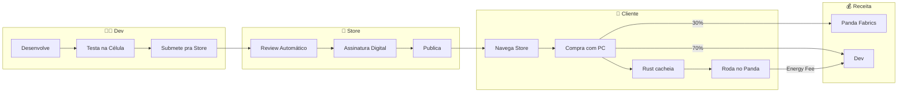
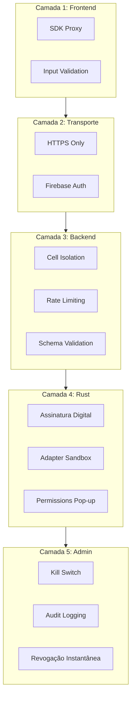
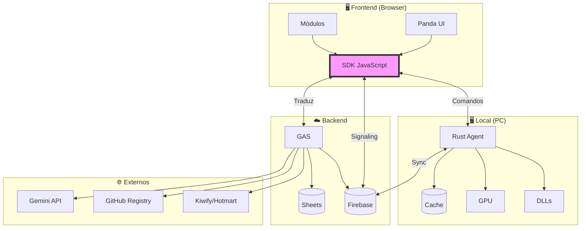

# 🐼 Panda OS - Mapas Mentais da Arquitetura

> Visualização completa de cada componente do ecossistema

---

## 1. 🎯 Visão Geral - SDK como Hub Central

O SDK é o **"Tradutor Universal"** - ele converte chamadas simples do dev em operações complexas para cada backend.

## 1. 🎯 Visão Geral - SDK como Hub Central

O SDK é o **"Tradutor Universal"** - ele converte chamadas simples do dev em operações complexas para cada backend.

```text
🐼 PANDA SDK
├── (Dev chama)
│   ├── Panda.Data.save
│   ├── Panda.Brain.chat
│   ├── Panda.Bridge.execute
│   └── Panda.GPU.process
└── (SDK traduz para)
    ├── GAS / Sheets
    │   ├── Google Apps Script
    │   ├── SpreadsheetApp
    │   └── DriveApp
    ├── Firebase
    │   ├── Realtime DB
    │   ├── Auth
    │   └── Signaling
    ├── Rust Agent
    │   ├── GPU Local
    │   ├── DLLs
    │   ├── Files
    │   └── MCP Tools
    └── APIs Externas
        ├── Gemini
        ├── Claude
        └── Stripe
```

---

## 2. 🦀 Mapa Mental: Rust Agent

```text
🦀 RUST AGENT
├── (Papel)
│   ├── Cache Manager
│   ├── Package Manager
│   ├── MCP Server
│   └── Hardware Bridge
├── (Capacidades)
│   ├── GPU
│   │   ├── CUDA NVIDIA
│   │   ├── ROCm AMD
│   │   ├── Metal Apple
│   │   └── WebGPU
│   ├── Files
│   │   ├── Read / Write
│   │   ├── Watch Folder
│   │   └── Compress
│   ├── DLLs
│   │   ├── MetaTrader
│   │   ├── ProfitChart
│   │   └── Drivers
│   ├── Automation
│   │   ├── Mouse / Keyboard
│   │   ├── OCR
│   │   └── Overlay HUD
│   └── Network
│       ├── Proxy Pool
│       ├── VPN
│       └── IP Rotation
├── (Comunicação)
│   └── Firebase Signaling
│       ├── command_queue
│       ├── response_stream
│       └── heartbeat
├── (Updates)
│   ├── Self-Update
│   ├── Module Cache
│   └── Extension Install
└── (Segurança)
    ├── Assinatura Digital
    ├── Permissions
    └── Kill Switch
```

---

## 3. 📜 Mapa Mental: GAS Backend

```text
📜 GAS BACKEND
├── (Core Services)
│   ├── Authentication
│   │   ├── OAuth Google
│   │   ├── Token Validation
│   │   └── Multi-tenant
│   ├── Data Storage
│   │   ├── Spreadsheet API
│   │   ├── CRUD Operations
│   │   └── Ghost Cells
│   └── Webhooks
│       ├── Kiwify
│       ├── Hotmart
│       └── Stripe
├── (Chapéus e Domains)
│   ├── FINANCE
│   │   ├── Wallet - Voltímetro
│   │   ├── Fiat - Gateways
│   │   └── Crypto - Blockchain
│   ├── STORE
│   │   ├── Registry - Catálogo
│   │   └── Sales - Comissão
│   └── AUTOMATION
│       └── Bots - Farms
├── (Dispatcher Core)
│   ├── Entry Point Unico
│   ├── Roteamento Seguro
│   └── Config Global
├── (Integrações Nativas)
│   ├── Gmail
│   ├── Calendar
│   ├── Drive
│   ├── Maps
│   └── YouTube
└── (Quotas)
    ├── 6 min por execução
    ├── 90 min por dia free
    └── Trigger automático
```

---

## 4. 🔥 Mapa Mental: Firebase Colmeia

```text
🔥 FIREBASE
├── (Core Zone)
│   ├── version
│   ├── status
│   └── announcements
├── (Células)
│   ├── Developer Cell
│   │   ├── profile
│   │   ├── sandbox
│   │   ├── modules_in_dev
│   │   ├── published_modules
│   │   └── quotas
│   └── Client Cell
│       ├── profile
│       ├── sandbox
│       ├── installed_modules
│       ├── data PRIVADO
│       └── quotas
├── (Signaling)
│   ├── command_queue
│   ├── response_stream
│   └── agent_status
├── (Security)
│   ├── Cell Isolation
│   ├── Auth Rules
│   ├── Rate Limiting
│   └── Schema Validation
└── (Multi-Project)
    ├── Core Project
    ├── Dev Sandbox
    └── Telemetry
```

---

## 5. 🔌 Mapa Mental: SDK Modular (Slots)

```text
🔌 SDK SLOTS
├── (Core Protegido)
│   ├── Panda.use
│   ├── Panda.on/emit
│   ├── Panda.version
│   ├── Sandbox
│   └── Validation
├── (Slot Data)
│   ├── Default: Sheets
│   └── Adapters
│       ├── MongoDB
│       ├── PostgreSQL
│       ├── Supabase
│       └── IndexedDB
├── (Slot Brain)
│   ├── Default: Gemini
│   └── Adapters
│       ├── Claude
│       ├── GPT-4
│       ├── Local Llama
│       └── DeepSeek
├── (Slot GPU)
│   ├── Default: Cloud
│   └── Adapters
│       ├── CUDA Direct
│       ├── ROCm
│       └── WebGPU
├── (Slot Render)
│   ├── Default: Nenhum
│   └── Adapters
│       ├── Three.js
│       ├── Babylon
│       └── PixiJS
├── (Slot Network)
│   ├── Default: Fetch
│   └── Adapters
│       ├── ProxyPool
│       └── VPN Client
└── (Slot Audio)
    ├── Default: Nenhum
    └── Adapters
        ├── Howler.js
        └── ElevenLabs
```

---

## 6. 🔄 Fluxo de Dados Completo

```text
👨‍💻 DEV (Code) --> 🎯 SDK (Router)
                      │
          ┌───────────┼───────────┐
          ▼           ▼           ▼
      🦀 RUST        📜 GAS      💾 CACHE
      (Local)       (Cloud)     (Offline)
         │             │           │
         ▼             ▼           ▼
    ⚡ Hardware    ☁️ Sheets    🔄 Sync Queue
    (GPU/DLLs)    (Drive)
         │             │           │
         └─────────────┼───────────┘
                       ▼
                  🔥 FIREBASE
                  (Signaling + Células)
```

---

## 7. 🏪 Fluxo: Store (Dev → Cliente)



---

## 8. 🛡️ Camadas de Segurança



---

## 9. 📊 Resumo Visual Completo



---

_Mapas gerados em 2026-01-21 | Panda Fabrics Architecture_
