# 🐼 Panda OS - Mapas Mentais da Arquitetura

> Visualização completa de cada componente do ecossistema

---

## 1. 🎯 Visão Geral - SDK como Hub Central

O SDK é o **"Tradutor Universal"** - ele converte chamadas simples do dev em operações complexas para cada backend.

```mermaid
mindmap
  root((🐼 PANDA SDK))
    (Dev chama)
      Panda.Data.save
      Panda.Brain.chat
      Panda.Bridge.execute
      Panda.GPU.process
    (SDK traduz para)
      GAS/Sheets
        Google Apps Script
        SpreadsheetApp
        DriveApp
      Firebase
        Realtime DB
        Auth
        Signaling
      Rust Agent
        GPU Local
        DLLs
        Files
        MCP Tools
      APIs Externas
        Gemini
        Claude
        Stripe
```

---

## 2. 🦀 Mapa Mental: Rust Agent

```mermaid
mindmap
  root((🦀 RUST AGENT))
    (Papel)
      Cache Manager
      Package Manager
      MCP Server
      Hardware Bridge
    (Capacidades)
      GPU
        CUDA NVIDIA
        ROCm AMD
        Metal Apple
        WebGPU
      Files
        Read/Write
        Watch Folder
        Compress
      DLLs
        MetaTrader
        ProfitChart
        Drivers
      Automation
        Mouse/Keyboard
        OCR
        Overlay HUD
      Network
        Proxy Pool
        VPN
        IP Rotation
    (Comunicação)
      Firebase Signaling
        command_queue
        response_stream
        heartbeat
    (Updates)
      Self-Update
      Module Cache
      Extension Install
    (Segurança)
      Assinatura Digital
      Permissions
      Kill Switch
```

---

## 3. 📜 Mapa Mental: GAS Backend

```mermaid
mindmap
  root((📜 GAS BACKEND))
    (Core Services)
      Authentication
        OAuth Google
        Token Validation
        Multi-tenant
      Data Storage
        Spreadsheet API
        CRUD Operations
        Ghost Cells
      Webhooks
        Kiwify
        Hotmart
        Stripe
    (Chapéus/Domains)
      FINANCE
        Wallet (Voltímetro)
        Fiat (Gateways)
        Crypto (Blockchain)
      STORE
        Registry (Catálogo)
        Sales (Comissão)
      AUTOMATION
        Bots (Farms)
    (Core Services)
      Dispatcher (Porteiro)
      Authentication
      Config Global
    (Integrações Nativas)
      Gmail
      Calendar
      Drive
      Maps
      YouTube
    (Quotas)
      6 min/execução
      90 min/dia free
      Trigger automático
```

---

## 4. 🔥 Mapa Mental: Firebase Colmeia

```mermaid
mindmap
  root((🔥 FIREBASE))
    (Core Zone)
      version
      status
      announcements
    (Células)
      Developer Cell
        profile
        sandbox
        modules_in_dev
        published_modules
        quotas
      Client Cell
        profile
        sandbox
        installed_modules
        data PRIVADO
        quotas
    (Signaling)
      command_queue
      response_stream
      agent_status
    (Security)
      Cell Isolation
      Auth Rules
      Rate Limiting
      Schema Validation
    (Multi-Project)
      Core Project
      Dev Sandbox
      Telemetry
```

---

## 5. 🔌 Mapa Mental: SDK Modular (Slots)

```mermaid
mindmap
  root((🔌 SDK SLOTS))
    (Core Protegido)
      Panda.use
      Panda.on/emit
      Panda.version
      Sandbox
      Validation
    (Slot Data)
      Default: Sheets
      Adapters
        MongoDB
        PostgreSQL
        Supabase
        IndexedDB
    (Slot Brain)
      Default: Gemini
      Adapters
        Claude
        GPT-4
        Local Llama
        DeepSeek
    (Slot GPU)
      Default: Cloud
      Adapters
        CUDA Direct
        ROCm
        WebGPU
    (Slot Render)
      Default: Nenhum
      Adapters
        Three.js
        Babylon
        PixiJS
    (Slot Network)
      Default: Fetch
      Adapters
        ProxyPool
        VPN Client
    (Slot Audio)
      Default: Nenhum
      Adapters
        Howler.js
        ElevenLabs
```

---

## 6. 🔄 Fluxo de Dados Completo

```mermaid
flowchart TB
    subgraph DEV["👨‍💻 Desenvolvedor"]
        CODE[Código do Dev]
        CODE --> CALL["Panda.Data.save()"]
    end

    subgraph SDK["🎯 PANDA SDK (Tradutor)"]
        CALL --> ROUTER{Router}
        ROUTER -->|"Online + Rust"| RUST_PATH
        ROUTER -->|"Online, no Rust"| GAS_PATH
        ROUTER -->|"Offline"| CACHE_PATH
    end

    subgraph RUST_PATH["🦀 Via Rust"]
        RUST[Rust Agent]
        RUST --> LOCAL_DB[(Cache Local)]
        RUST --> GPU[GPU Process]
        RUST --> DLL[DLLs]
        RUST -->|Sync| FIREBASE
    end

    subgraph GAS_PATH["📜 Via GAS (DDD)"]
        DISPATCHER[Dispatcher Core]
        DOMAINS{Chapéus / Domains}
        SHEETS[(Google Sheets)]

        DISPATCHER -->|Roteia| DOMAINS
        DOMAINS -->|Finance/Store| SHEETS
    end

    subgraph CACHE_PATH["💾 Offline"]
        IDB[(IndexedDB)]
        IDB -->|Quando online| SYNC[Sync Queue]
    end

    subgraph FIREBASE["🔥 Firebase"]
        FB_CELL[Célula do User]
        FB_SIGNAL[Signaling]
    end

    RUST_PATH --> FIREBASE
    GAS_PATH --> FIREBASE
    CACHE_PATH --> SYNC --> GAS_PATH
```

---

## 7. 🏪 Fluxo: Store (Dev → Cliente)

```mermaid
flowchart LR
    subgraph DEV["👨‍💻 Dev"]
        D1[Desenvolve] --> D2[Testa na Célula]
        D2 --> D3[Submete pra Store]
    end

    subgraph STORE["🏪 Store"]
        S1[Review Automático]
        S2[Assinatura Digital]
        S3[Publica]
        D3 --> S1 --> S2 --> S3
    end

    subgraph CLIENT["👤 Cliente"]
        C1[Navega Store]
        C2[Compra com PC]
        C3[Rust cacheia]
        C4[Roda no Panda]
        S3 --> C1 --> C2 --> C3 --> C4
    end

    subgraph REVENUE["💰 Receita"]
        C2 -->|30%| PANDA[Panda Fabrics]
        C2 -->|70%| DEVREV[Dev]
        C4 -->|Energy Fee| DEVREV
    end
```

---

## 8. 🛡️ Camadas de Segurança

```mermaid
flowchart TB
    subgraph L1["Camada 1: Frontend"]
        SDK_PROXY[SDK Proxy]
        VALIDATION[Input Validation]
    end

    subgraph L2["Camada 2: Transporte"]
        HTTPS[HTTPS Only]
        FIREBASE_AUTH[Firebase Auth]
    end

    subgraph L3["Camada 3: Backend"]
        CELL_ISOLATION[Cell Isolation]
        RATE_LIMIT[Rate Limiting]
        SCHEMA[Schema Validation]
    end

    subgraph L4["Camada 4: Rust"]
        SIGNATURE[Assinatura Digital]
        SANDBOX[Adapter Sandbox]
        PERMISSIONS[Permissions Pop-up]
    end

    subgraph L5["Camada 5: Admin"]
        KILL_SWITCH[Kill Switch]
        AUDIT_LOG[Audit Logging]
        REVOKE[Revogação Instantânea]
    end

    L1 --> L2 --> L3 --> L4 --> L5
```

---

## 9. 📊 Resumo Visual Completo

---

_Mapas gerados em 2026-01-21 | Panda Fabrics Architecture_
